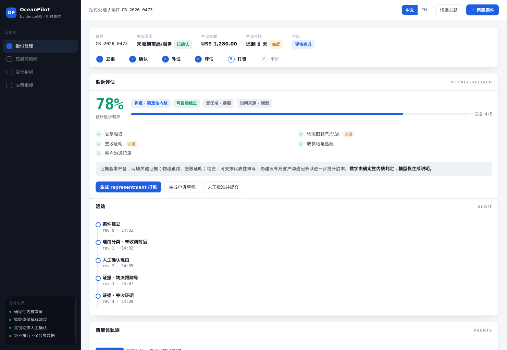

# OceanPilot — 跨境拒付申诉协作 Agent


**帮助跨境 PSP 在举证窗口内收齐有效证据、判断是否值得申诉，并生成可审核的拒付申诉材料。** OceanPilot 用一个版本化案件串联拒付理由、证据缺口、胜诉评估、材料打包、人工审批与审计；AI 负责理解、补问和起草，确定性规则与人工负责裁定。

> **当前边界：** 产品主线是 synthetic 拒付申诉：HTTP/Web 已跑通“受理 → 补证 → 评估 → 打包 → 人审 → mock 申诉”，签名飞书回调已用显式 `/chargeback` 指令和 namespaced 卡片动作跑通受理与补证。EvidenceOS Foundation 以 `PAYMENT_INCIDENT` 切片验证完整证据、确定性诊断和人工确认，是底层能力证明，不是第二个并列产品。真实飞书 tenant、Oceanpayment 数据、银行规则和上游申诉均未接入，系统不执行任何真实资金或业务动作。

### 三个核心设计

- **拒付案件作为单一协作对象：** 用版本化案件聚合拒付理由、证据状态、评估、审批和审计，减少截图与聊天记录反复转发。
- **证据门槛先于申诉判断：** 按 reason-code 逐项定位缺口，关键证据不足时不生成乐观结论，转入补证或人工复核。
- **AI 提议、规则约束、人类裁定：** AI 理解模糊表达并起草材料；确定性规则计算完整度和胜诉评估；人工批准高风险步骤。

## What OceanPilot Is

OceanPilot 是一个面向跨境 PSP 拒付运营的独立参赛原型。它把一次拒付处理固定为一条可检查的业务链：识别理由、补齐证据、评估申诉价值、按银行规则打包、人工批准并记录审计。EvidenceOS Foundation 提供证据先行、确定性决策、人工闸门和可追溯审计等底层原则；仓库中的支付异常切片用于验证这些原则可以扩展到其它跨境支付协作场景。

这个版本适合用于代码审查、架构讨论和比赛演示。所有商户、交易、银行规则和证据内容均为合成示例；仓库不包含真实商户数据或外部系统凭据，离线评测结果也只说明 synthetic fixture 上的可重复行为。

## Current Runtime Scope

| Capability | Status | Current behavior |
|---|---|---|
| Chargeback mainline | Available (synthetic) | 受理、reason 确认、逐项补证、确定性评估、银行规则打包、人工闸门后的 mock 申诉与审计 |
| Web console and demos | Available (synthetic) | `/demo`、跨平台 Python transcript、Docker 一键启动与 synthetic 离线评测 |
| EvidenceOS Foundation | Supporting slice | `PAYMENT_INCIDENT` 建案/补证、确定性诊断持久化与 identity replay，用于验证底层证据与审计能力 |
| Foundation Feishu callbacks | Supporting slice | 经签名校验的建案、补问、诊断卡和人工确认审计；与拒付主线共享签名与回执基础设施 |
| Basic observability | Available (synthetic) | PII-free request/trace 日志与进程内决策指标；不是生产日志平台或持久化 metrics backend |
| Chargeback Feishu callbacks | Available (synthetic) | `/chargeback` 显式建案、理由/补证卡片、签名与 replay 防护、哈希 chat↔case 绑定；未做真实 tenant smoke |
| Rules and company data | Placeholder only | 当前为确定性 reason-code 表与内存精确规则匹配；真实规则、脱敏案例与 RAG 尚未接入 |
| Real integrations | Planned | 真实 Oceanpayment、外部 A2A/MCP/工单、上游申诉与公网 Feishu tenant smoke |
| Production readiness | Not claimed | 尚未完成鉴权、限流、生产可观测性后端、云数据库、备份、部署和运行保障 |

## 产品主线：拒付申诉协作 / Chargeback Appeal

OceanPilot 将一次跨境拒付固定为下面这条业务链。内部可以由多个专属处理器完成窄任务，但对用户呈现的是一个连续案件，而不是七个彼此独立的 Agent：

```text
收到拒付
  → 识别理由      抽取安全事实并提出 reason-code；不确定时由人工确认
  → 补齐证据      按理由逐项提示缺口；关键材料不足时停止评估
  → 申诉评估      确定性规则计算完整度、胜诉可能性、薄弱点与人工路由
  → 材料打包      按银行/卡组织模板组织 representment 材料
  → 人工批准      人类核对依据和申诉草稿
  → 提交与跟进    当前只调用 synthetic mock connector，并记录时限和审计
```

三条设计取向：**(1) 渠道无关内核**，完整链路由 HTTP/Web 驱动，飞书复用同一 `ChargebackChannelService` 承载受理与补证协作；**(2) 模型可插拔**，离线运行默认 Scripted/确定性 fallback，只有显式开启 live 开关才按安全档位路由到 Claude 或本地隔离模型；**(3) 混合决策**——确定性内核决策、LLM 只解释/建议、人类拍板。系统绝不执行真实支付、退款、风控或上游提交；人工批准只可能调用 synthetic mock connector。

- 设计文档：[docs/design/2026-08-06-chargeback-agent-cluster-design.md](docs/design/2026-08-06-chargeback-agent-cluster-design.md)
- 安全与部署分级：[docs/security/deployment-tiers.md](docs/security/deployment-tiers.md)
- 给公司的数据需求：[docs/data/2026-08-07-chargeback-data-request.md](docs/data/2026-08-07-chargeback-data-request.md)
- 离线可跑的演示：`examples/chargeback_demo.py`（agent 集群）、`examples/chargeback_transcript.py`（HTTP 全链路 transcript）
- 一键起服务：`docker build -t oceanpilot-evidenceos . && docker run --rm -p 127.0.0.1:8000:8000 oceanpilot-evidenceos`
- Web 演示面板（可视化全链路）：起服务后打开 `http://127.0.0.1:8000/demo`
- 离线评测报告（分类准确率 + 胜诉率校准）：`python scripts/eval_chargeback.py`

## Web 控制台 / Console



统一的单页控制台把整条拒付链串在一屏：识别理由 → 补证（带 SLA 时限）→ 胜诉评估（内核判定 + 逐项证据 + 决策来源）→ 打包 → 人工批准 → mock 申诉 → 审计轨迹。交易前预防是扩展示例，不属于主申诉链；PII / 卡号安全护栏横跨所有步骤。

- 服务启动后打开根路径 `/`（自动跳转到 `/demo`）。
- Docker：`docker run --rm -p 127.0.0.1:8000:8000 oceanpilot-evidenceos`，浏览器开 `http://127.0.0.1:8000/demo`。
- 远程服务器：SSH 端口转发 `ssh -L 8000:127.0.0.1:8000 <user>@<host>`，本地开 `http://localhost:8000/demo`。
- 顶栏可切换中/英与深/浅色；「API 文档」指向 Swagger `/docs`。

## 技术原则：证据先行闭环


OceanPilot 的核心不是增加一个信息入口，而是让 AI、确定性规则与人工共同遵守同一套案件证据口径：资料不足先定位缺口，达到门槛后才输出评估，高风险步骤始终由人工确认。

> 图例边界：这是报名阶段的 Foundation 规划图。绿色实线为当时的基础原型，海洋蓝虚线为离线规则资产，浅灰虚线与琥珀色节点为当时的规划路径；`v0.2.1` 的实际运行边界以本文状态表与 `docs/architecture.md` 为准。

## Architecture

当前运行时包含一条拒付产品主线和一条 Foundation 能力验证切片，两者都保持单向依赖：

```text
Chargeback HTTP / Web console
    -> ChargebackChannelService -> Supervisor / deterministic kernel
    -> ChargebackCaseStore -> chargeback SQLite
    -> Packager -> in-memory synthetic bank rules
    -> Appeal -> human gate -> mock upstream connector

Foundation HTTP / signed Feishu callbacks
    -> CaseService -> domain evidence policies / DiagnosisEngine
    -> CaseStore port -> foundation SQLite
```

API 只负责严格输入映射、状态码和安全错误；领域/应用层负责 readiness、评估和编排；SQL、事务、revision 条件更新和审计落库由 Store 负责。Foundation 诊断快照会持久化并 replay；拒付 assessment/package/appeal 当前按最新案件状态计算，不声明 snapshot replay 或生产提交语义。完整组件和数据流见 [docs/architecture.md](docs/architecture.md)。

## Foundation：底层能力验证切片


Foundation 以合成支付异常验证版本化证据、确定性诊断、审计和签名飞书回调，不是当前产品主线。其公开 HTTP 输入使用严格 UUIDv4 和 `synthetic=true`，调用方不能注入来源可信度、状态、revision 或路由结论。


> **事实边界（图为报名期分层规划）：** 图中曾标为规划的 Foundation 诊断主链与飞书回调已实现为 synthetic demo；拒付主线也已接入同一签名事件/卡片入口，但尚未做真实 tenant smoke。真实 Oceanpayment 数据、外部 A2A/MCP/工单均未接入。

## 开发者指南 / Developer guide

**先读源码导航**：[`src/oceanpilot/README.md`](src/oceanpilot/README.md) 讲清六边形分层与唯一依赖规则,每层再各有一份 README：

| 层 | 文档 |
|---|---|
| 领域内核 | [`src/oceanpilot/domain/README.md`](src/oceanpilot/domain/README.md) |
| 应用/端口 | [`src/oceanpilot/application/README.md`](src/oceanpilot/application/README.md) |
| 适配器 | [`src/oceanpilot/adapters/README.md`](src/oceanpilot/adapters/README.md) |
| HTTP 接口 | [`src/oceanpilot/api/README.md`](src/oceanpilot/api/README.md) |
| 测试与门禁 | [`tests/README.md`](tests/README.md) |

**配置**：所有环境变量见根目录 [`.env.example`](.env.example)(存储路径、Claude、本地模型、飞书凭据);凭据只经环境变量注入,绝不入库。运行/安装见下方 Quick Start。

**提交前门禁**(与 CI 一致)：

```bash
python -m pytest -p no:cacheprovider -q
ruff check src tests && ruff format --check src tests
python -m compileall -q src tests
```

## 提交材料索引

- [报名表 Part 1 / Part 2 可粘贴文本](docs/submission/registration-copy.md)
- [两页开题报告补充材料（PDF）](artifacts/OceanPilot-开题报告补充材料.pdf)
- [外部研究与事实边界](docs/submission/sources.md)
- [当前未完成能力与后续路线](docs/roadmap/incomplete-work.md)
- [飞书集成配置指南](docs/feishu-setup.md)
- [本地演示 runbook](docs/demo.md)

> 公共仓库仅供比赛评审；未授予复用许可。当前原型仅使用合成数据。Foundation 与拒付主线均已在签名 callback seam 跑通；真实 tenant smoke 和生产部署仍未完成。

## Quick Start

要求 Python 3.12。以下命令只在 `127.0.0.1` 启动本地服务。

Windows PowerShell：

```powershell
py -3.12 -m venv .venv
.\.venv\Scripts\python.exe -m pip install -e ".[dev]"
$env:OCEANPILOT_DB_PATH = "work/oceanpilot.db"
.\.venv\Scripts\python.exe -m uvicorn oceanpilot.main:create_app --factory --host 127.0.0.1 --port 8000
```

Linux / macOS：

```bash
python3.12 -m venv .venv
.venv/bin/python -m pip install -e ".[dev]"
export OCEANPILOT_DB_PATH=work/oceanpilot.db
.venv/bin/python -m uvicorn oceanpilot.main:create_app --factory --host 127.0.0.1 --port 8000
```

启动过程由 FastAPI lifespan 创建 SQLite schema 并执行一次 Store 健康检查。构造或导入应用本身不会打开数据库连接。飞书回调为可选：设置 `FEISHU_APP_ID/APP_SECRET/VERIFICATION_TOKEN/ENCRYPT_KEY` 后启用（凭据只走环境变量），配置步骤见 [docs/feishu-setup.md](docs/feishu-setup.md)，演示脚本见 [docs/demo.md](docs/demo.md)。未配置飞书时核心 API 与 `/health` 正常，飞书路由返回固定安全 `503`。

## API Walkthrough

服务运行后，在另一个 PowerShell 窗口执行：

```powershell
powershell.exe -NoProfile -ExecutionPolicy Bypass -File .\examples\demo.ps1
```

脚本按顺序验证：

1. `GET /health` 返回 `200`；
2. `POST /api/v1/cases` 创建一个 synthetic 支付异常案件并返回 `201`；
3. `POST /api/v1/cases/{case_id}/evidence` 追加 `context.environment=PROD` 并返回 `201`；
4. `GET /api/v1/cases/{case_id}` 读取持久化后的案件视图；
5. `POST /api/v1/cases/{case_id}/diagnose` 返回真实 `DiagnosisResponse`（首次 `201`，相同诊断身份 replay `200`）。

首次追加证据返回 `201`；同一 `evidence_id` 和规范化内容重放返回 `200`；同一 ID 携带不同内容返回安全 `409 EVIDENCE_CONFLICT`。演示脚本不启动或关闭服务器，也不访问外部服务。

## What Is Deliberately Deferred

已完成（截至 `v0.2.1`）：Foundation 诊断快照 CAS 持久化、identity replay、stale 检查与原子审计；RFC 9457 Problem Details、request/trace 关联头与 OpenAPI 错误矩阵；经签名校验的 Foundation 飞书事件/卡片回调；synthetic 拒付 Supervisor、补证、评估、打包、mock 申诉、时限计算、预防建议、审计/agent trace；Web 控制台、Docker、跨平台 transcript、基础结构化日志/进程内指标和离线评测。

仍然延期：

- 真实 Oceanpayment 数据/API、真实银行规则、外部 A2A、MCP、工单、上游申诉、自动派单或任何资金动作；
- RAG/向量检索，以及 company-data 校准；
- 公网 HTTPS 部署与拒付真实 tenant smoke；
- 定时任务、出站 SLA 通知和超期后的生产工作流变更；
- 鉴权、限流、生产可观测性后端、云数据库、备份和发布运维。

逐项依赖、文件所有权与可执行验收命令见 [docs/roadmap/incomplete-work.md](docs/roadmap/incomplete-work.md)。延期能力不会用内存假结果或展示文案代替。

## Verification

`v0.2.1` 标签的本地全量套件基线为 `1095 passed, 3 skipped`：无 PowerShell 环境跳过一个 `demo.ps1` 语法测试，无 `ANTHROPIC_API_KEY` 跳过两个可选 live Claude 测试。Ruff lint、`ruff format --check`、compileall、19 路径 OpenAPI 合同与 diff 检查均通过；TestClient 运行会出现一条来自固定版本 Starlette/httpx 组合的上游弃用警告。GitHub Actions（Python 3.12）在 [`.github/workflows/ci.yml`](.github/workflows/ci.yml) 中定义；分支新增测试后的准确数量与远程结果以对应 commit 的实际门禁为准。

可重复执行（Linux / macOS；Windows 用 `.\.venv\Scripts\python.exe`）：

```bash
.venv/bin/python --version
.venv/bin/python -m pytest -p no:cacheprovider -q
.venv/bin/ruff check src tests
.venv/bin/ruff format --check src tests
.venv/bin/python -m compileall -q src tests
.venv/bin/python -m pytest tests/api/test_lifespan_openapi.py -q
git diff --check
```

Foundation 遗留的 `ruff format` 格式漂移已在一个独立的机械提交中统一处理（不与功能/文档改动混合），`ruff format --check src tests` 现已通过。

## Competition Context

本项目用于 [2026 AI 先锋未来人才大赛](https://activity.feishu.cn/future-talent#challenge) 的 Oceanpayment 企业命题探索，关注跨境商户接入与上线后问题协作。当前实现覆盖 synthetic `PAYMENT_INCIDENT` Foundation 与 synthetic 拒付申诉集群，不代表 Oceanpayment 官方产品，也未获得其真实接口、流程、银行规则或生产数据验证。

领域证据契约、状态机、原子事务和规则表属于本参赛方案中的组合设计；其中使用的通用工程方法不被表述为团队独创算法。公开代码当前仅供比赛评审，未授予复用许可。
