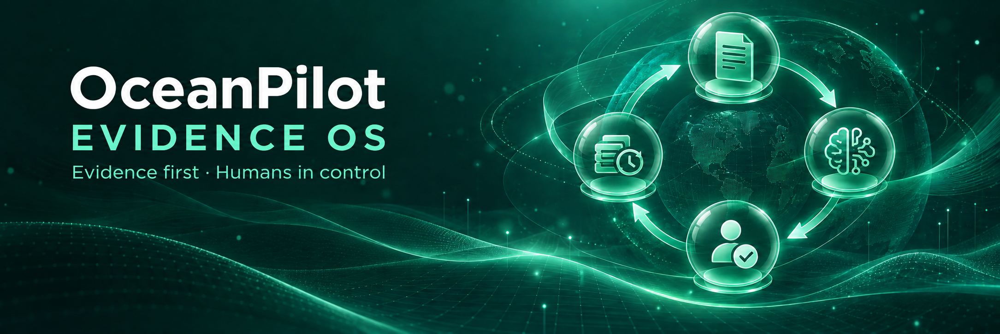
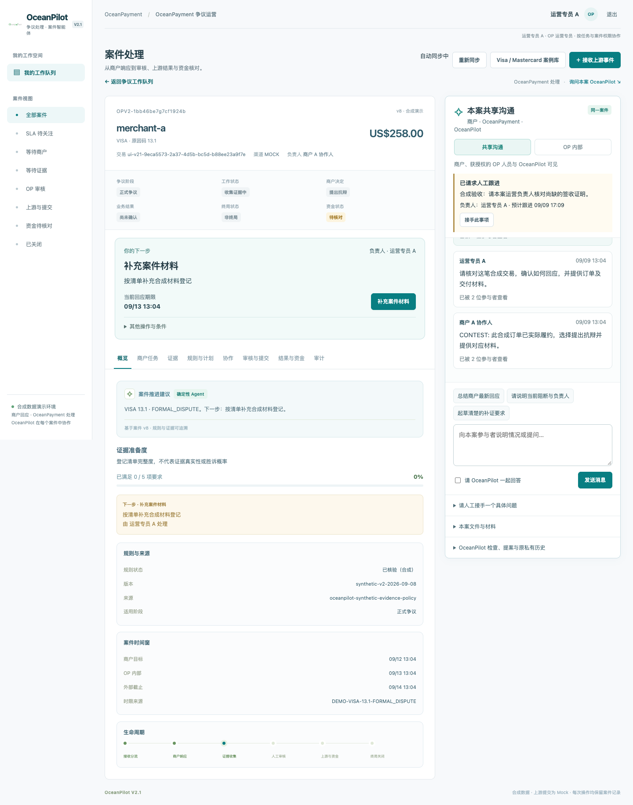
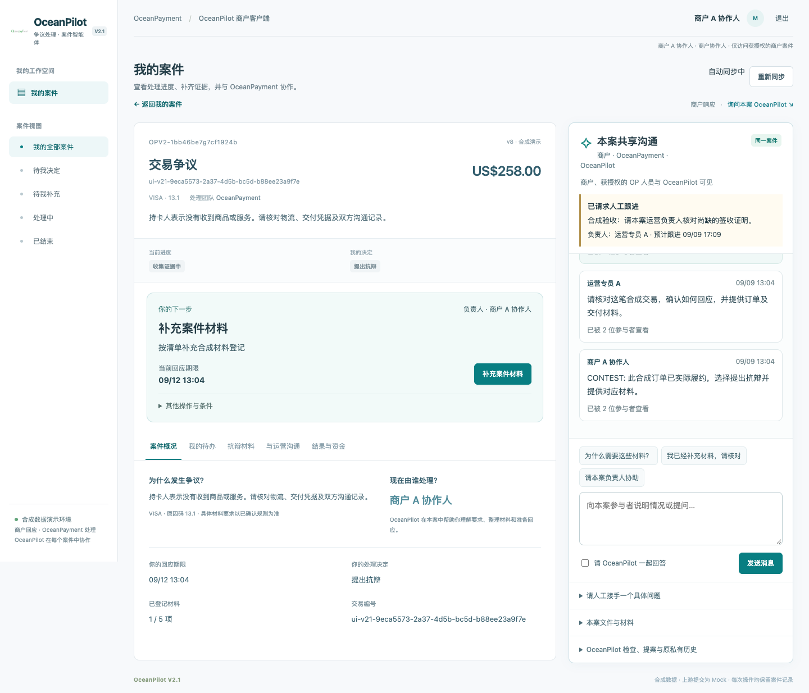
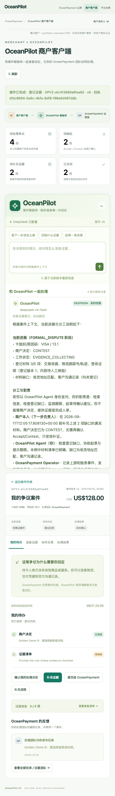
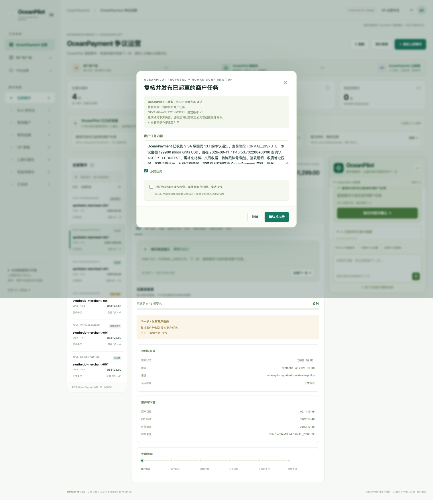
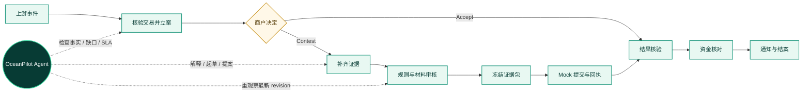

<p align="center">
  
</p>

<h1 align="center">OceanPilot EvidenceOS</h1>

<p align="center">
  <strong>证据驱动的跨境拒付案件协作系统</strong><br>
  一个案件 · 两个工作端 · 一条可审计的人机协作闭环
</p>

<p align="center">
  <a href="https://github.com/jiang4wqy/oceanpilot-evidenceos/actions/workflows/ci.yml"></a>
  
  
  
  
</p>

<p align="center">
  <a href="#overview">项目亮点</a> ·
  <a href="#tour">产品预览</a> ·
  <a href="#workflow">协作闭环</a> ·
  <a href="#quickstart">快速开始</a> ·
  <a href="#demo">Golden Demo</a> ·
  <a href="#docs">文档导航</a>
</p>

> [!IMPORTANT]
> OceanPilot V2.1 是用于比赛演示与工程验收的本地原型。交易、账务及上游提交均为 **Synthetic / Mock / Disabled**；规则指南是可追溯参考，不会自动成为生产规则。当前验证状态与限制见 [V2.1 验证记录](docs/v2/v21-validation.md)。

> [!NOTE]
> `master` 为当前 V2.1 项目主线，包含飞书群知识问答、私聊案件助手及合成演练；V1 历史演示入口仍保留。真实飞书修复与验收边界见 [商户助手实测记录](docs/v2/feishu-merchant-live-test-2026-09-16.md)。

<a id="overview"></a>
## 为什么是 OceanPilot？

拒付处理的问题不只是“缺一个 AI 聊天框”，而是证据、规则、时间、权限和版本必须围绕**同一个案件事实**持续同步。OceanPilot 把 AI 放进受控的案件循环：先用确定性工具检查事实与边界，再由模型解释和起草，最后由有权限的人确认业务动作。

|  | 能力 | OceanPilot 的做法 |
|---|---|---|
| 🔎 | **Evidence first** | 上传真实文件内容并定位事实；缺少必需证据时阻止送审 |
| 🔁 | **Revision bound** | 材料、规则或结果变化即生成新 revision，旧确认自动失效 |
| 🧭 | **One case, two surfaces** | 商户端与运营端共享案件事实和协作线程，但严格隔离权限界面 |
| 🛡️ | **Human controlled** | AI 只检查、解释、起草和提案；提交、终审、资金核对、结案必须人工确认 |
| ⏱️ | **SLA aware** | 截止时间、升级路径和未响应状态独立记录，不把沉默推断为授权 |
| 🧾 | **Audit ready** | 身份、版本、证据、规则来源、审批与幂等回执形成完整审计链 |

<p align="center">
  
</p>

<a id="tour"></a>
## 产品预览

| OceanPayment 运营工作区 | 商户工作区 |
|---|---|
|  |  |
| 规则、材料、审核、提交、结果与资金核对都围绕当前 revision 展开 | 商户只看到自己的案件、决定、补证任务和本案共享沟通 |

<details>
<summary><strong>查看更多界面：移动端 Agent、提案确认与资金闭环</strong></summary>
<br>

| 案件 Agent | 人工确认提案 | 资金差异处理 |
|---|---|---|
|  |  |  |

</details>

<a id="workflow"></a>
## 从上游事件到资金结案



每一次案件变化都会产生新的可观察状态。Agent 的六项确定性检查先返回规则与来源、证据缺口、SLA、权限动作、同商户相似案件和可执行边界；模型随后只负责表达、追问与草拟。任何业务动作仍校验 `case_id + expected_revision + role`。

### 一套案件事实，两个独立权限面

| 商户端 | 共享案件核心 | OceanPayment 运营端 |
|---|---|---|
| Accept / Contest、上传事实与证据、查看本人任务、参与本案沟通 | 阶段、工作状态、商户决定、结果、终局、资金状态、revision 与审计 | 受理建案、规则复核、材料初审、任务发布、包终审、提交、结果处理、资金核对 |

共享的是案件上下文，不是权限界面。运营内部讨论、终审和资金操作不会暴露给商户；经办人、材料审核人或证据包作者不能自审终审。

<a id="demo"></a>
## 四个 Golden Demo

| 场景 | 初始状态 | 要证明的系统行为 |
|---|---|---|
| **A · 正常抗辩** | OP 已发布商户任务 | Contest → 补证 → 审核 → 终审 → Mock 提交 → 终局 → 核对 → 通知 → 结案 |
| **B · 缺证阻断** | 商户已 Contest，缺签收与物流材料 | Agent 明确证据缺口；补齐前不能送审或通过 |
| **C · SLA 风险** | 商户截止时间已过，等待人工升级 | 未响应与 Accept 严格分离，不推断授权、不自动接受 |
| **D · 财务异常** | 已 Mock 提交、结果 WON、资金存在差异 | WON 不等于结案；差异须由风控经理核对后才能通知并关闭 |

> 演练使用独立身份、合成交易和实际文件内容。旧快捷生成命令仅保留为历史领域 fixtures，不是 V2.1 的正式 HTTP 入口。

<a id="quickstart"></a>
## 快速开始

### 1. 创建环境并安装

```bash
git clone https://github.com/jiang4wqy/oceanpilot-evidenceos.git
cd oceanpilot-evidenceos
git switch oceanpilot-v2

python3.12 -m venv .venv
.venv/bin/python -m pip install -e '.[dev]'
```

### 2. 创建演示账号

```bash
PYTHONPATH=src .venv/bin/python -m oceanpilot.v21_accounts \
  --db work/oceanpilot-chargeback.db \
  --output work/v21-accounts.json
```

密码只会写入指定的本地文件；已有默认账号不会被覆盖。如果设置了 `OCEANPILOT_CHARGEBACK_DB_PATH`，这里的 `--db` 必须使用同一路径。

### 3. 本地启动

```bash
PYTHONPATH=src \
OCEANPILOT_DB_PATH=work/v2.db \
.venv/bin/python -m uvicorn oceanpilot.main:create_app \
  --factory --host 127.0.0.1 --port 8002
```

打开 [`http://127.0.0.1:8002/v2/login`](http://127.0.0.1:8002/v2/login)。同时演示商户端和运营端时，请使用两个独立浏览器配置文件；普通标签页会共用会话。

<details>
<summary><strong>可选：启用真实模型解读</strong></summary>
<br>

OceanPilot 默认离线运行，不需要模型密钥。启用 DeepSeek 时，在被 Git 忽略的 `.env` 中配置：

```dotenv
DEEPSEEK_API_KEY=your_key
OCEANPILOT_MODEL_PROVIDER=deepseek
OCEANPILOT_CHARGEBACK_LIVE_MODEL=1
```

启动命令增加 `--env-file .env`。确定性工具观察会立即完成，后台模型请求不会阻塞材料登记；模型失败时系统返回确定性摘要，不会放宽业务边界。详见 [Agent 协作与验证](docs/v2/agent-workflow.md)。

</details>

### 主要入口

| 路径 | 工作区 / 能力 |
|---|---|
| `/v2/login` | 独立账号登录；URL 或客户端角色头不授予权限 |
| `/` → `/v2/operations` | OceanPayment 争议运营工作区 |
| `/v2/merchant` | 商户自己的案件列表与待办 |
| `/v2/merchant/cases/{id}` | 商户案件页、补证决定与共享沟通 |
| `/v2/operations/cases/{id}` | 运营案件页、审核提交、共享沟通与隔离的内部讨论 |
| `/v2/operations/library` | 62 条指南参考均可创建独立合成演练；风控经理确认匹配的 Mock 规则后才可直接发布待办，专员建案后须转交经理确认 |
| `/v2/governance` | 规则来源、角色权限、集成状态与人工审核知识 |
| `/v2/admin` | IT 管理员：账号、合成交易与系统管理 |
| `/docs` | V2 严格命令 HTTP 合同与兼容的 V1 API |
| `/demo` · `/business` · `/admin` | 保留的 V1 历史演示与运维入口 |

## 工程能力

<details open>
<summary><strong>案件、证据与协作</strong></summary>
<br>

- **多维案件状态：** `Stage`、`Work Status`、`Merchant Decision`、`Outcome`、`Finality`、`Financial Status` 独立保存，避免用一个“状态”掩盖业务差异。
- **真实文件内容：** 支持 UTF-8 TXT、JSON、单行交易 CSV 的上传、哈希、版本、正文与事实定位；未知类型须由独立风控核验原文摘录与行号。
- **同案协作：** Portal 与标准化 Feishu 事件进入同一 timeline / audit；持久游标同步消息、阅读状态与未发送输入。
- **完整后处理：** 终局后仍登记借记、贷记、退款与费用，以整数最小货币单位核对；差异、过期通知或未解决作业都会阻止关闭。

</details>

<details>
<summary><strong>规则、权限与人工控制</strong></summary>
<br>

- **可追溯规则：** 按 scheme / channel / reason / stage / 生效日期精确匹配；旧案保留规则快照，未确认条件进入 `NEEDS_CONFIRMATION`。
- **四角色权限：** 商户、风控专员、风控经理、IT 管理员职责分离；终审、资金核对等动作执行独立复核约束。
- **冻结证据包：** 缺少必需证据不能通过；材料变化会让旧审核和证据包失效；提交保留版本、digest、技术回执、业务接收和幂等编号。
- **知识治理：** 结案后只生成脱敏候选；独立 Admin 审批后才能进入相似模式检索。

</details>

<details>
<summary><strong>Agent 与持久化安全</strong></summary>
<br>

- **受控 Agent loop：** 每次命令后保存工具检查、缺口、草稿与提案运行记录；实际业务命令继续检查确认人、当前版本和角色权限。
- **最小化模型上下文：** 相似案件限制在同商户；外部模型仅接收经过检查、脱敏且完成任务所必需的案件上下文。
- **事务与恢复：** V2 SQLite 表与 V1 共存；案件、revision、审计和幂等命令回执在同一事务中提交，支持重启恢复与并发版本冲突拒绝。
- **安全降级：** 界面区分规则工具、真实模型和失败降级；模型不可用时不会跳过确定性检查或人工确认。

</details>

## 测试与复现

```bash
PYTHONPATH=src .venv/bin/python -m pytest -p no:cacheprovider -q
.venv/bin/ruff check src tests
.venv/bin/ruff format --check src tests
PYTHONPATH=src .venv/bin/python -m compileall -q src tests
PYTHONPATH=src .venv/bin/python scripts/eval_dispute_v2.py
```

CI 还会构建 Docker 镜像并对 `/health`、V1 页面、V2 登录、会话隔离和演示账号生成执行 smoke test。测试只证明所列 synthetic fixtures 上的规则匹配、缺证检测、危险动作阻挡、版本安全、SLA 和审计行为，不代表生产业务效果。

V2 默认使用 `OCEANPILOT_V2_UPSTREAM_MODE=mock`。设为 `disabled` 后仍可查看、复核和制作证据包，但最终模拟提交会被拒绝；任何其他 mode 都会在启动时拒绝。

<a id="docs"></a>
## 文档导航

| 想了解什么 | 推荐阅读 |
|---|---|
| 快速完成双端演示 | [V2.1 双端操作指南](docs/v2/dual-workspace-guide-v21.md) · [Golden Demo 步骤](docs/v2/demo.md) |
| 当前完成度与已知限制 | [V2.1 验证进度](docs/v2/v21-validation.md) · [验收记录](docs/v2/acceptance.md) |
| 数据从哪里来、写到哪里 | [数据取源与案件起点](docs/v2/data-wiring-v21.md) |
| Agent 如何检查、提案与降级 | [Agent 协作与验证](docs/v2/agent-workflow.md) |
| 会话、租户与案件隔离 | [Stage 2 隔离审核](docs/v2/stage2-session-isolation-review.md) |
| 任务、材料与补证体验 | [Stage 3 体验审核](docs/v2/stage3-task-material-review.md) |
| 飞书配置与本地验收 | [飞书接入说明](docs/v2/feishu.md) |
| 需求与来源覆盖 | [V2.1 来源与验收矩阵](docs/v2/v21-requirements.md) |
| DeepSeek 本地配置 | [DeepSeek 接入指南](docs/deepseek-setup.md) |
| V1 历史资料 | [V1 README](docs/v2/v1-readme.md) · [原架构](docs/architecture.md) · [历史提交材料](docs/submission/registration-copy.md) |

## 上线前仍需企业确认

1. OceanPayment 各渠道角色及真实争议来源字段。
2. 商户接受 / 抗辩授权、未响应处置、正式规则与 SLA。
3. 上游提交对象、技术 / 业务回执、结果与阶段映射。
4. 财务流水、退款、费用、币种和净影响的正式核对口径。
5. 真实租户飞书联调、企业 SSO、生产部署和运行保障。

这些内容被保留为可替换的集成与规则边界。当前版本适合本地比赛演示与工程验收，未声称已经生产上线。

---

<p align="center">
  <strong>AI proposes · Rules constrain · Humans approve</strong><br>
  <sub>OceanPilot V2.1 · Synthetic competition prototype · Auditable by design</sub>
</p>

> 公共仓库用于比赛评审，未授予复用许可。历史报告、截图和数据需求保留原日期口径，不能替代 V2.1 当前代码与验收记录。
