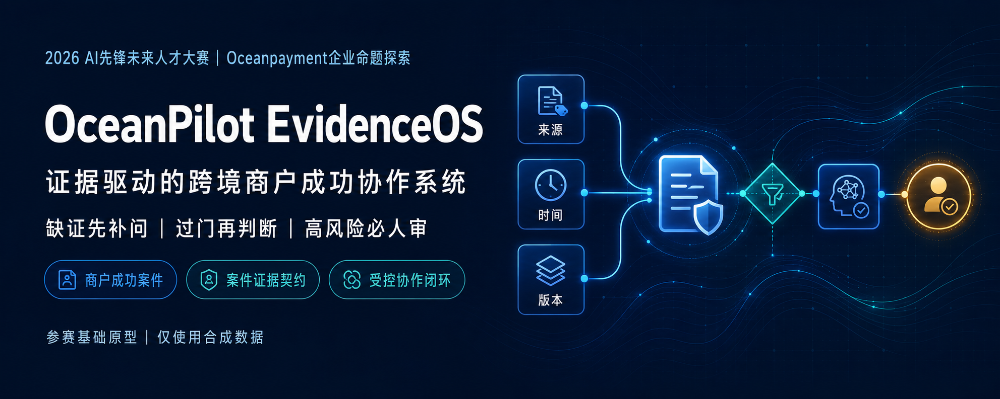
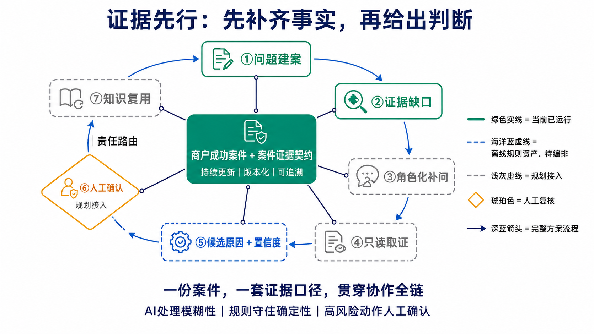
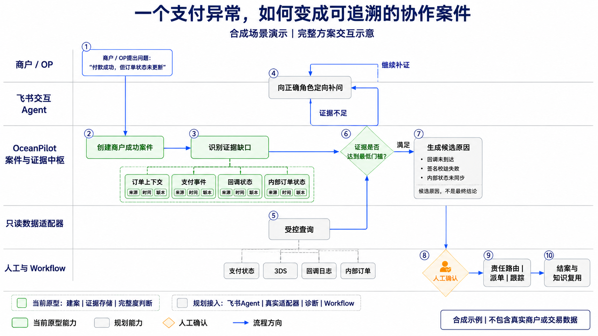
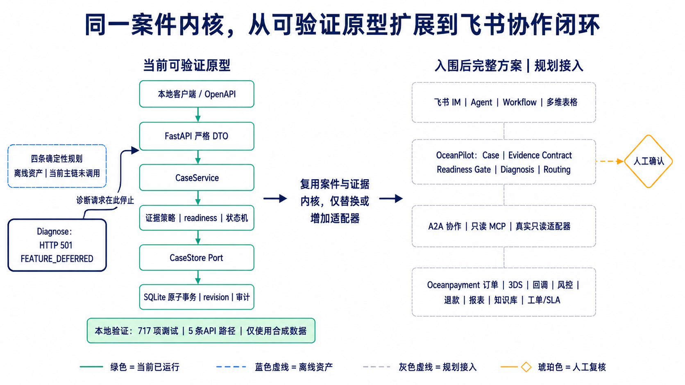

# OceanPilot EvidenceOS



**证据驱动的跨境商户成功协作系统。** OceanPilot 用同一份“商户成功案件”串联问题、证据、判断与交接：缺证先补问，达到证据门槛后再进入候选判断，高风险动作由人工确认。

> **当前边界：** 已验证建案、证据存储、完整度判断、确定性诊断与审计边界，并接入一条经签名校验的飞书事件/卡片回调链路（建案 → 补问 → 达标诊断 → 人工确认审计）。真实 Oceanpayment 数据、A2A、MCP、工单与飞书真机联调仍为规划/入围后能力。当前原型仅使用合成数据，不执行任何支付、退款、风控放行或资金动作；人工确认只记录建议、不改变案件状态、不触发业务动作。

### 三个核心设计

- **商户成功案件（Merchant Success Case）：** 用持续演进、可版本化的案件聚合问题上下文与协作状态，减少截图和聊天记录反复转发。
- **案件证据契约（Case Evidence Contract）：** 每条证据绑定来源、时间、版本与引用；资料不足时先定位缺口，不让系统直接猜测。
- **受控协作闭环：** 完整方案中由 AI 处理模糊表达和补问，确定性规则约束状态与责任路由，高风险动作必须人工确认；当前基础原型只验证案件与证据内核。

## What OceanPilot Is

OceanPilot EvidenceOS 是一个面向跨境支付异常协作的独立参赛原型。它把零散的问题描述整理为版本化案件，把每条输入转换为可追溯证据，再由确定性的领域策略计算资料完整度和案件状态。当前重点不是给出未经验证的“AI 结论”，而是先证明一条较窄但可检查的链路：创建 synthetic payment incident 案件、追加证据、读取同一案件视图，并对尚未完成的诊断能力明确停机。

这个基础版本适合用于代码审查、架构讨论和后续分工。所有商户、交易和证据内容均为合成示例；仓库不包含真实商户数据或外部系统凭据。

## Current Foundation Scope

| Capability | Status | Current behavior |
|---|---|---|
| `GET /health` | Available | 检查本地 SQLite Store 是否可访问 |
| Create case | Available | 创建唯一启用的 synthetic `PAYMENT_INCIDENT` 案件 |
| Read case | Available | 返回案件、readiness、证据、revision 和当前诊断指针 |
| Append evidence | Available | 追加受限证据；同 ID 同内容 replay，同 ID 异内容 conflict |
| Diagnosis | Available (synthetic) | 达标后运行四条确定性规则并持久化诊断；身份 `(case_id, evidence_revision, policy_version)` replay；低置信度/低来源质量/风险/冲突/无规则进入人工复核 |
| Feishu event & card callbacks | Available (synthetic) | 经签名校验的回调：建案、角色化补问卡、达标真实诊断卡、人工确认审计；未配置飞书时返回固定安全 `503` |
| Real integrations | Planned | 真实 Oceanpayment / A2A / MCP / 工单接入与飞书真机联调（需公网 HTTPS）为入围后工作 |
| Production readiness | Not claimed | 尚未完成鉴权、限流、生产日志/指标、部署和运行保障 |

公开 HTTP 输入必须使用规范 UUIDv4，`synthetic` 必须是布尔值 `true`。HTTP 层固定证据来源为 `MERCHANT / USER_REPORTED / synthetic=true`，调用方不能注入来源可信度、状态、revision 或路由结论。

## 证据先行闭环



OceanPilot 的核心不是增加一个信息入口，而是让 AI、确定性规则与人工共同遵守同一套案件证据口径：资料不足先定位缺口，达到门槛后才输出带引用的候选原因，高风险动作始终由人工确认。

> 图例边界：绿色实线为当前基础原型，海洋蓝虚线为离线规则资产，浅灰虚线与琥珀色节点为完整方案的规划路径。

## 一个合成支付异常如何进入协作案件



> 合成支付异常的完整方案交互示意；绿色为当前基础原型，灰色为规划能力。飞书 Agent、真实数据适配、诊断与 Workflow 尚未接入，因此本图不代表当前端到端运行结果。

## 当前原型与完整方案



> **事实边界（图为报名期分层规划）：** 上图记录报名期的分阶段规划，其中诊断主链与飞书回调标为规划接入。**竞赛演示分支已把这两项实现为合成 demo：** 诊断请求返回真实持久化结果（不再 `501`），飞书事件/卡片回调链路可端到端跑通。右侧灰色模块中，真实 Oceanpayment 数据、A2A、MCP、工单与真机联调仍为入围后接入。

## Architecture

当前运行链路保持单向依赖：

```text
HTTP / OpenAPI
    -> CaseService
    -> domain evidence policies and state machine
    -> CaseStore port
    -> local SQLite
```

API 只负责严格输入映射、状态码和安全错误；readiness、状态变化和证据规范化由领域层负责；SQL、事务、revision 条件更新和审计落库由 Store 负责。诊断路由不会绕过这些边界生成临时结果。完整组件和数据流见 [docs/architecture.md](docs/architecture.md)。

## 拒付申诉智能体集群 / Chargeback Agent Cluster

在证据内核之上,2026-08 起扩展出**跨境拒付（chargeback）申诉多智能体集群**——本仓库当前的开发重点。它复用同一套"证据先行 + 人工确认"口径,把一次拒付串成可检查的链路：

```text
描述问题
  → Intake     抽结构化事实 + 判定拒付理由（不确定→待人工确认/更正）
  → Evidence   按理由逐项补证（带 SLA 倒计时；可"无法提供→转人工复核"）
  → Assess     确定性内核算胜诉率（缺关键证据门控）、责任团队、是否需人工
  → Package    按银行/卡组织模板结构化打包
  → Appeal     生成 representment 申诉信；人工确认后才提交上游（mock）
```

三条设计取向：**(1) 渠道无关内核**,飞书只是可选渠道之一(另有纯 HTTP 渠道);**(2) 模型可插拔**,Claude 优先但按安全档位路由到脱敏/本地隔离模型,不可达时确定性兜底;**(3) 混合决策**——确定性内核决策、LLM 只解释/建议、人类拍板。系统绝不执行支付/退款/风控/提交动作,最强动作是"建议人工复核"。

- 设计文档：[docs/design/2026-08-06-chargeback-agent-cluster-design.md](docs/design/2026-08-06-chargeback-agent-cluster-design.md)
- 安全与部署分级：[docs/security/deployment-tiers.md](docs/security/deployment-tiers.md)
- 给公司的数据需求：[docs/data/2026-08-07-chargeback-data-request.md](docs/data/2026-08-07-chargeback-data-request.md)
- 离线可跑的演示：`examples/chargeback_demo.py`

## 开发者指南 / Developer guide

**先读源码导航**：[`src/oceanpilot/README.md`](src/oceanpilot/README.md) 讲清六边形分层与唯一依赖规则,每层再各有一份 README：

| 层 | 文档 |
|---|---|
| 领域内核 | [`src/oceanpilot/domain/README.md`](src/oceanpilot/domain/README.md) |
| 应用/端口 | [`src/oceanpilot/application/README.md`](src/oceanpilot/application/README.md) |
| 适配器 | [`src/oceanpilot/adapters/README.md`](src/oceanpilot/adapters/README.md) |
| HTTP 接口 | [`src/oceanpilot/api/README.md`](src/oceanpilot/api/README.md) |
| 测试与门禁 | [`tests/README.md`](tests/README.md) |

**配置**：所有环境变量见根目录 [`.env.example`](.env.example)(存储路径、Claude、本地模型、飞书凭据);凭据只经环境变量注入,绝不入库。运行/安装见下方 Quick Start。

**提交前门禁**(与 CI 一致)：

```bash
python -m pytest -p no:cacheprovider -q
ruff check src tests && ruff format --check src tests
python -m compileall -q src tests
```

## 提交材料索引

- [报名表 Part 1 / Part 2 可粘贴文本](docs/submission/registration-copy.md)
- [两页开题报告补充材料（PDF）](artifacts/OceanPilot-开题报告补充材料.pdf)
- [外部研究与事实边界](docs/submission/sources.md)
- [当前未完成能力与后续路线](docs/roadmap/incomplete-work.md)
- [飞书集成配置指南](docs/feishu-setup.md)
- [本地演示 runbook](docs/demo.md)

> 公共仓库仅供比赛评审；未授予复用许可。当前原型仅使用合成数据，完整飞书协作链为入围后规划。

## Quick Start

要求 Python 3.12。以下命令只在 `127.0.0.1` 启动本地服务。

Windows PowerShell：

```powershell
py -3.12 -m venv .venv
.\.venv\Scripts\python.exe -m pip install -e ".[dev]"
$env:OCEANPILOT_DB_PATH = "work/oceanpilot.db"
.\.venv\Scripts\python.exe -m uvicorn oceanpilot.main:create_app --factory --host 127.0.0.1 --port 8000
```

Linux / macOS：

```bash
python3.12 -m venv .venv
.venv/bin/python -m pip install -e ".[dev]"
export OCEANPILOT_DB_PATH=work/oceanpilot.db
.venv/bin/python -m uvicorn oceanpilot.main:create_app --factory --host 127.0.0.1 --port 8000
```

启动过程由 FastAPI lifespan 创建 SQLite schema 并执行一次 Store 健康检查。构造或导入应用本身不会打开数据库连接。飞书回调为可选：设置 `FEISHU_APP_ID/APP_SECRET/VERIFICATION_TOKEN/ENCRYPT_KEY` 后启用（凭据只走环境变量），配置步骤见 [docs/feishu-setup.md](docs/feishu-setup.md)，演示脚本见 [docs/demo.md](docs/demo.md)。未配置飞书时核心 API 与 `/health` 正常，飞书路由返回固定安全 `503`。

## API Walkthrough

服务运行后，在另一个 PowerShell 窗口执行：

```powershell
powershell.exe -NoProfile -ExecutionPolicy Bypass -File .\examples\demo.ps1
```

脚本按顺序验证：

1. `GET /health` 返回 `200`；
2. `POST /api/v1/cases` 创建一个 synthetic 支付异常案件并返回 `201`；
3. `POST /api/v1/cases/{case_id}/evidence` 追加 `context.environment=PROD` 并返回 `201`；
4. `GET /api/v1/cases/{case_id}` 读取持久化后的案件视图；
5. `POST /api/v1/cases/{case_id}/diagnose` 返回真实 `DiagnosisResponse`（首次 `201`，相同诊断身份 replay `200`）。

首次追加证据返回 `201`；同一 `evidence_id` 和规范化内容重放返回 `200`；同一 ID 携带不同内容返回安全 `409 EVIDENCE_CONFLICT`。演示脚本不启动或关闭服务器，也不访问外部服务。

## What Is Deliberately Deferred

已完成（PR1–PR5）：诊断快照 CAS 持久化、唯一键 replay、stale 检查与原子审计；`CaseService.diagnose()` 编排与有限重算；RFC 9457 Problem Details、request/trace 关联头与 OpenAPI 错误矩阵；三个闭环 synthetic 业务场景；跨表面敏感数据 sentinel 与 Python 3.12 GitHub Actions；经签名校验的飞书事件/卡片回调链路。

仍然延期：

- 真实 Oceanpayment API、A2A、MCP、工单、SLA、通知、自动派单或任何支付动作；
- 飞书真机联调（需公网 HTTPS 部署）与远程 CI 运行的绿灯证据；
- 鉴权、限流、生产日志/指标；
- 容器、云数据库和发布运维。

逐项依赖、文件所有权与可执行验收命令见 [docs/roadmap/incomplete-work.md](docs/roadmap/incomplete-work.md)。延期能力不会用内存假结果或展示文案代替。

## Verification

当前本地全量套件新鲜验证为 `862 passed, 1 skipped`（skip 的是无 PowerShell 环境下的 `demo.ps1` 语法测试）。Ruff lint、`ruff format --check`、compileall、7 路径 OpenAPI 与 diff 检查均通过；TestClient 运行会出现一条来自固定版本 Starlette/httpx 组合的上游弃用警告。GitHub Actions（Python 3.12）在 [`.github/workflows/ci.yml`](.github/workflows/ci.yml) 中定义；这里不声称远程 CI 运行结果，以实际 Actions 状态为准。

可重复执行（Linux / macOS；Windows 用 `.\.venv\Scripts\python.exe`）：

```bash
.venv/bin/python --version
.venv/bin/python -m pytest -p no:cacheprovider -q
.venv/bin/ruff check src tests
.venv/bin/ruff format --check src tests
.venv/bin/python -m compileall -q src tests
.venv/bin/python -c "from oceanpilot.main import create_app; assert len(create_app().openapi()['paths']) == 7"
git diff --check
```

Foundation 遗留的 `ruff format` 格式漂移已在一个独立的机械提交中统一处理（不与功能/文档改动混合），`ruff format --check src tests` 现已通过。

## Competition Context

本项目用于 [2026 AI 先锋未来人才大赛](https://activity.feishu.cn/future-talent#challenge) 的 Oceanpayment 企业命题探索，关注跨境商户接入与上线后问题协作。当前实现只覆盖 synthetic `PAYMENT_INCIDENT` 基础切片，不代表 Oceanpayment 官方产品，也未获得其真实接口、流程或生产数据验证。

领域证据契约、状态机、原子事务和规则表属于本参赛方案中的组合设计；其中使用的通用工程方法不被表述为团队独创算法。公开代码当前仅供比赛评审，未授予复用许可。
