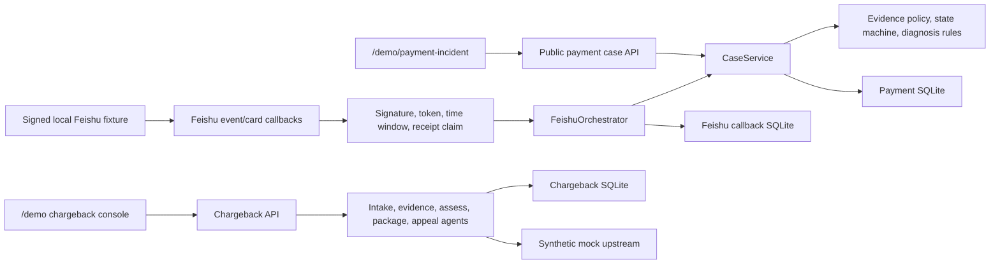

# OceanPilot EvidenceOS Architecture

## 1. Scope and product shape

OceanPilot 的目标形态是证据驱动的综合商户成功智能体。当前仓库没有假装一次完成全部产品，而是验证两个 synthetic 纵向切片：

- **支付异常协作：** 支付案件、readiness、四条确定性诊断规则、责任路由、审计、支付 cockpit 和 signed local Feishu fixture。
- **拒付申诉：** 独立的拒付智能体集群、证据门槛/SLA、胜诉评估、打包、申诉草稿、人工门、审计、指标和 `/demo` console。

两条链均不连接 Oceanpayment 生产系统。系统不执行支付、退款、风控放行、资金移动、生产配置变更或真实上游提交；真实飞书测试群也尚无公网 HTTPS 联调证据。

## 2. Current runtime



依赖方向由外向内。领域层不知道 FastAPI 或 SQLite；应用服务依赖领域模型和 Store port；适配器实现持久化、HTTP、模型与上游边界。

## 3. Ownership

| Layer | Owns | Must not own |
|---|---|---|
| FastAPI / demo surfaces | 严格 DTO、状态码、安全错误、把 API 响应渲染为页面 | readiness、规则结论、SQL、凭据、伪造 confidence/route/audit |
| Payment `CaseService` | 建案、读案、补证、诊断编排和有限重算 | HTTP 细节、SQL、外部网络调用 |
| Payment domain | 证据规范化、readiness、状态机、置信度和四条确定性规则 | 数据库连接、Web 框架 |
| Feishu adapter/orchestrator | 验签、回执去重、消息/卡片映射、角色化补问与确认审计 | 业务动作、证据可信度注入、资金操作 |
| Chargeback supervisors | 原因识别、证据循环、评估、打包、草稿和人工门 | 真实自动提交、资金动作 |
| Store adapters | 事务、CAS、replay/conflict、hydration 和审计持久化 | 规则判断、网络调用 |

## 4. Payment incident flow

```text
POST /api/v1/cases
  -> synthetic PAYMENT_INCIDENT case + CASE_CREATED audit
POST /api/v1/cases/{case_id}/evidence
  -> server-owned MERCHANT / USER_REPORTED origin
  -> normalize evidence, rebuild readiness, CAS commit + audits
POST /api/v1/cases/{case_id}/diagnose
  -> evidence gate
  -> deterministic DiagnosisEngine
  -> snapshot + hypotheses + evidence refs + route + audit atomically committed
  -> 201 CREATED or identity replay 200
```

诊断身份为 `(case_id, evidence_revision, policy_version)`。相同身份 replay 已持久化快照；证据并发变化时服务在有限预算内重算，耗尽后返回稳定冲突。跨案件证据引用会让整个事务回滚。低置信度、冲突、风险、低来源质量或无规则结果进入人工复核。

支付 cockpit 只调用上述公开 API。它不会提交 `source_reliability`，也不会硬编码规则、置信度、责任团队、revision 或审计结果；任一步失败即停止并只展示阶段、HTTP status、安全错误 code 和 trace ID。

## 5. Signed local Feishu flow

```text
signed message callback
  -> verifier + exact-payload receipt claim
  -> create/bind one payment case
  -> seven signed evidence actions + role-scoped cards
  -> readiness threshold + diagnosis card
  -> signed human confirmation
  -> one approval audit; core case unchanged
```

`examples/signed_fixture_demo.py` 每次生成随机凭据和 synthetic 外部标识，使用 in-process outbound transport，不访问外网。相同消息与确认 payload replay 不产生重复案件、卡片或审批；非空工作目录在写入前 fail closed。fixture 明确输出 `business_action_executed: false`。

真实飞书配置继续使用环境变量。未配置完整凭据时，支付/拒付核心和 `/health` 可用，飞书路由返回固定安全 `503`。

## 6. Chargeback flow

```text
description
  -> Intake: classify / ask human to confirm
  -> Evidence: reason-specific checklist + deadline
  -> Assess: deterministic likelihood, route and human-review gate
  -> Package: bank/card-scheme-oriented synthetic package
  -> Appeal: draft; approved submission goes only to MockUpstreamConnector
  -> durable audit and metrics
```

模型可用于解释/草稿，但确定性内核拥有门槛和数字。mock upstream 是本地 synthetic 测试边界，不是 Oceanpayment 或卡组织真实提交。

## 7. Persistence and consistency

系统保留三个独立 SQLite 文件：

- payment core：案件、证据、诊断和 core audit；
- chargeback：拒付案件和 audit；
- Feishu callback：事件/动作 receipts、chat binding 和 approval audits。

每个聚合内部使用短事务与 CAS；三个库之间没有分布式事务。跨表面展示属于 best effort。支付人工确认只提交 Feishu receipt 和 approval audit，不修改 payment core case。

Feishu 外部 chat/actor 标识在 Store 边界使用命名空间哈希；receipts 保存 payload hash 而不保存 callback body。凭据、原始 actor/chat/thread、callback body 和证据正文不得进入安全错误、日志或审批审计。

## 8. HTTP and trust boundary

当前 OpenAPI 实际包含 **19 条 paths**：payment case/diagnosis、chargeback、Feishu callbacks 和 health。`/demo`、`/demo/payment-incident` 及 `/` redirect 不进入 OpenAPI。

请求模型拒绝未知字段、非法 UUIDv4、错误 synthetic 类型、NaN/Infinity 和非法 RFC3339。错误使用安全 `application/problem+json`，带 request/trace 关联；错误响应不复制 Pydantic 原始输入、异常、SQL、证据正文或凭据。

## 9. External boundary

已实现的是两个 synthetic 本地切片及其测试/CI 配置，不是生产系统。仍需验证或建设：

- 真实 Oceanpayment 只读/写入适配与数据治理；
- 真实飞书测试群的公网 HTTPS smoke；
- A2A、MCP、工单、SLA、通知和自动派单；
- 鉴权、限流、生产可观测性、部署与云数据库；
- 真实上游申诉流程和业务效果。

当前不能声称真实集成、生产就绪、实测商业收益或 Gate 4 PASS。状态与依赖见 [roadmap/incomplete-work.md](roadmap/incomplete-work.md)。
