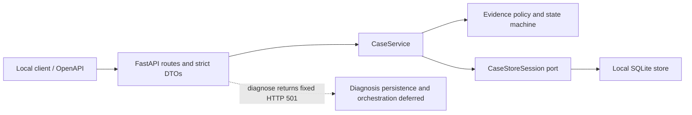

# OceanPilot Foundation Architecture

## 1. Scope

当前系统是一个使用合成数据的本地支付异常协作基础原型。它只启用 `PAYMENT_INCIDENT`，提供健康检查、案件创建/读取和证据追加。诊断入口存在，但固定返回 `501 FEATURE_DEFERRED`；没有真实 Oceanpayment、飞书 Agent、A2A、MCP、工单或支付系统连接。

## 2. Current Runtime Shape



依赖方向由外向内。领域层不知道 FastAPI 或 SQLite；应用服务依赖领域模型和 Store port；SQLite adapter 实现 port；API 只把 HTTP 请求映射为应用命令。

## 3. Layer Ownership

| Layer | Owns now | Must not own |
|---|---|---|
| FastAPI API | 严格 DTO、UUIDv4/RFC3339 边界、依赖注入、状态码、固定安全错误 | readiness 计算、规则执行、SQL、revision 修改、路由选择 |
| `CaseService` | 创建/读取/追加证据的命令顺序，一次 Store session，一次 CAS 写入尝试 | HTTP 细节、SQL、伪诊断结果、外部网络调用 |
| Domain | 证据规范化、ActiveEvidenceView、readiness、状态机、置信度和四条确定性规则 | 数据库连接、当前时间/UUID 生成、Web 框架 |
| Store port / SQLite adapter | 连接生命周期、外键、自包含短事务、条件更新、replay/conflict、审计持久化 | 规则判断、网络调用、业务文案 |

API 因此永远不直接拥有 readiness、SQL 或 revisions。它返回的 `CaseView` 是应用服务与 Store 完成领域和事务处理后的结果。

## 4. Foundations Already Present Before This Milestone

原实施计划 Tasks 0–8 已留下可复用基础，而不是另起一套临时代码：

| Task | Existing asset |
|---:|---|
| 0 | 报名文案与能力声明边界被冻结；该文案的最终事实同步仍留到 Task 18 |
| 1 | Python 3.12 项目、固定依赖和测试工具链 |
| 2 | 严格 Pydantic 领域模型、枚举、UUIDv4、带时区时间和 immutable evidence |
| 3 | EvidenceItem 规范化、content hash、ActiveEvidenceView 与 readiness 策略 |
| 4 | 显式状态机、置信度门和四个 rule ID 的确定性规则表 |
| 5 | 冻结的应用 commands、稳定错误和原子 Store ports |
| 6 | 已提交的 Gate 1 独立领域审查报告 |
| 7 | 原生 `sqlite3` 连接、六表 schema、外键和事务 primitive |
| 8 | 案件创建与证据追加的原子事务、replay/conflict、rollback 和并发写检查 |

Foundation Tasks 1–3 在这些资产上新增薄 `CaseService`、FastAPI lifespan/安全错误，以及精确五条公开路径。没有复制或重写领域规则与 SQLite schema。

## 5. Lifecycle and Connections

`create_app()` 解析 `Settings`，构造 Store factory 与 `CaseService`，并立即挂到 `app.state`；这一阶段不创建数据库文件。进入 FastAPI lifespan 后才执行 schema 初始化，再打开一个 Store session 做健康检查。每个业务命令通过 factory 获得自己的连接并显式关闭；SQLite 连接启用外键并使用短事务。

默认数据库路径为 `work/oceanpilot.db`，可由 `OCEANPILOT_DB_PATH` 覆盖。服务示例只绑定 `127.0.0.1`。

## 6. Command Data Flows

### Create case

```text
strict CreateCaseRequest
  -> server request/trace IDs
  -> CaseService validates PAYMENT_INCIDENT and sensitive-data boundary
  -> domain computes empty readiness and creation status
  -> Store atomically inserts case + CASE_CREATED audit
  -> CaseView
```

新案件从 `case_revision=1`、`evidence_revision=0` 开始。

### Append evidence

```text
strict EvidenceCreateRequest
  -> server-owned MERCHANT / USER_REPORTED / synthetic origin
  -> load one CaseInputSnapshot
  -> normalize EvidenceItem and content hash
  -> rebuild ActiveEvidenceView and readiness
  -> compute target state
  -> Store atomically appends evidence + updates case/revisions + writes audits
  -> created CaseView or replay/conflict result
```

同一证据 ID 和同一规范化内容由 Store 判定 replay，不重复写入；同一 ID 的不同内容返回 `409 EVIDENCE_CONFLICT`。当前应用服务对并发 case revision 冲突只做一次尝试，不在隐藏循环中重算。

### Read case

`GET /api/v1/cases/{case_id}` 通过 `CaseService.get_case()` 和 Store hydrator 返回案件、readiness、按稳定顺序重建的证据以及可选当前诊断。缺失案件返回固定 `404 CASE_NOT_FOUND`。

### Diagnose

诊断 schema 和 domain rule assets 的存在不等于运行时诊断链已经完成。当前缺少 Task 9 的诊断 snapshot CAS/去重/引用事务，以及 Task 11 的 `CaseService.diagnose()` 编排。若现在执行规则后丢弃结果，或写入内存假 snapshot，都会破坏 replay、revision 与审计语义。因此路由不调用规则或 Store，只抛出 `FeatureDeferred`，由统一 handler 返回：

```json
{
  "status": 501,
  "code": "FEATURE_DEFERRED",
  "detail": "diagnosis is deferred in the foundation milestone"
}
```

## 7. Storage Boundary

SQLite schema 当前包含六张表：`cases`、`evidence_items`、`diagnosis_snapshots`、`hypotheses`、`hypothesis_evidence_refs` 和 `audit_events`。Foundation 运行路径实际写入案件、证据和相应审计；诊断相关表为后续契约基础，当前 API 不写入它们。

案件聚合和审计在同一事务中提交。证据追加使用预期 case/evidence revisions 做条件写入，避免静默覆盖；Store 从不调用规则或外部服务。schema 初始化不启用 WAL，也没有文件上传、WORM、JCS 或哈希链声明。

## 8. HTTP and Trust Boundary

| Method and path | Current result |
|---|---|
| `GET /health` | SQLite 可用时 `200 {"status":"ok"}` |
| `POST /api/v1/cases` | synthetic payment incident 创建成功时 `201` 和 `Location` |
| `GET /api/v1/cases/{case_id}` | 读取成功 `200` |
| `POST /api/v1/cases/{case_id}/evidence` | 首次写入 `201`；replay `200`；conflict `409` |
| `POST /api/v1/cases/{case_id}/diagnose` | 固定 `501 FEATURE_DEFERRED` |

请求模型拒绝未知字段、非 UUIDv4 ID、非严格 `true` 的 synthetic 值、NaN/Infinity、非闭合 typed value 和无时区/非精确 RFC3339 时间。可疑敏感输入在领域边界再次扫描。当前错误体固定为 `status`、`code`、`detail`，不复制原始验证输入、异常文本或 SQL。

这只是基础安全边界。完整 RFC 9457 media type、trace header、鉴权、限流、生产日志和五表面泄漏回归均在后续任务中。

## 9. Deferred Extension Order

后续必须沿现有边界依次扩展：诊断持久化 Task 9 → Persistence Gate 2 → 完整服务编排 Task 11 → API 安全合同 Tasks 12–14 → 三个 synthetic E2E 场景 Task 15 → security/CI 与 Gate 3 Tasks 16–17 → 最终事实审计和 release Task 18。

具体文件所有权、影响与每条可运行验收命令见 [roadmap/incomplete-work.md](roadmap/incomplete-work.md)。在这些门完成前，不声明真实系统集成、自动派单、业务效果或生产就绪性。
