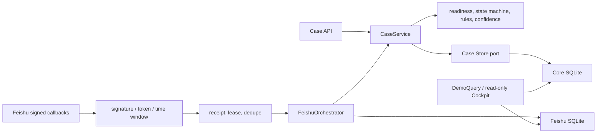

# OceanPilot Showcase Architecture

## 1. Scope

当前系统是 synthetic 跨境支付异常协作比赛原型。它启用 `PAYMENT_INCIDENT`，打通建案、补证、持久化诊断、责任建议、飞书人工确认审计和只读 Cockpit。它不连接 Oceanpayment 生产系统，不执行资金或生产动作。

## 2. Runtime Shape



依赖方向由外向内。应用层依赖 Protocol，不依赖 SQLite；domain 不知道 FastAPI、飞书或数据库；adapter 负责外部协议、SQL 和事务。

## 3. Core Case Flow

### Create and evidence

严格 HTTP/飞书 DTO 转换为应用 command。领域层构建 active evidence view、readiness 和目标状态；Store 用预期 case/evidence revision 原子写案件、证据和审计。同 ID 同规范内容 replay，同 ID 异内容 conflict。

### Diagnose

`CaseService.diagnose()`：

1. 读取冻结的案件输入 snapshot；
2. evidence 未达标则拒绝；
3. 运行四条确定性规则与置信度策略；
4. 构造 evidence-cited diagnosis、route、ticket draft；
5. 用 `(case_id, evidence_revision, policy_version)` replay/CAS 持久化；
6. 证据并发变化时最多重算三次；
7. 在同一 core DB 事务写 diagnosis、引用、route/state audit。

规则无命中、冲突、低置信度、来源质量不足或风险决策不会产生自动业务动作，只会进入人工复核。

## 4. Feishu Flow

```text
signed event
  -> time/signature/token validation
  -> event receipt claim with lease and payload hash
  -> allowed test-group check and robot suppression
  -> chat/thread binding
  -> create/reload case
  -> server-owned question card
  -> signed card action
  -> evidence append and next question
  -> diagnosis card after readiness
  -> signed confirmation
  -> current-diagnosis validation
  -> one semantic approval audit
```

Receipt、claim token 和 lease fencing 处理重放、处理中请求和崩溃接管。不同 event 的重复确认由 `(case_id, diagnosis_id, action_kind)` 语义唯一性去重。原始 reviewer 身份只用于生成 hash；confirmation 不改变 core case，案件仍为 `HUMAN_REVIEW`。

外部发送只通过 `FeishuOutboundClient`。本地 signed fixture runner 注入 synthetic transport，因此不访问外网。

## 5. Two SQLite Stores

### Core SQLite

持久化案件、证据、诊断 snapshot、hypotheses、evidence refs 和核心 audit。案件视图与最多 200 条安全 audit 在同一 deferred read transaction 中读取；第 201 条只用于标记截断。

### Feishu SQLite

持久化 callback receipts、租约、chat/thread binding、outbound replay metadata 和 approval audit。hydrator 对 synthetic 标记、时间和确认语义做严格校验。

两个库没有分布式事务。Cockpit 分别执行短读取，将一致性明确标为 `READ_ONLY_BEST_EFFORT`；飞书库不可用时 core case 仍返回 200，confirmation 显示 `UNAVAILABLE`。

## 6. Read-only Demo Boundary

`GET /api/v1/demo/cases/{case_id}` 使用严格、冻结、白名单 DTO：

- 展示案件摘要、revision、readiness、证据代码和值、诊断、引用、route、确认状态和安全 audit timeline；
- 排除 `source_ref`、`content_hash`、audit metadata、底层 request/trace、actor hash、action/approval ID 和凭据；
- 返回前再次执行 sensitive-data sentinel；
- `/demo` 和 `/demo/cases/{case_id}` 没有表单、按钮或 mutation fetch；
- 动态内容通过 `textContent` 写入 DOM。

## 7. HTTP Surfaces

OpenAPI 当前含 8 条 path：

| Method | Path | Purpose |
|---|---|---|
| GET | `/health` | Store health |
| POST | `/api/v1/cases` | Create case |
| GET | `/api/v1/cases/{case_id}` | Read case |
| POST | `/api/v1/cases/{case_id}/evidence` | Append/replay evidence |
| POST | `/api/v1/cases/{case_id}/diagnose` | Create/replay diagnosis |
| POST | `/api/v1/feishu/events` | Signed event callback |
| POST | `/api/v1/feishu/card-actions` | Signed card callback |
| GET | `/api/v1/demo/cases/{case_id}` | Safe Cockpit projection |

静态 HTML/CSS/JS routes 不进入 OpenAPI。所有 4xx/5xx API 错误使用固定 `application/problem+json`，验证错误位置经过白名单清洗。

## 8. Trust and Safety Boundary

- 所有业务数据必须为 `synthetic=true`；
- callback 校验签名、verification token、时间窗口、app/chat 范围和事件重放；
- caller 不能提交 source reliability、confidence、route 或 approval identity；
- credential 只从环境注入，配置 dataclass 隐藏 repr；
- actor 原文、tenant/chat/thread identity、credential 和 callback body 不写 core audit 或公开响应；
- sensitive input 在写入前拒绝；receipt 只保留 replay identity 与 payload hash；
- 集中 sentinel 测试扫描 HTTP、日志、两库及 sidecar bytes、snapshot/audit 和静态资源。

## 9. Demonstration Tiers

1. 真实飞书测试群 + 公网 HTTPS callback：外部条件满足时的首选路径；
2. signed fixture runner：同一签名和业务路由，synthetic transport，无外网；
3. `examples/demo.ps1`：四规则 direct API fallback。

真实飞书 smoke、远端 CI 和匿名 GitHub 发布必须有外部证据才能标记 PASS。本地 fallback 不代替这些外部门。

## 10. Deferred Production Work

鉴权/授权、限流、生产 secret manager、观测性、备份恢复、云数据库、WORM/哈希链、真实 Oceanpayment adapter、工单/SLA/A2A/MCP 和任何执行器均不在当前比赛构建中。
