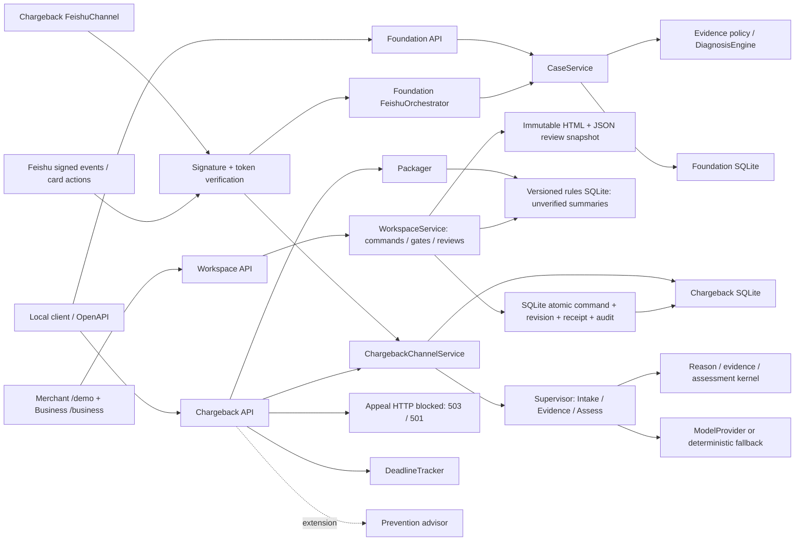

# OceanPilot Runtime Architecture（2026-09-06 双端工作台）

## 1. Scope

当前系统以 **跨境拒付申诉协作** 为唯一产品主线，同时保留一个 Foundation 能力验证切片。两者彼此分离且只使用合成数据：

1. **产品主线 — synthetic chargeback cluster：** HTTP/Web Intake、理由确认、逐项补证、
   材料登记与分层闸门、实际规则引用、当前版本人工登记复核、HTML/JSON 摘要、
   持久化操作回执与审计。最终模拟发送由后端关闭。Prevention advisor 是交易前扩展示例，不属于申诉主链。
2. **能力验证 — Foundation `PAYMENT_INCIDENT`：** 健康检查、案件创建/读取、证据追加、
   确定性诊断 snapshot/CAS/replay，以及经签名校验的飞书事件/卡片回调。

Foundation 用于证明版本化证据、确定性诊断、人工闸门、审计和签名飞书回调等底层能力可以独立运行，不作为第二个产品对外叙述。两条切片使用不同的应用服务和 SQLite 文件。真实 Oceanpayment 数据、真实银行规则、
外部 A2A/MCP/工单、真实上游申诉和任何资金动作都未接入。Foundation 签名飞书回调
已经过 synthetic callback seam 验证；chargeback `FeishuChannel` 也已通过显式
`/chargeback` 指令和 namespaced 卡片动作接入相同签名路由，但尚未做真实 tenant smoke。

## 2. Current Runtime Shape



所有依赖保持由外向内。领域层不知道 FastAPI、SQLite、飞书 SDK 或 Anthropic SDK；
应用层依赖领域模型与 ports；adapters 实现持久化、模型、规则和渠道边界。

## 3. Layer Ownership

| Layer | Owns now | Must not own |
|---|---|---|
| FastAPI / Web surfaces | 严格 DTO、状态码、Problem Details、依赖注入、synthetic console 渲染 | 领域评估、SQL、真实业务动作 |
| Foundation `CaseService` | 建案/读案/补证/诊断编排、diagnosis identity replay 与有限 CAS 重算 | HTTP 细节、SQL、外部网络调用 |
| Foundation domain | Evidence contract、readiness、状态机、置信度、四条确定性诊断规则 | 数据库、当前时间/UUID、Web 框架 |
| Foundation Store | 六表 schema、事务、evidence/diagnosis CAS、snapshot/replay、原子审计 | 规则判断、网络调用、业务文案 |
| `ChargebackChannelService` / Supervisor | 归一化 channel 输入、Intake/Evidence/Assess 相位与人工闸门 | 渠道 SDK、SQL、真实提交 |
| Chargeback domain | reason/evidence 内部清单、材料就绪度、关键/普通缺口分层、人工路由、预防建议 | 模型生成、数据库、外部调用 |
| WorkspaceService | 同案视图、明确确认命令、疑点与人审门槛、规则引用、确定性摘要快照 | HTTP 细节、SQL、模型自动执行写操作 |
| Chargeback / Workspace Store | 案件/材料/疑点/审核/Agent 回合/摘要持久化、CAS、命令原子回执与审计 | 业务结论、外部网络、正文识别 |
| Model/KB/deadline/upstream adapters | 有期限的可选解释、实际版本规则匹配、内部演示时限、未启用的 Mock 连接器 | 改写确定性结论或执行真实业务动作 |

## 4. Lifecycle and Composition

`create_app()` 解析 `Settings` 并构造 Foundation `CaseService`、chargeback
Supervisor/Store、WorkspaceService、Packager、Appeal、Prevention、DeadlineTracker 和进程内 metrics。
这一阶段不创建数据库文件。进入 FastAPI lifespan 后才初始化 Foundation schema 和
chargeback/workspace 与独立规则 schema，并执行 Foundation Store 健康检查；配置飞书时，callback store
factory 也在 lifespan 中挂载。

- Foundation DB 默认 `work/oceanpilot.db`，由 `OCEANPILOT_DB_PATH` 覆盖。
- Chargeback DB 默认使用同目录下 `oceanpilot-chargeback.db`，由
  `OCEANPILOT_CHARGEBACK_DB_PATH` 覆盖。
- Feishu callback DB 仅在完整凭据配置后启用，由 `OCEANPILOT_FEISHU_DB_PATH` 覆盖。
- 规则 DB 默认同目录 `oceanpilot-rules.db`，由 `OCEANPILOT_RULES_DB_PATH` 覆盖；规则是 `UNVERIFIED_SUMMARY`，不是生产核验依据。
- 模型默认离线 `ScriptedModelProvider`；显式 `OCEANPILOT_CHARGEBACK_LIVE_MODEL=1` 才启用已选定的 DeepSeek。凭据只走环境变量，其他 provider 不进入当前正式演示配置。
- 模型调用有单次期限和请求总预算；异常结果标为 `FALLBACK`，确定性规则输出为 `DETERMINISTIC`，实际模型输出为 `MODEL`。供应商配置不等于本次输出来源。
- `OCEANPILOT_MOCK_SEND_ENABLED` 默认 0。最终发送 HTTP 默认 503；即使设为 1 也返回 501，等待冻结版本批准、幂等提交和回执恢复联合验收。

## 5. Foundation Data Flows

### Create case

```text
strict CreateCaseRequest
  -> server request/trace IDs
  -> CaseService validates PAYMENT_INCIDENT and sensitive-data boundary
  -> domain computes empty readiness and creation status
  -> Store atomically inserts case + CASE_CREATED audit
  -> CaseView
```

新案件从 `case_revision=1`、`evidence_revision=0` 开始。

### Append evidence

```text
strict EvidenceCreateRequest
  -> server-owned MERCHANT / USER_REPORTED / synthetic origin
  -> load one CaseInputSnapshot
  -> normalize EvidenceItem and content hash
  -> rebuild ActiveEvidenceView and readiness
  -> compute target state
  -> Store atomically appends evidence + updates revisions + writes audits
  -> created CaseView or replay/conflict result
```

同一 evidence ID 和同一规范化内容由 Store 判定 replay；同一 ID 的不同内容返回
`409 EVIDENCE_CONFLICT`。公开 Foundation HTTP 输入不能注入来源可信度、案件状态、
revision 或路由结论。

### Diagnose

`CaseService.diagnose()` 载入当前证据视图、强制 readiness、运行
`DiagnosisEngine`，并把诊断 snapshot、假设、证据引用、责任路由与审计原子提交。
诊断 identity 为 `(case_id, evidence_revision, policy_version)`；相同 identity replay
已持久化 snapshot，新证据只让旧诊断历史化。stale 输入在有限重试耗尽后返回稳定
冲突，跨案件证据引用会回滚事务。

低置信度、冲突证据、风险决策、低来源质量和无规则结果进入人工复核。Foundation
飞书证据固定为 `USER_REPORTED`，因此签名飞书链的诊断要求人工复核；确认只写审计，
不改变案件状态或执行业务动作。

## 6. 双端合成正式争议链路

```text
/demo MERCHANT + /business BUSINESS
  -> POST workspace/commands: COPY_SAMPLE or confirmed CREATE_CASE
  -> same case_id + revision + formal-dispute premise
  -> REGISTER_MATERIAL: metadata/source only, file content NOT_READ
  -> material gate + unresolved concerns + actual rule match
  -> BUSINESS REVIEW: explicit scope, current version, saved history
  -> POST summaries(expected_revision): deterministic snapshot
  -> save HTML/JSON after version + review + rule-change checks
  -> GET saved summary: no model, no re-analysis, immutable old version
```

`WorkspaceService` 显示更细的工作阶段，包括关键缺失、有限分析、疑点待审、无精确规则、待登记复核与当前登记复核通过。内部 Supervisor 继续兼容四个相位 `NEEDS_INTAKE / REASON_PROPOSED / NEED_EVIDENCE / ASSESSED`：关键缺失即使 finalize 也停在 `NEED_EVIDENCE`；普通缺失 finalize 后可以 `ASSESSED` 有限分析，缺口仍随视图返回。完整内部清单仍强制人工复核。旧 `win_likelihood` 字段仅作兼容，含义是材料就绪度，不能当作真实胜诉概率。

`X-Demo-Role` 只表达本地演示的提交/复核职责，不是生产认证。写操作由严格结构化命令、`confirmed:true` 和 `expected_revision` 约束；AI 提议必须经过人工确认，不因模型给出动作就自动执行。同一 `command_id` 和同一完整内容重试返回原回执；同 ID 不同内容冲突。案件变更、版本、审计和命令回执使用同一 SQLite 写事务。

疑点由人工或结构化输入登记，保留字段、旧新值、两侧来源、版本、处理人与审核说明；来源未知自动形成待复核记录。这不声称从文件正文检测了矛盾。新材料、撤回、原因/卡组织纠正或疑点变化使旧审核历史化。当前人工审核只能覆盖所选登记范围，不能证明交易真实或材料正文一致。

摘要保存案件说明、材料元数据、缺口、规则版本与限制、人工记录、下一步及未核验事项。生成不调用模型，不拼接不同版本结果；保存时校验案件及审核状态，规则指纹变化也要求重新生成。已保存的旧摘要只代表原版本，刷新或重启后可恢复读取。

规则库按实际卡组织和原因进行精确映射。Visa 10.4、Visa 13.1、Mastercard 4853 引用各自版本；默认模板或无来源旧规则只可用于内部清单解释，不作为正式依据。内存 fallback 不使包自动获得可提交资格。兼容 `ready_to_submit` 仅反映内部模板准备条件，不能视为真实上游提交授权；HTTP 发送端点始终在调用模型或连接器前拒绝。

旧 Chargeback HTTP/飞书渠道仍保留受理和登记兼容路径。只读案件/规则/材料预览 GET 使用确定性投影，不重新调用模型或隐式写入审核。`DeadlineTracker` 是内部演示窗口与提醒计算，没有 Scheduler/Messenger。Prevention 仅对 synthetic signals 给建议。日志为 PII-free 请求关联日志；DecisionMetrics 为进程内计数，均不是生产观测平台。

## 7. Storage Boundaries

| Store | Tables / state | Current boundary |
|---|---|---|
| Foundation SQLite | `cases`、`evidence_items`、`diagnosis_snapshots`、`hypotheses`、`hypothesis_evidence_refs`、`audit_events` | Foundation snapshot/CAS/replay 与原子审计 |
| Chargeback / Workspace SQLite | 案件、材料、审计、Agent 回合、人审记录、工作台元数据/疑点、命令回执、摘要 | 同一文件中的版本化协作；部分传统预览按当前状态计算；不保存可发送的冻结包或上游回执 |
| Rules SQLite | 文档来源、规则版本、Demo 映射 | 独立未核验摘要库；导出检查规则指纹变化 |
| Feishu callback SQLite | 事件/动作回执、chat↔Foundation case 绑定、确认审计 | 独立回调回执与绑定；拒付案件自身写入 Chargeback Store |

Store 从不调用领域规则或外部服务。当前没有文件上传、对象存储、WORM、JCS、哈希链、
云数据库或备份声明。

## 8. HTTP and Trust Boundary

当前准确路径以 `/docs` 和生成的 OpenAPI 为准；不沿用历史版本的固定路径总数。

| Surface | Current result |
|---|---|
| Foundation core / Feishu | 健康、建案/读案/补证/诊断及签名回调；未配置回调凭据安全拒绝 |
| Chargeback compatibility | 受理/读案/确认/登记/撤回/finalize、只读规则与材料预览；最终发送禁用 |
| Case Agent | 保存当前版本分析与明确动作建议，写入仍受人工与后端门槛约束 |
| Workspace | 同案列表/详情、结构化命令与回执、当前人审、疑点、HTML/JSON 摘要 |
| Web | 用户端 `/demo`、业务端 `/business`；运行维护端另行 `/admin` |

完整字段、错误与重试语义见 [工作台合同](implementation/2026-09-06-workspace-contract.md)。

Foundation 请求拒绝未知字段、非 UUIDv4 ID、非严格 `true` 的 synthetic 值、NaN/Infinity、
非闭合 typed value 和无时区时间。Chargeback 请求由独立严格 DTO/枚举约束。可疑敏感
输入在领域边界再次扫描。错误使用 RFC 9457 `application/problem+json`，不复制原始
验证输入、异常文本或 SQL。中间件添加 `X-Trace-ID`；Foundation 成功响应与错误合同
还包含 request/trace 关联字段。

## 9. Deferred Extension Boundary

本版具备合成双端协作与复核摘要，仍不声明生产就绪。后续项为：

- 冻结版本发送批准、持久化幂等提交、Mock 回执恢复；验收前后端拒绝发送；

- #21 公司流程、保密等级、真实 reason-code/证据模板/银行规则与脱敏案例；
- 公网 HTTPS 部署与 chargeback 真实 tenant smoke；
- 在真实规则体量证明需要后再实现 RAG/向量检索；
- Scheduler/Messenger、出站 SLA 通知与经确认的生产状态流转；
- 真实 Oceanpayment、外部 A2A/MCP/工单/上游申诉连接；
- 鉴权、限流、生产日志/metrics backend、云数据库、备份、部署和运行保障。

未完成项不会用内存假结果或展示文案冒充真实集成。路线状态见
[roadmap/incomplete-work.md](roadmap/incomplete-work.md)，飞书配置见
[feishu-setup.md](feishu-setup.md)，本地演示见 [demo.md](demo.md)。
