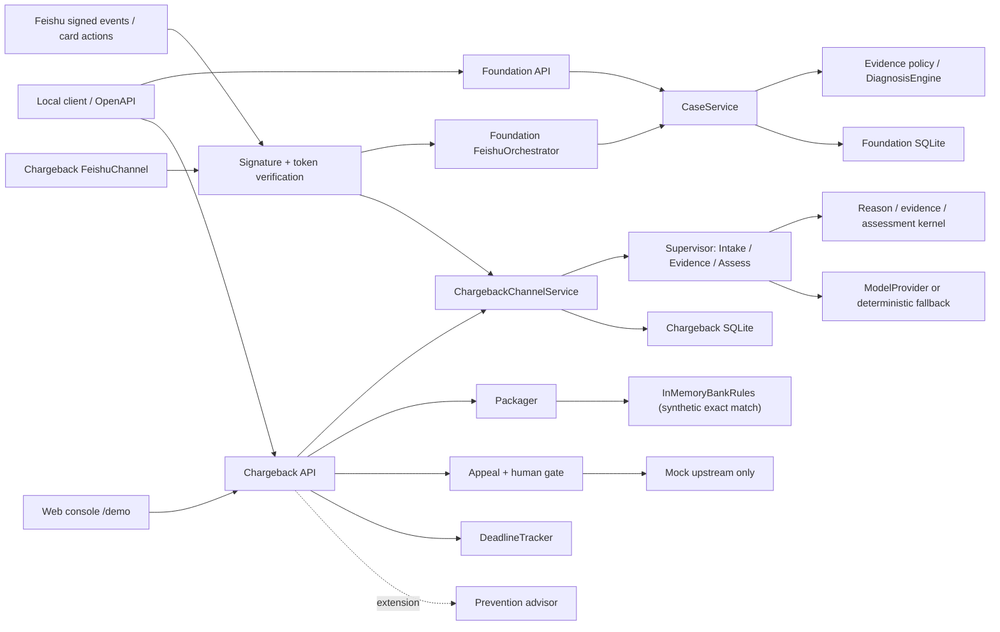

# OceanPilot Runtime Architecture (`v0.2.1`)

## 1. Scope

当前系统以 **跨境拒付申诉协作** 为唯一产品主线，同时保留一个 Foundation 能力验证切片。两者彼此分离且只使用合成数据：

1. **产品主线 — synthetic chargeback cluster：** HTTP/Web Intake、理由确认、逐项补证、
   确定性胜诉评估、银行规则打包、人工闸门后的 mock Appeal、时限计算、
   审计与 agent trace 展示。Prevention advisor 是交易前扩展示例，不属于申诉主链。
2. **能力验证 — Foundation `PAYMENT_INCIDENT`：** 健康检查、案件创建/读取、证据追加、
   确定性诊断 snapshot/CAS/replay，以及经签名校验的飞书事件/卡片回调。

Foundation 用于证明版本化证据、确定性诊断、人工闸门、审计和签名飞书回调等底层能力可以独立运行，不作为第二个产品对外叙述。两条切片使用不同的应用服务和 SQLite 文件。真实 Oceanpayment 数据、真实银行规则、
外部 A2A/MCP/工单、真实上游申诉和任何资金动作都未接入。Foundation 签名飞书回调
已经过 synthetic callback seam 验证；chargeback `FeishuChannel` 也已通过显式
`/chargeback` 指令和 namespaced 卡片动作接入相同签名路由，但尚未做真实 tenant smoke。

## 2. Current Runtime Shape



所有依赖保持由外向内。领域层不知道 FastAPI、SQLite、飞书 SDK 或 Anthropic SDK；
应用层依赖领域模型与 ports；adapters 实现持久化、模型、规则和渠道边界。

## 3. Layer Ownership

| Layer | Owns now | Must not own |
|---|---|---|
| FastAPI / Web surfaces | 严格 DTO、状态码、Problem Details、依赖注入、synthetic console 渲染 | 领域评估、SQL、真实业务动作 |
| Foundation `CaseService` | 建案/读案/补证/诊断编排、diagnosis identity replay 与有限 CAS 重算 | HTTP 细节、SQL、外部网络调用 |
| Foundation domain | Evidence contract、readiness、状态机、置信度、四条确定性诊断规则 | 数据库、当前时间/UUID、Web 框架 |
| Foundation Store | 六表 schema、事务、evidence/diagnosis CAS、snapshot/replay、原子审计 | 规则判断、网络调用、业务文案 |
| `ChargebackChannelService` / Supervisor | 归一化 channel 输入、Intake/Evidence/Assess 相位与人工闸门 | 渠道 SDK、SQL、真实提交 |
| Chargeback domain | reason/evidence 规则、胜诉评估、责任路由、预防风险判断 | 模型生成、数据库、外部调用 |
| Chargeback Store | case/reason/evidence/finalize 持久化、revision CAS、append-only audit | assessment/package/appeal 决策和外部网络 |
| Model/KB/deadline/upstream adapters | 可选解释、内存规则精确匹配、时限计算、mock submission | 改写确定性结论或执行真实业务动作 |

## 4. Lifecycle and Composition

`create_app()` 解析 `Settings` 并构造 Foundation `CaseService`、chargeback
Supervisor/Store、Packager、Appeal、Prevention、DeadlineTracker 和进程内 metrics。
这一阶段不创建数据库文件。进入 FastAPI lifespan 后才初始化 Foundation schema 和
chargeback schema，并执行 Foundation Store 健康检查；配置飞书时，callback store
factory 也在 lifespan 中挂载。

- Foundation DB 默认 `work/oceanpilot.db`，由 `OCEANPILOT_DB_PATH` 覆盖。
- Chargeback DB 默认使用同目录下 `oceanpilot-chargeback.db`，由
  `OCEANPILOT_CHARGEBACK_DB_PATH` 覆盖。
- Feishu callback DB 仅在完整凭据配置后启用，由 `OCEANPILOT_FEISHU_DB_PATH` 覆盖。
- Chargeback 模型默认是离线 `ScriptedModelProvider`。只有显式开启
  `OCEANPILOT_CHARGEBACK_LIVE_MODEL` 才构造分级 live provider；凭据只走环境变量。
  `OCEANPILOT_MODEL_PROVIDER` 可选择 `claude`（缺省）或 `deepseek`；两者均复用
  LOW 直连、MEDIUM 脱敏、HIGH 本地隔离或脱敏兜底的安全路由。

## 5. Foundation Data Flows

### Create case

```text
strict CreateCaseRequest
  -> server request/trace IDs
  -> CaseService validates PAYMENT_INCIDENT and sensitive-data boundary
  -> domain computes empty readiness and creation status
  -> Store atomically inserts case + CASE_CREATED audit
  -> CaseView
```

新案件从 `case_revision=1`、`evidence_revision=0` 开始。

### Append evidence

```text
strict EvidenceCreateRequest
  -> server-owned MERCHANT / USER_REPORTED / synthetic origin
  -> load one CaseInputSnapshot
  -> normalize EvidenceItem and content hash
  -> rebuild ActiveEvidenceView and readiness
  -> compute target state
  -> Store atomically appends evidence + updates revisions + writes audits
  -> created CaseView or replay/conflict result
```

同一 evidence ID 和同一规范化内容由 Store 判定 replay；同一 ID 的不同内容返回
`409 EVIDENCE_CONFLICT`。公开 Foundation HTTP 输入不能注入来源可信度、案件状态、
revision 或路由结论。

### Diagnose

`CaseService.diagnose()` 载入当前证据视图、强制 readiness、运行
`DiagnosisEngine`，并把诊断 snapshot、假设、证据引用、责任路由与审计原子提交。
诊断 identity 为 `(case_id, evidence_revision, policy_version)`；相同 identity replay
已持久化 snapshot，新证据只让旧诊断历史化。stale 输入在有限重试耗尽后返回稳定
冲突，跨案件证据引用会回滚事务。

低置信度、冲突证据、风险决策、低来源质量和无规则结果进入人工复核。Foundation
飞书证据固定为 `USER_REPORTED`，因此签名飞书链的诊断要求人工复核；确认只写审计，
不改变案件状态或执行业务动作。

## 6. Synthetic Chargeback Flow

```text
POST /api/v1/chargeback/cases
  -> Intake proposes a reason and extracts safe facts
  -> low-confidence reason waits at REASON_PROPOSED for human confirmation
  -> Evidence asks for one deterministic missing item at a time
  -> Assess computes win likelihood, evidence breakdown and review routing
  -> GET package applies synthetic in-memory bank/network rules
  -> POST appeal drafts text; only explicit human approval reaches mock upstream
```

当前 Supervisor 相位只有 `NEEDS_INTAKE / REASON_PROPOSED / NEED_EVIDENCE /
ASSESSED`。Package 与 Appeal 不把案件持久化为 `PACKAGED`、`SUBMITTED` 或
`RESOLVED`。Chargeback SQLite 只持久化案件、reason 确认、证据、collection-finalized
和 append-only audit；assessment、package、appeal outcome 与 agent trace 均按当前状态
计算，不声明 snapshot identity、持久化 replay 或 exactly-once。

`InMemoryBankRules` 按 bank + network + reason、network + reason、默认模板的顺序做
精确匹配。`KnowledgeBase` port 和 ingestion schema 已为真实规则预留边界，但当前没有
RAG 或向量库。`DeadlineTracker` 只计算 15/45 天窗口、提醒节点与逾期标志；没有
Scheduler/Messenger，不发送真实通知，也不改变生产状态。

Prevention 只对 synthetic signals 给出建议；Safety Scan 不回显原输入；DecisionMetrics
仅在进程内计数。请求中间件写 method/path/status/request/trace ID 的 PII-free 结构化
日志，但这不是生产日志或 metrics backend。

## 7. Storage Boundaries

| Store | Tables / state | Current boundary |
|---|---|---|
| Foundation SQLite | `cases`、`evidence_items`、`diagnosis_snapshots`、`hypotheses`、`hypothesis_evidence_refs`、`audit_events` | Foundation snapshot/CAS/replay 与原子审计 |
| Chargeback SQLite | `chargeback_cases`、`chargeback_evidence`、`chargeback_audit` | synthetic case/reason/evidence/finalize + revision CAS；不保存 assessment/package/appeal |
| Feishu callback SQLite | 事件/动作回执、chat↔Foundation case 绑定、确认审计 | 独立文件；不存拒付集群状态 |

Store 从不调用领域规则或外部服务。当前没有文件上传、对象存储、WORM、JCS、哈希链、
云数据库或备份声明。

## 8. HTTP and Trust Boundary

OpenAPI 当前冻结 19 条路径；根跳转和 `/demo` 不进入 OpenAPI：

| Surface | Paths | Current result |
|---|---:|---|
| Foundation core | 5 | `/health` + Foundation 建案/读案/补证/诊断 |
| Foundation Feishu integration | 2 | 签名 events/card-actions；未配置返回固定安全 `503` |
| Chargeback case workflow | 8 | 建案/读案/reason 确认/补证/finalize/package/appeal/audit |
| Chargeback support | 4 | catalog、process-local metrics、prevention、safety scan |

Foundation 请求拒绝未知字段、非 UUIDv4 ID、非严格 `true` 的 synthetic 值、NaN/Infinity、
非闭合 typed value 和无时区时间。Chargeback 请求由独立严格 DTO/枚举约束。可疑敏感
输入在领域边界再次扫描。错误使用 RFC 9457 `application/problem+json`，不复制原始
验证输入、异常文本或 SQL。中间件添加 `X-Trace-ID`；Foundation 成功响应与错误合同
还包含 request/trace 关联字段。

## 9. Deferred Extension Boundary

`v0.2.1` 已具备 synthetic 演示、Docker 和基础可观测性，但仍不声明生产就绪。后续项为：

- #21 公司流程、保密等级、真实 reason-code/证据模板/银行规则与脱敏案例；
- 公网 HTTPS 部署与 chargeback 真实 tenant smoke；
- 在真实规则体量证明需要后再实现 RAG/向量检索；
- Scheduler/Messenger、出站 SLA 通知与经确认的生产状态流转；
- 真实 Oceanpayment、外部 A2A/MCP/工单/上游申诉连接；
- 鉴权、限流、生产日志/metrics backend、云数据库、备份、部署和运行保障。

未完成项不会用内存假结果或展示文案冒充真实集成。路线状态见
[roadmap/incomplete-work.md](roadmap/incomplete-work.md)，飞书配置见
[feishu-setup.md](feishu-setup.md)，本地演示见 [demo.md](demo.md)。
