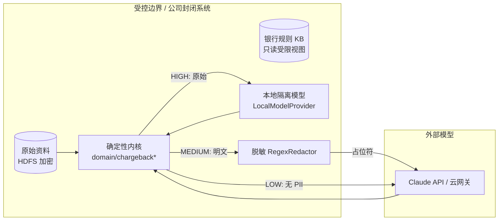

# 安全与部署分级方案（拒付 Agent 集群）

> 状态：待评审 · 版本 v1（2026-08-06）· 对应 issue #20 (T11)
> 关联实现：T7 脱敏（`application/redaction.py`, `adapters/redaction.py`）、
> T8 本地/隔离模型（`adapters/model/local.py`）、T10 组合根开关（`adapters/model/composition.py`）。
> 参见设计文档 `docs/design/2026-08-06-chargeback-agent-cluster-design.md` §7–§8。

本方案回答会议重点：**按每一步的数据敏感度做分级路由，而不是全局一刀切**；并给出飞书企业版 + HDFS 存储的传输/静态加密与访问控制建议。所有取值均与代码中的分级路由/脱敏保持一致，可评审、可落地。

---

## 1. 核心原则

1. **确定性内核决策，模型只解释/起草**：胜诉评估、路由、是否人工、拒付风险分级都由 `domain/chargeback*.py` 的规则内核确定；模型（Claude/本地）只产出解释文字与文书草稿。模型不可用时有确定性兜底。因此**即使模型被攻破也不会改变业务判定**。
2. **数据不出域优先**：触及原始 PII / 交易明细的推理走本地隔离模型；必须调用外部模型时**先脱敏**。
3. **凭据只走环境变量**：不入库、不进日志、不进审计、不进 Git。
4. **纯建议、不执行业务动作**：系统从不执行支付/退款/风控放行/资金操作/真实配置变更；最强动作是「建议人工复核」。

---

## 2. 保密等级与模型部署

三档保密等级由 `application/model_provider.py` 的 `SecurityTier`（`HIGH` / `MEDIUM` / `LOW`）表达，并由 `RoutingModelProvider` 按 `TaskSpec.security_tier` 路由到对应实现。

| 等级 | 触及原始 PII/交易明细 | 推理/起草 | 部署实现 | 代码路由目标 |
|---|---|---|---|---|
| **高 HIGH** | 本地隔离模型（内网/VPC，独立节点，数据不出域） | 本地隔离模型 | `LocalModelProvider`（OpenAI 兼容端点，自持 vLLM/llama.cpp/TGI/Ollama） | `RoutingModelProvider[HIGH]` |
| **中 MEDIUM** | 先脱敏/打码去隐私 | 脱敏后调外部模型（Claude/云网关） | `RedactingModelProvider(ClaudeProvider, RegexRedactor)` | `RoutingModelProvider[MEDIUM]` |
| **低 LOW** | 无原始 PII（模板/文案/结构化事实） | 外部模型 | `ClaudeProvider`（`claude-opus-4-8`，adaptive thinking + effort） | `RoutingModelProvider[LOW]` |

**兜底不确定性**：`build_chargeback_model_provider()` 在未配置本地端点时，将 **HIGH 也接到脱敏路径**（而非明文外发），保证「宁可降级也不泄露」。生产高保密场景**必须**配置本地端点，见 §5。

### 2.1 各 Agent 的默认档位（与代码一致）

| Agent | 默认 `security_tier` | 依据 |
|---|---|---|
| Intake（自由文本→原因码） | `MEDIUM` | 商户自述可能含 PII，脱敏后再分类 |
| Evidence（补问下一项证据） | `LOW` | 仅就证据编码提问，无 PII |
| Assess（胜诉解释） | `LOW` | 输入是结构化判定事实，无 PII |
| Prevention（拒付倾向提示） | `LOW` | 输入是合成布尔/金额/计数信号，无 PII |
| Packager（文书 cover note） | 建议 `MEDIUM`（可配置） | 若草稿含交易明细则脱敏，或改走本地 |

> 高保密部署可将上述档位整体上调（例如 Intake/Packager → `HIGH`），只需在组合根改注入，**不动应用与领域层**。

---

## 3. 数据流（按等级）

- **HIGH**：原始 PII/交易明细仅在受控边界内被本地模型处理，**不出域**。
- **MEDIUM**：出站前 `RegexRedactor` 把卡号/邮箱/电话替换为 `[REDACTED:CARD/EMAIL/PHONE]` 占位符（一次性、单向），外部模型只见脱敏文本；还原（如需）只在受控边界内进行。
- **LOW**：仅发送结构化、无 PII 的事实或模板内容。

### 3.1 脱敏覆盖（T7，`adapters/redaction.py`）

默认规则（有序，先长数字串卡号，再邮箱，再较短电话串，避免二次误配）：

| 类型 | 正则（要点） | 占位符 |
|---|---|---|
| 卡号 | `\b\d(?:[ -]?\d){12,18}\b` | `[REDACTED:CARD]` |
| 邮箱 | `...@...\.[A-Za-z]{2,}` | `[REDACTED:EMAIL]` |
| 电话 | `\+?\d[\d -]{7,}\d` | `[REDACTED:PHONE]` |

规则可通过 `RegexRedactor(patterns=...)` 扩展（如加入护照号、银行账号、地址）。脱敏为**尽力而为的第二道防线**；第一道防线仍是「HIGH 不外发」。

---

## 4. 飞书企业版 + HDFS 存储加密与访问控制

**原则**：原始资料（凭证、聊天记录、文书）留在公司封闭系统；Agent 只拿受限/脱敏视图；跨系统只传引用（ID/hash），不传正文。

### 4.1 传输加密（in transit）
- 所有出入站一律 **TLS 1.2+**（飞书开放平台回调、外部模型 API、本地模型端点内网调用建议 mTLS）。
- 飞书回调**验签 + 时间戳防重放**（已实现 `adapters/feishu/security.py`）；加密事件用飞书 `encrypt_key` 解密后立即校验。
- 本地模型端点即便在内网也建议启用 TLS/mTLS，`LocalModelProvider` 支持 `http(s)` 与 `Authorization: Bearer`（`OCEANPILOT_LOCAL_MODEL_API_KEY`）。

### 4.2 静态加密（at rest）
- **HDFS**：启用 HDFS Transparent Data Encryption（TDE，加密区 Encryption Zone）+ KMS 托管密钥；原始证据正文仅存于加密区。
- **本地 SQLite（案件/审计）**：部署在加密卷（LUKS/dm-crypt）或启用应用层字段加密；`chargeback_audit` 表**不含**凭据、原始用户 ID、证据正文——只存枚举值与 revision（见 `adapters/persistence/chargeback_sqlite.py`）。
- **飞书企业版**：启用企业级数据合规/DLP 与租户级密钥；敏感字段不落卡片明文。

### 4.3 访问控制
- 最小权限：Agent 服务账号只读「受限/脱敏视图」，无原始区写权限；HDFS 加密区按角色（RBAC）+ Ranger/ACL 授权。
- 凭据：`ANTHROPIC_API_KEY`、`FEISHU_APP_SECRET`、`FEISHU_ENCRYPT_KEY`、`FEISHU_VERIFICATION_TOKEN`、本地模型 `API_KEY` **只经环境变量注入**；密钥托管用 Vault/KMS，定期轮换。
- 人在环闸门：⑤提交、⑥超期判负必须人工确认（「确认建议并记录，不执行业务动作」）。

### 4.4 日志/审计/留痕
- 日志与审计**不含**凭据、原始用户 ID、证据正文；需要关联时存 **hash**。
- 审计留痕原子写入、可重放、带 revision（T9 已实现）；`trace_id` 贯穿请求便于追溯而不泄露内容。

---

## 5. 配置开关（与实现对齐）

| 环境变量 | 作用 | 缺省 |
|---|---|---|
| `OCEANPILOT_CHARGEBACK_LIVE_MODEL` | 组合根总开关：`1/true/yes/on` 启用实时分级模型；否则离线合成 Provider | 关（离线） |
| `ANTHROPIC_API_KEY` | Claude 凭据；未设置时 `build_chargeback_model_provider()` 返回 `None`（回退离线） | 无 |
| `OCEANPILOT_LOCAL_MODEL_ENDPOINT` | 本地/隔离模型端点（OpenAI 兼容 `/v1/chat/completions`）；HIGH 档路由目标 | 无（HIGH 退回脱敏路径） |
| `OCEANPILOT_LOCAL_MODEL_NAME` | 本地模型名 | `local-isolated-model` |
| `OCEANPILOT_LOCAL_MODEL_API_KEY` | 本地端点鉴权（可选） | 无 |
| `FEISHU_APP_ID/APP_SECRET/VERIFICATION_TOKEN/ENCRYPT_KEY` | 飞书渠道凭据（缺失则飞书渠道不启用） | 无 |
| `OCEANPILOT_DB_PATH` / `OCEANPILOT_CHARGEBACK_DB_PATH` | 案件/审计 SQLite 文件路径（建议置于加密卷） | `work/...` / 同级 `oceanpilot-chargeback.db` |

**部署建议档位**：

- **高保密生产**：`OCEANPILOT_CHARGEBACK_LIVE_MODEL=1` + 配置 `OCEANPILOT_LOCAL_MODEL_ENDPOINT`（本地隔离）；Intake/Packager 档位上调至 HIGH；HDFS TDE + 加密卷。
- **中等**：启用 Claude + 脱敏（MEDIUM），不配本地端点（HIGH 自动走脱敏兜底）。
- **演示/离线**：默认关，全程走 `ScriptedModelProvider`，无需任何 key，CI 全绿。

---

## 6. 与设计/代码的一致性核对

| 设计要求（§8） | 实现 | 状态 |
|---|---|---|
| 高保密走本地隔离模型 | `LocalModelProvider` + `RoutingModelProvider[HIGH]` | ✅ T8 |
| 中保密先脱敏再外发 | `RedactingModelProvider` + `RegexRedactor` | ✅ T7 |
| 低保密直连外部 | `ClaudeProvider` | ✅ |
| 按数据敏感度路由 | `TaskSpec.security_tier` → `RoutingModelProvider` | ✅ |
| 可注入配置开关 | `build_chargeback_model_provider()` + 环境变量 | ✅ T10 |
| 凭据仅环境变量、日志/审计无敏感 | 审计表仅枚举/revision；凭据 env 注入 | ✅ T9 |
| HDFS/飞书企业版加密 | 本文 §4（运维方案，非代码） | 📄 待运维落地 |

---

## 7. 残留风险与后续

- 脱敏为尽力而为，可能漏配非常规格式 PII → 高保密场景以「不外发」为主、脱敏为辅；按需扩展 `RegexRedactor` 规则并加测试。
- 本地模型质量/资源成本需评估；可先用 mock 端点跑通链路（`LocalModelProvider` 注入 transport）。
- HDFS TDE / 飞书企业版密钥托管属运维交付，需与公司安全团队对齐 KMS/Vault 与轮换策略。
