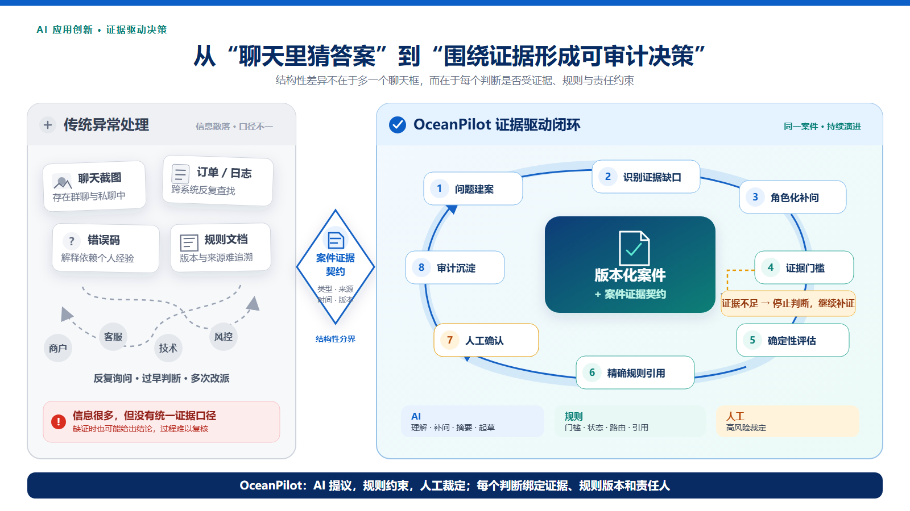
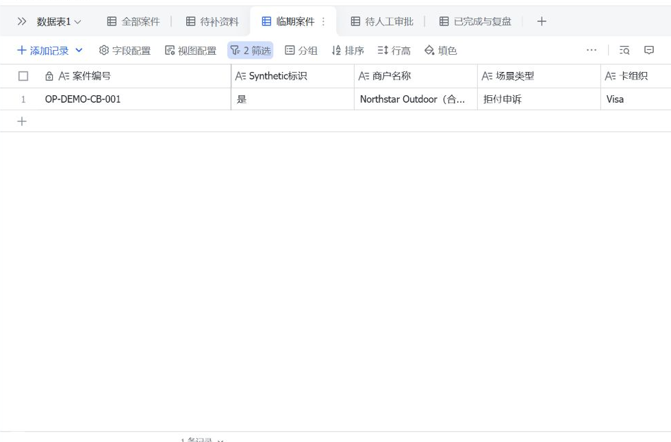
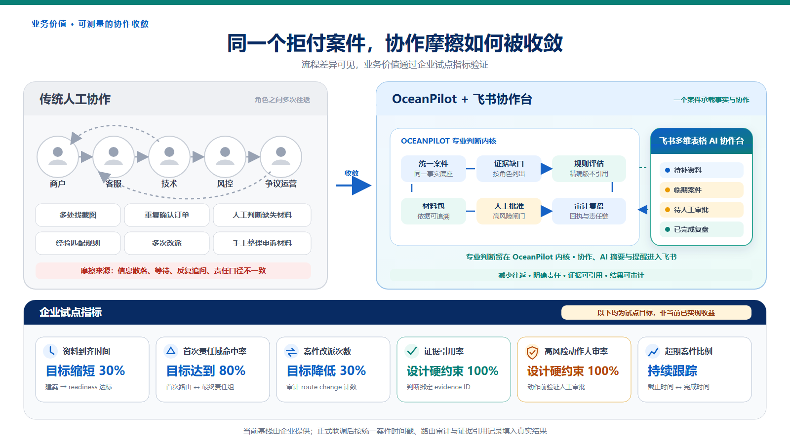

# 【40强赛】钱海网络🤝鹿出草莓酱｜OceanPilot：证据驱动的跨境商户成功智能体

> 版本：2026-08-16 正式方案候选稿
> 数据边界：全文业务数据、案件与动作均为 Synthetic/Mock；不含真实商户、交易或资金操作。
> 项目仓库：<https://github.com/jiang4wqy/oceanpilot-evidenceos>

## 一、参赛方案信息卡

| 项目 | 内容 |
|---|---|
| 队名 | 鹿出草莓酱 |
| 命题 | 钱海网络——AI 驱动的跨境商户成功运营助手 |
| 方案名称 | OceanPilot：证据驱动的跨境商户成功智能体 |
| 一句话摘要 | OceanPilot 先把一次跨境支付问题组织成版本化案件，再用证据契约识别缺口；资料过门后才形成带依据、规则版本、责任域和下一动作的判断，让 AI 提议、规则约束、人工裁定。 |
| 成员介绍与分工 | 蒋灏然：队长，负责产品统筹、方案整合与演示；朱泽林：负责工程协作与核心功能实现；卢薪宇：负责业务场景研究、测试与演示支持。 |
| 使用的飞书 AI 能力 | 多维表格：已创建 Synthetic 案件协作台，导入 3 类案件，配置 5 个视图、2 个 AI 自动填充字段与 4 组视图筛选；3 条提醒自动化已形成配置说明，尚未启用对外通知。 |

## 二、方案成果展示

### 1. 命题场景、问题与痛点

#### 1.1 我们选择从拒付申诉切入

Oceanpayment 面向全球跨境商户。商户上线后遇到的支付失败、拒付、退款、对账差异、配置或回调问题，往往不是一个系统或一个团队可以独立回答。一次拒付可能同时涉及商户、PSP、收单行、发卡行和卡组织；商户无法直接向银行申诉，PSP 需要在有限举证窗口内追齐材料、判断是否值得申诉，再按对应规则组织 representment 材料。

这个场景具备三个特征：

1. **事实分散。** 订单、支付状态、设备信息、风控结果、物流、退款、服务记录、截图和日志分布在不同系统及聊天中。
2. **判断依赖证据。** 同一句“客户说不是本人交易”，可能因为证据来源、时间线和缺失材料不同而得到完全不同的处理结果。
3. **协作具有时限和风险。** 漏证、误判、反复改派或超期可能直接影响处理质量、商户体验和资金风险。

普通聊天机器人可以解释术语，却无法保证每个判断都建立在同一份案件事实之上；普通工单可以记录状态，却不会判断当前证据是否足够。因此，我们先打通“支付异常中的拒付申诉”这一条最深的纵向链路，用它证明综合商户成功智能体的核心能力。

#### 1.2 传统流程的结构性问题

传统协作通常是：商户发来截图，客服转给技术，技术补充日志，风控判断风险，争议运营再重新核对规则。每一次转交都可能丢失上下文，后续人员需要重新追问“哪个订单、发生了什么、有什么证据、谁已经确认”。

根本问题不是信息不足，而是没有统一的证据口径：

- 信息很多，但不知道哪些是事实、哪些只是陈述；
- 材料很多，但不知道是否满足当前 reason code 的最低门槛；
- AI 可以生成答案，但缺少“证据不足时必须停止”的制度；
- 处理完成后，判断依据、规则版本和人工确认难以被复用。



> **插图 1｜AI 应用创新性对比：** 从“聊天里猜答案”到“围绕证据形成可审计决策”。

### 2. 方案优势与创新点

#### 创新一：版本化商户成功案件

OceanPilot 不把一次对话当作答案，而把一次问题当作持续演进的案件。案件聚合：

- 安全上下文与时间线；
- 证据清单与缺口；
- reason code 与责任域；
- 规则版本与材料包；
- 人工审批、回执和审计。

新证据到达时，系统更新案件 revision，而不是覆盖过去结论。这样，商户、客服、技术、风控和争议运营围绕同一对象协作。

#### 创新二：案件证据契约

证据契约约束每项材料的类型、来源、时间、版本和引用关系。系统先回答“现在能不能判断”，再回答“可能是什么原因”。

```text
证据不足
  → 返回缺口
  → 定位责任角色
  → 生成下一条补问
  → 禁止输出乐观申诉判断

证据达到门槛
  → 运行确定性评估
  → 引用具体证据和规则版本
  → 进入人工复核或下一动作
```

这种安全失败能力，是 OceanPilot 与普通问答式 Agent 的关键差异。

#### 创新三：AI 提议、规则约束、人工裁定

OceanPilot 不追求让一个大模型包办全部工作，而采用混合决策：

| 参与者 | 负责 | 不负责 |
|---|---|---|
| AI | 理解模糊表达、生成摘要、角色化补问、起草说明与材料 | 不单独决定高风险动作，不承诺胜诉 |
| 确定性内核 | 证据门槛、状态、幂等、路由、规则引用和安全停止 | 不伪装成人类判断，不补写未知事实 |
| 人工 | 确认不确定 reason、核对依据、批准高风险动作 | 不再重复机械整理所有上下文 |

这套分工把生成式 AI 放到擅长的语义环节，把确定性要求放到代码和状态机，把业务责任留给人。

### 3. 具体方案说明

#### 3.1 完整主演示链路

```text
AI 运营总窗口
  → 支付异常
  → 创建 Visa 10.4 Synthetic 拒付案件
  → 确认 reason code
  → 识别证据缺口
  → 角色化补问
  → Evidence Readiness 达标
  → 确定性评估
  → 精确引用规则版本
  → 生成 representment 材料包
  → 人工批准
  → in-process mock connector
  → 回执与案件审计
```

Evidence Readiness 只表示当前清单的材料就绪度，不是胜诉概率。即使 readiness 达标，Fraud 或低置信度案件仍可被路由到人工复核。

#### 3.2 AI、规则与审计如何协作

1. 用户描述异常后，系统把模糊文本映射为案件意图和安全字段。
2. Evidence Policy 根据案件类型列出最低材料门槛。
3. 缺证时只返回责任角色、具体材料和下一补问。
4. 证据达标后，确定性评估输出候选判断、依据、责任域和人工复核原因。
5. 规则引用通过后端返回的 `rule_version_id` 精确定位，不由前端按 reason code 猜测。
6. Package 复用同一个规则版本，按演示规则摘要校验并排序材料。
7. 未批准的高风险动作被确定性阻断；批准后也只调用进程内 mock connector。
8. 关键步骤通过 revision、幂等 replay 和追加审计保持可复核。

#### 3.3 规则知识库

当前原型使用独立 SQLite 规则库，包含 9 条 `UNVERIFIED_SUMMARY` 摘要，其中 3 条用于 Demo 映射：Visa 10.4、Visa 13.1 和 Mastercard 4853。其余摘要只用于浏览和知识展示。

规则页显示来源、版本、核验状态和限制。规则摘要尚未获得 Oceanpayment 或卡组织生产核验，因此正式落地必须按卡组织、地区、版本、生效日期和收单机构有效版本复核。

#### 3.4 飞书多维表格 AI 协作台

OceanPilot Web 负责专业处理，多维表格负责跨团队协作：

```text
OceanPilot 决策内核
  ├─ 案件、证据、规则、状态、审计
  └─ 人工闸门与 mock connector

飞书多维表格 AI 协作台
  ├─ 全部案件
  ├─ 待补资料
  ├─ 临期案件
  ├─ 待人工审批
  └─ 已完成与复盘
```

协作台地址：<https://larkcommunity.feishu.cn/wiki/PkLAwdnf4iCDxrkUkIYcHzxGnIb>

当前已完成：

- 导入拒付申诉、风控拒绝、配置不匹配 3 条 Synthetic 案件；
- 建立全部案件、待补资料、临期案件、待人工审批、已完成与复盘 5 个视图；
- 配置 AI 运营摘要与 AI 补问/下一动作 2 个自动填充字段；
- 配置待补、临期、待审批与已完成 4 组视图筛选；
- 表格不执行支付、退款、风控放行或真实申诉；
- 当前未与 OceanPilot API 实时双向同步；3 条提醒自动化仅提供配置说明，未启用对外通知。



> **实页截图｜** “临期案件”视图按 2 个条件筛选，仅展示符合内部演示时钟的 Synthetic 案件；其余 4 个视图与 AI 字段已在同一案件台配置。

#### 3.5 下一阶段 Aily 入口

下一阶段可用飞书 Aily 承载自然语言入口：Aily 理解用户意图、提取安全字段和调用 OceanPilot；OceanPilot 返回证据缺口、评估与审计；飞书卡片展示依据并请求人工确认。

这不会重写内核，而是在同一案件协议上增加新的交互渠道。

### 4. 方案价值

#### 4.1 同一案件的流程摩擦对比

| 环节 | 传统人工协作 | OceanPilot + 飞书协作台 |
|---|---|---|
| 问题受理 | 截图、订单号和描述分散 | 建立统一版本化案件 |
| 补充材料 | 多角色重复询问 | 一次列出缺口、责任人和用途 |
| 判断 | 依赖个人经验 | 证据门槛后运行确定性评估 |
| 规则 | 人工查找、版本可能不一致 | 诊断和 Package 引用同一规则版本 |
| 路由 | 多次转派 | 输出责任域和下一动作 |
| 高风险动作 | 口头确认或过程难追踪 | 人工闸门和审批记录 |
| 复盘 | 聊天记录难复用 | 案件审计、规则来源和回执分层保存 |



> **插图 2｜业务价值直观对比：** 同一个拒付案件，协作摩擦如何被收敛。

#### 4.2 企业试点指标

以下全部是试点目标，不是当前已实现收益：

| 指标 | 当前基线 | 试点目标 | 测量方法 |
|---|---|---|---|
| 资料到齐时间 | 由企业提供 | 缩短 30% | 建案至 readiness 达标 |
| 首次责任域命中率 | 由企业提供 | 达到 80% | 首次路由与最终责任组比较 |
| 案件改派次数 | 由企业提供 | 降低 30% | 审计中的 route change 次数 |
| 证据引用率 | 待测 | 100% 设计硬约束 | 判断是否绑定 evidence ID |
| 高风险动作人审率 | 待测 | 100% 设计硬约束 | 动作前是否记录人工审批 |
| 超期案件比例 | 由企业提供 | 持续跟踪并下降 | 截止时间与完成时间比较 |

#### 4.3 三层业务价值

**对商户：** 一次看清缺什么、为什么需要、由谁处理和下一步是什么，减少重复提交和无效等待。

**对 Oceanpayment：** 降低客服、技术、风控和争议运营之间的重复沟通，将专家经验转化为可复核流程，并用统一指标衡量试点成效。

**对企业能力：** 案件、证据、路由和人工闸门可以复用到支付失败、风控拒绝、退款、对账、配置和商户上线问题，最终形成综合商户成功智能体。

### 5. 方案体验入口与验证证据

#### 5.1 当前可验证能力

- 公共仓库：<https://github.com/jiang4wqy/oceanpilot-evidenceos>
- 当前候选分支：`wip/rules-ui-evidence-handoff-20260815`
- 当前候选分支与提交以公开仓库最新记录为准。
- 本地测试：`1148 passed, 2 skipped`，另有一条上游依赖弃用警告。
- Ruff、format、compileall、diff check 和 GitHub Actions：通过。
- 数据：全部为 Synthetic/Mock。
- 上游动作：只到 in-process mock connector。

测试数量证明工程行为可重复，不代表真实业务准确率或胜诉率。

#### 5.2 推荐 Demo 路径

3–5 分钟视频只展示一条深链：

1. AI 运营总窗口和 Synthetic 边界。
2. 进入支付异常和 Visa 10.4 案件。
3. 展示证据不足时的停止与补问。
4. 补证后展示 Evidence Readiness 和人工路由。
5. 打开规则详情，返回后生成 Package，再定位同一规则版本。
6. 展示未批准阻断、人工批准、mock 回执和审计。
7. 切换到飞书多维表格，展示待补资料、临期、待审批和 AI 摘要。

本轮方案以公开仓库、飞书协作台与现场演示为验证入口；Demo 视频将在后续展示阶段补录，不作为当前功能完成依据。

### 6. 可落地性与推广路线

#### 阶段一：当前比赛原型

- Synthetic Web 决策闭环。
- 多维表格 AI 协作台。
- 人工审批和 mock connector。
- 公共代码、自动化测试和安全边界。

#### 阶段二：Oceanpayment 影子运行

- 接入脱敏历史案件或授权只读样本。
- 由业务专家校准 evidence policy 和规则映射。
- 不执行真实上游动作，只对照人工流程。
- 测量资料到齐、首次路由、改派和超期指标。

#### 阶段三：飞书深度接入

- OceanPilot 与多维表格单向或双向同步。
- 增加 Aily 自然语言入口。
- 对低置信度、冲突证据和系统异常保留人工接管。

#### 阶段四：综合商户成功智能体

在同一案件协议上扩展：

- 支付失败与 3DS/callback 异常；
- 风控拒绝；
- 退款协作；
- 对账差异；
- 配置不匹配；
- 商户上线和支付方式推荐；
- 知识沉淀与运营看板。

核心内核保持渠道无关，飞书是协作入口，不把企业业务逻辑锁死在某个界面中。

### 7. 安全、合规和诚实边界

- 不包含真实商户、订单、卡号、密码、验证码或生产密钥。
- 不执行支付、退款、风控放行、配置变更或真实申诉。
- 不把 Evidence Readiness 表述为胜诉概率。
- 不把规则摘要表述为卡组织或 Oceanpayment 已核验规则。
- 不把试点目标表述为当前业务收益。
- 低置信度、证据冲突和高风险动作必须进入人工复核。
- 飞书与 HTTP 错误响应不回显证据正文或敏感字段。

## 三、自由展示区

### 1. 官方入围评价

钱海网络命题的公开入围评价指出，团队使用“证据契约”替代传统“猜测性”做法，思维创新与 AI 能力形成互补，并具备向生产演进的架构潜力。

### 2. 当前工程证据

- 版本化案件、CAS、幂等 replay、stale 拒绝和原子审计。
- 真实诊断 API 和统一 Problem Details 错误合同。
- Synthetic E2E、签名飞书 callback seam 和安全日志边界。
- 规则知识库、精确版本引用和 Package provenance。
- 人工闸门与 mock connector。
- 公共 GitHub、CI 和本地全量测试。

### 3. 团队迭代方法

团队采用“先验证一个深场景，再扩展能力域”的策略：先用拒付申诉验证证据、规则、协作和人工闸门，再将同一模式扩展到其他商户成功问题。每项能力必须有可复现的测试或演示证据，不能只以概念图代替实现。

### 4. 结语

OceanPilot 的目标不是用一个模型替代所有运营角色，而是把跨境商户问题转化为可协作、可停止、可复核的决策过程。拒付申诉是本次展示的第一条深链，证据契约、版本化案件、责任路由和人工闸门则是可复用的能力底座。

比赛之后，我们希望先与 Oceanpayment 用脱敏历史案件开展影子运行：不接管生产动作，只对照人工流程校准证据政策和规则映射，用真实基线衡量资料到齐、首次路由、改派和超期。只有当安全边界和试点指标被验证，OceanPilot 才逐步扩展到更多商户成功场景。
