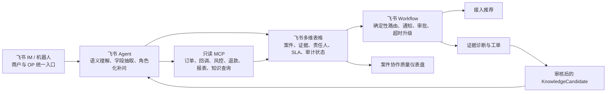
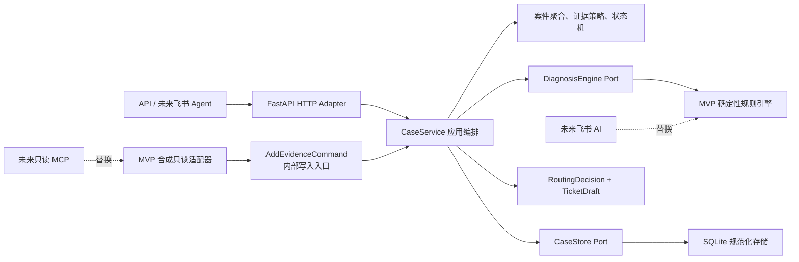
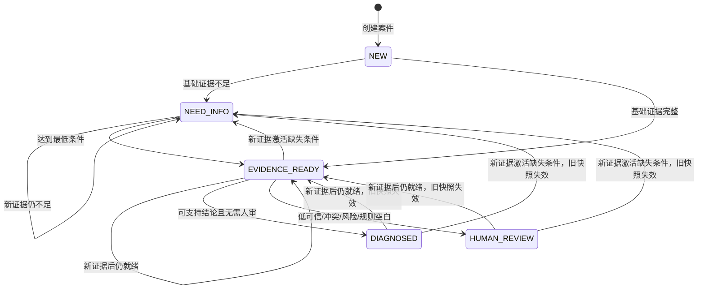

# OceanPilot：证据驱动的跨境商户成功运营助手

> EvidenceOS 是 OceanPilot 内部的可信案件架构，而不是对外产品的第一标题。

- 文档状态：`v0.1 - 待团队书面复核`
- 设计日期：2026-07-18
- 当前阶段：报名后资料尚未解锁前的基础框架
- 首个交付周期：2 天
- 技术基线：Python 3.12、FastAPI、Pydantic、SQLite
- 数据边界：只使用公开资料与明确标记的合成数据

## 1. 结论先行

OceanPilot 的核心不是再做一个“会回答支付问题的聊天机器人”，而是把一次模糊、分散、难追责的商户咨询转化为一个可协作、可审核、可复用的 **商户成功案件（Merchant Success Case）**。

我们提出配套的 **案件证据契约（Case Evidence Contract）**：系统在证据不足时不直接生成原因，而是识别最有价值的证据缺口，向正确角色补问；达到最低判断条件后，才形成带证据引用、可信度、责任域、人工审核原因和下一验证动作的诊断假设。这样把“AI 的模糊理解能力”限制在可追溯的工作流中：

> AI 处理模糊性，Workflow 守住确定性，人工控制高风险性。

两天 MVP 只把 `PAYMENT_INCIDENT`（上线后支付异常）做深，完成：

```text
模糊咨询
  → 结构化案件
  → 动态补问
  → 不可变证据包
  → 可复现诊断
  → 责任域路由
  → 工单草稿 / 人工审核
```

总体方案完整包含支付方式推荐、飞书 Agent/MCP、知识沉淀和运营看板；两天原型只实现它们共同依赖的案件证据内核与支付异常切片，其余能力明确标为“已设计、未实现”或“入围后验证”。

## 2. 对赛题的理解

根据当前公开命题页面，Oceanpayment 的问题包含两段连续旅程：

1. **接入前**：商户不知道不同国家、客群和业务类型应开通哪些支付方式，导致上线决策慢。
2. **上线后**：支付失败、拒付、退款和对账差异涉及渠道、风控、配置、回调与报表等不同责任域，内部业务、技术、财务、客服和 PSP 支持需要反复收集截图、订单号、错误码、报表和日志，协作成本高。

命题要求覆盖支付方式推荐、问题诊断、工单分派、知识沉淀和运营看板，并强调通过 AI 对话完成数据协作，以及 A2A、MCP 等节点协作能力。

我们基于公开命题形成的、待企业访谈与真实案件验证的核心假设是：问题不只是“少一个大模型入口”，更在于 **信息尚未被转化为可信、版本化、可交接的案件对象**。若该假设成立，没有证据边界地增加 Agent 数量反而会放大错误结论和重复协作。

### 2.1 命题覆盖矩阵

| 命题能力 | 总体方案设计 | 计划状态 | 验证边界 |
|---|---|---|---|
| 支付方式推荐 | `RecommendationPack` + 可解释推荐 | 已定义契约、未实现 | 取得企业材料后校准适用条件，不编造开通规则 |
| 问题诊断 | 证据补问→诊断假设→人工闸门 | 本轮计划实现 | 三个合成案例验证，不能当作真实效果 |
| 工单分派 | 责任域、优先级、SLA 与草稿 | 本轮计划实现草稿 | 不声称已实际派单或改变生产状态 |
| 知识沉淀 | 审核后的 `KnowledgeCandidate` | 已定义契约、未实现 | 未审核内容不得进入正式知识库 |
| 运营看板 | `CaseMetricsSummary` 案件质量指标 | 已定义契约、未实现 | 入围后验证，不重复建设交易报表 |
| 数据协作构建 | 下一问题、目标角色、原因与完成度 | 本轮计划实现确定性内核 | 后续再接自然语言抽取和多角色对话 |
| A2A / MCP | 结构化 Agent 交接 + 受控工具访问 | 仅定义端口，入围后实现 | MCP 用于工具访问，不冒充 Agent 通信协议 |

### 2.2 当前阶段的成功标准

MVP 必须证明：

1. 一句模糊描述可以创建案件，并返回下一条最有价值的问题。
2. 证据只追加、不覆盖；每条证据有来源、发生时间、采集时间和合成标识。
3. 未达到最低条件时禁止生成因果诊断。
4. 每个诊断假设都引用同一案件内的证据；无规则命中时不编造兜底原因。
5. 同一证据版本与规则版本只能产生一份确定性诊断快照。
6. 诊断后新增证据会保留并失效旧快照，再进入重新诊断。
7. 高风险、证据冲突、低可信度和规则空白必须进入人工审核。
8. 同一证据或同一输入版本的诊断重试不重复写入；诊断提交使用内部 revision/CAS，旧快照不能覆盖新证据。
9. 请求、响应、日志、审计和数据库都不出现测试卡号、密钥或原始日志。
10. 三个合成案例能够完整演示创建、补证、诊断、路由和审计。

### 2.3 明确不做

两天 MVP 不包含：

- 真实 Oceanpayment API、生产凭据或客户数据；
- 实际退款、重试扣款、支付配置修改或资金动作；
- 真实公网 Webhook、消息队列、重试 Worker；
- 真实飞书 Agent、MCP Server、A2A 网络协议或自动派单；
- React 前端、账号体系、多租户、RBAC、高可用；
- 通用事件溯源、Temporal、LangGraph 或复杂多 Agent 编排；
- 完整支付方式推荐算法、知识库发布和运营看板；
- “提升成功率”“降低平均处理时长”等未经真实数据验证的业务效果。

## 3. 产品原创性与公开表达边界

### 3.1 可以作为团队原创方案表达的部分

- 用“商户成功案件”统一接入前决策和上线后运营问题。
- 用“案件证据契约”规定 AI 何时必须补问、何时可以提出假设。
- 将证据引用、可信度、责任域、下一动作和人工审核原因放在同一个诊断输出中。
- 诊断后补证自动重开，同时保留旧结论的版本历史。
- 把运营指标定位为“案件协作质量”，而不是重复展示交易流水。

### 3.2 不应声称原创的部分

状态机、幂等键、乐观并发、审计日志、HTTP Problem Details、MCP 和 A2A 都是通用工程或协议机制。项目可以独立实现并组合这些机制，但不能声称发明了它们。

公开材料无需罗列内部调研过的开源仓库；但实际依赖必须在 `pyproject.toml`、许可证和仓库说明中正常披露。禁止复制项目代码后删除来源或许可证。我们的原创性来自问题建模、领域契约、工作流组合和演示验证，而不是隐藏依赖。

## 4. 总体架构

### 4.1 总体方案的飞书业务架构



总体方案完整覆盖接入推荐、协作补问、异常诊断、工单/SLA、知识候选和案件质量看板。飞书 Agent 处理语言与角色化交互，多维表格承载可协作案件，Workflow 守住状态、审批与超时，MCP 只读访问业务工具。两天可运行原型只验证其中“支付异常”纵向切片，使用 FastAPI/SQLite/合成适配器替代尚未开放的飞书与企业数据能力；图中其余节点均为已设计、未实现或入围后验证，不能在提交材料中标为完成。

### 4.2 两天原型的技术架构



`EvidenceSource` 不是应用层 Port。MVP 合成适配器与未来只读 MCP 都在外层把来源数据映射为冻结的 `AddEvidenceCommand`，再经同一内部入口调用 `CaseService`；它们不能绕过应用服务直接写 Store，也不能把演示场景类型泄漏到内层。

### 4.3 分层约束

```text
src/oceanpilot/
├── main.py
├── api/
│   ├── cases.py
│   ├── health.py
│   ├── schemas.py
│   └── errors.py
├── application/
│   ├── case_service.py
│   └── ports.py
├── domain/
│   ├── enums.py
│   ├── models.py
│   ├── state_machine.py
│   ├── evidence_policy.py
│   └── diagnosis.py
└── adapters/
    ├── persistence/sqlite.py
    ├── diagnosis/rules.py
    └── evidence/synthetic.py

tests/
├── domain/
├── repository/
└── api/                 # 含三个端到端合成案例
```

硬性边界：

- `domain/` 不得导入 FastAPI、SQLite、MCP 或模型 SDK。
- `api/` 只完成 HTTP 与领域命令的映射，不编写诊断规则。
- `application/` 负责用例顺序和事务边界，不包含框架 DTO。
- `adapters/` 实现端口；外部 AI/MCP 的返回值必须重新经过领域 Schema 校验。
- MVP 使用 Python 标准库 `sqlite3`，不为了未来可能性引入 ORM、消息队列或工作流引擎。

### 4.4 为什么暂不采用更重框架

- LangGraph 适合有循环、工具调用和持久化执行的 Agent 图；当前首要风险是领域契约尚未被验证，先引入会让状态责任分散。
- Temporal 适合分布式、长时、可恢复工作流；当前是单机两天 MVP，SQLite 短事务已足够。
- Kill Bill 等支付平台证明支付域需要明确状态与模块边界，但 OceanPilot 不复制其支付处理能力，只学习“尝试、状态、失败原因分离”的建模原则。
- 当后续出现真实长时任务、重试、异步人工节点或多个外部系统时，再用适配器替换当前执行方式，领域层不重写。

### 4.5 运行时与应用生命周期

- 冻结 Python `3.12.x`，避免团队成员使用不同解释器产生依赖和类型行为差异。
- 应用通过 `create_app()` 工厂创建；数据库初始化与启动自检只放在 FastAPI `lifespan` 中，不混用已弃用风格的 `@on_event`。
- SQLite 每个应用命令创建一个 Unit of Work 连接；该命令中的所有 Repository 操作共享同一连接，并在命令结束时显式关闭。连接设置有限超时、`sqlite3.Row` 和 `PRAGMA foreign_keys=ON`，随后读取 PRAGMA 验证确实开启。
- API 测试必须使用 `with TestClient(app)` 触发完整 lifespan；每个测试使用 `tmp_path` 下的真实 SQLite 文件，不使用普通 `:memory:` 连接，以免不同连接意外访问不同数据库。
- `dependency_overrides` 在每个测试结束时清空，防止测试间依赖泄漏。

## 5. 领域模型

### 5.1 版本语义

必须区分四种版本：

| 字段 | 递增/变化条件 | 用途 |
|---|---|---|
| `schema_version` | 对象结构变化 | 序列化兼容 |
| `case_revision` | 任一成功的新业务命令改变案件 | 内部条件更新、审计定位 |
| `evidence_revision` | 证据集合新增一条有效证据 | 诊断输入身份 |
| `policy_version` | 诊断/路由规则发布 | 结果可复现 |

诊断快照唯一键为：

```text
(case_id, evidence_revision, policy_version)
```

同一键重复诊断直接返回原快照，不增加案件版本、诊断记录或审计事件。

`engine_version` 用于可观测性；任何会改变诊断输出的代码、提示词或模型配置变化，都必须同时提升 `policy_version`。因此 MVP 不把 `engine_version` 加入唯一键。

状态机用小型、表驱动的允许列表实现，未列出的迁移一律拒绝；不引入 `transitions` 等运行时依赖。

MVP 的领域与持久化 ID 统一使用 UUIDv4，避免引入 ULID 或其他生成依赖：

- `case_id`、`diagnosis_id`、`hypothesis_id`、`event_id`、`trace_id/request_id` 和未来 A2A 的 `correlation_id` 均由服务端使用 Python 标准库 `uuid.uuid4()` 生成；
- JSON、领域模型与数据库一律保存规范小写、带连字符的字符串形式；
- `evidence_id` 是唯一例外，由调用端生成并在 `EvidenceCreateRequest` 中提交，以支持稳定重放；边界必须验证 UUID 版本为 v4，并在哈希与持久化前规范化；
- 无效格式或非 v4 UUID 返回 `422 VALIDATION_FAILED`；大小写等价的合法 UUIDv4 规范化后视为同一 ID；
- `merchant_ref`、`source_ref`、`rule_id`、`cause_code` 和 `evidence_code` 是业务引用或闭合代码，不按 UUID 解析。

### 5.2 MerchantSuccessCase

```text
case_id                 服务端生成的 UUIDv4
case_type               PAYMENT_INCIDENT（MVP 唯一启用类型）
status                  NEW | NEED_INFO | EVIDENCE_READY | DIAGNOSED | HUMAN_REVIEW
schema_version          领域结构版本
case_revision           案件内部并发版本
evidence_revision       证据集合版本
synthetic               MVP 必须为 true
summary                 脱敏后的模糊问题描述，最长 500 字符
merchant_ref            匿名商户标识，不接受真实密钥或账户材料
created_at              服务端 RFC 3339 时间
updated_at              服务端 RFC 3339 时间
current_diagnosis_id    可空
readiness               服务端计算，客户端不得写入
```

`ONBOARDING_RECOMMENDATION` 是已知但未启用的未来类型；若客户端尝试创建，返回 `409 CASE_TYPE_NOT_ENABLED`，而不是默默当成支付异常。

### 5.3 EvidenceItem

`EvidenceItem` 是带来源、时间和可靠等级的不可变观测或主张记录，不等同于 AI 推断。不可变性只保证原始记录不被覆盖，并不代表内容已经证实；诊断必须结合来源等级和一致性校验。领域模型使用 `ConfigDict(frozen=True)`（或等价冻结 dataclass），Repository 不提供更新/删除方法。

```text
case_id
evidence_id             客户端生成的稳定 UUIDv4
schema_version
evidence_code           闭合枚举
availability            AVAILABLE | CONFIRMED_UNAVAILABLE
value_type              STRING | BOOLEAN | DATETIME | COUNTRY | CURRENCY
typed_value             仅 AVAILABLE 时存在
source_type             MERCHANT | INTERNAL_OPERATOR | SYSTEM_OF_RECORD | SYNTHETIC_ADAPTER
source_ref              脱敏引用，不是原始日志
source_reliability      SYSTEM_OF_RECORD | VERIFIED_DOCUMENT | OPERATOR_CONFIRMED |
                        USER_REPORTED | SYNTHETIC_TEST
observed_at             该观测的业务时间，可空；存在时必须带时区
collected_at            服务端采集时间
synthetic               MVP 必须为 true
content_hash            规范化内容哈希
```

第一版允许的 `evidence_code`：

```text
context.environment
transaction.reference
transaction.occurred_at
transaction.country
transaction.currency
payment.method
integration.type
integration.platform
integration.plugin_version
symptom.status
symptom.error_code
authentication.status
authentication.result_code
callback.delivery_status
risk.decision_code
configuration.check_result
```

核心字段的 `typed_value` 规则冻结为：

| evidence_code | value_type | MVP 允许值/格式 |
|---|---|---|
| `context.environment` | STRING | `PROD`、`SANDBOX` |
| `transaction.reference` | STRING | 1–64 位脱敏引用，只允许字母、数字、`_-.` |
| `transaction.occurred_at` | DATETIME | 带时区 RFC 3339 |
| `transaction.country` | COUNTRY | ISO 3166-1 alpha-2 |
| `transaction.currency` | CURRENCY | ISO 4217 三字母代码 |
| `payment.method` | STRING | `CARD`、`APPLE_PAY`、`GOOGLE_PAY`、`KLARNA`、`LOCAL_PAYMENT`、`OTHER` |
| `integration.type` | STRING | `API`、`PLUGIN` |
| `integration.platform` | STRING | `SHOPIFY`、`WOOCOMMERCE`、`MAGENTO`、`CUSTOM` |
| `integration.plugin_version` | STRING | 1–32 位版本字符串 |
| `symptom.status` | STRING | `PENDING`、`FAILED`、`SUCCEEDED`、`DECLINED`、`UNKNOWN` |
| `symptom.error_code` | STRING | 1–64 位脱敏错误码，不接收错误堆栈 |
| `authentication.status` | STRING | `REQUIRED`、`CHALLENGE_PENDING`、`AUTHENTICATED`、`FAILED`、`UNKNOWN` |
| `authentication.result_code` | STRING | 1–64 位脱敏结果码 |
| `callback.delivery_status` | STRING | `NOT_RECEIVED`、`DELIVERED`、`FAILED`、`UNKNOWN` |
| `risk.decision_code` | STRING | 1–64 位脱敏决策码 |
| `configuration.check_result` | STRING | `MERCHANT_SIDE_MISMATCH`、`PSP_PROFILE_MISMATCH`、`NO_MISMATCH`、`UNKNOWN` |

不提供“任意 JSON 日志”证据类型。新增证据代码必须先更新字段字典、敏感信息策略和测试。

`content_hash` 覆盖 `evidence_id/evidence_code/availability/typed_value/observed_at/source_ref` 以及服务端解析后的 `source_type/source_reliability/synthetic`，用应用内部固定序列化计算 SHA-256：UTF-8、Unicode NFC、字段名排序、无多余空白，日期统一为 UTC RFC 3339 表达；排除 `collected_at` 与 `content_hash` 自身。它只用于重放/冲突判断，不宣称是法证哈希链或不可抵赖证明。

HTTP 写入使用单独的 `EvidenceCreateRequest`，客户端只允许提交：

```text
evidence_id
evidence_code
availability
typed_value
observed_at
source_ref
```

HTTP 来源由服务端固定为 `source_type=MERCHANT`、`source_reliability=USER_REPORTED`、`synthetic=true`；客户端不能自称 `SYSTEM_OF_RECORD`。`collected_at`、`content_hash` 和 Schema 版本也由服务端生成。内部合成适配器构造来源固定为 `SYNTHETIC_ADAPTER/SYNTHETIC_TEST` 的冻结 `AddEvidenceCommand`，并经 `CaseService` 的同一内部入口写入；未来只有经过认证和授权的内部适配器才能声明 `SYSTEM_OF_RECORD`。

`transaction.occurred_at.typed_value` 是交易发生时间的唯一业务事实槽位；EvidenceItem 元数据的 `observed_at` 只描述该条观测在来源侧的时间，不能替代交易发生时间。

`availability=AVAILABLE` 时必须提供符合字段字典的 `typed_value`；`CONFIRMED_UNAVAILABLE` 时必须省略或置空 `typed_value`。两种状态不可互相隐式转换。

Readiness 与诊断只通过确定性的 `ActiveEvidenceView V1` 读取追加式证据；同一 `evidence_code` 的归并规则为：

1. 只有 `CONFIRMED_UNAVAILABLE`：视为已回答未知，不提供规则证据。
2. 只有一个规范化后的 AVAILABLE 值：使用该值。
3. 多条 AVAILABLE 的规范化值相同：选择来源质量最高的一条作为规则引用；质量相同则选 `evidence_id` 字典序最小者，其余记录仍保留。
4. 多条 AVAILABLE 的规范化值不同：标记 `CONFLICTING_EVIDENCE`，不按“最新”或来源高低覆盖，诊断直接进入人工审核。
5. AVAILABLE 与 CONFIRMED_UNAVAILABLE 并存：按 AVAILABLE 处理，但保留所有历史记录。

上述冲突规则也适用于 `integration.type`；出现冲突时不激活任一插件条件分支。相同 evidence_revision 必须生成完全相同的 ActiveEvidenceView。

### 5.4 ReadinessAssessment

每次创建案件或新增证据后，服务端返回：

```text
ready                    是否达到最低诊断条件
missing_fields           当前仍缺少的事实槽位
known_unknown_fields     已回答“无法获得”的上下文槽位
next_question            下一条最有价值的问题；ready 时为空
question_reason          为什么需要这个信息
target_role              MERCHANT_BUSINESS | MERCHANT_TECH | INTERNAL_OPS |
                         INTERNAL_RISK | INTERNAL_FINANCE
completion_ratio         0..1 的确定性槽位完成度，不是模型概率
stop_reason              READY | NEED_MORE_EVIDENCE | CONFIRMED_UNKNOWN |
                         UNSUPPORTED | SECURITY_BLOCKED
```

最低条件采用“不可缺失核心槽位 + 可确认未知的上下文槽位”，避免既草率诊断，又让商户因不知道国家或支付方式而永远无法继续。

MVP 不做复杂价值预测；`next_question` 永远选择下表中优先级数字最小、尚未回答的激活槽位：

| 优先级 | 槽位 | 满足方式 | 目标角色 | 固定提问目的 |
|---:|---|---|---|---|
| 1 | `transaction.reference` | 至少一个脱敏 order/payment/attempt 引用，必须 AVAILABLE | `MERCHANT_TECH` | 定位同一笔交易 |
| 2 | `transaction.occurred_at` | 带时区时间，必须 AVAILABLE | `MERCHANT_TECH` | 对齐订单、回调和风控时间线 |
| 3 | `context.environment` | PROD 或 SANDBOX，必须 AVAILABLE | `MERCHANT_TECH` | 区分配置与凭据环境 |
| 4 | `symptom.signal` | 任一 status/error/authentication/callback/risk/config 证据，必须 AVAILABLE | `MERCHANT_TECH` | 确认可观察症状 |
| 5 | `integration.type` | API、PLUGIN 或 CONFIRMED_UNAVAILABLE | `MERCHANT_TECH` | 决定后续条件槽位 |
| 6 | `integration.platform` | 仅 `integration.type=PLUGIN` 时激活 | `MERCHANT_TECH` | 确定插件上下文 |
| 7 | `integration.plugin_version` | 仅 `integration.type=PLUGIN` 时激活 | `MERCHANT_TECH` | 排查版本差异 |

`merchant_ref` 在创建案件时强制提供，因此不进入补问队列。`completion_ratio = 已回答激活槽位数 / 激活槽位总数`，各槽位等权并固定为 `READINESS_V1`；AVAILABLE 和 CONFIRMED_UNAVAILABLE 都算“已回答”，但 CONFIRMED_UNAVAILABLE 不计入任何诊断规则的证据覆盖。核心槽位 1–4 只要有一个不是 AVAILABLE，`ready=false`。插件槽位可以被确认未知，此时允许进入诊断，但相关配置规则不得形成假设。

国家、币种、支付方式不是通用最低条件，可由只读证据源补齐，或仅在依赖它们的规则中作为必需证据。某条规则依赖的字段缺失时，该规则不得生成假设。

当基础条件完整但没有规则具备足够证据时，允许执行诊断，但结果是空假设并进入 `HUMAN_REVIEW / POLICY_GAP`，不能生成听起来合理的兜底原因。

`missing_fields` 包含未回答槽位以及被确认未知的核心槽位；非核心的确认未知项进入 `known_unknown_fields`。若仍有未回答槽位，`stop_reason=NEED_MORE_EVIDENCE`；全部已回答但核心槽位被确认未知时为 `CONFIRMED_UNKNOWN`；达到最低条件时为 `READY`。相同 evidence_revision 必须产生同一问题、原因、目标角色和完成度。客户端不得上传或覆盖这些服务端结果。

### 5.5 DiagnosisSnapshot 与 Hypothesis

```text
DiagnosisSnapshot
  diagnosis_id
  case_id
  evidence_revision
  policy_version
  engine_version
  status                  CURRENT | SUPERSEDED
  hypotheses[]
  routing_decision?       POLICY_GAP/冲突无法安全路由时为空
  ticket_draft?           无可靠路由时为空
  requires_human
  review_reasons[]
  created_at

Hypothesis
  hypothesis_id
  cause_code
  explanation
  evidence_refs[]         至少一条，且必须属于同一案件
  confidence_score        0..1 的有限数
  confidence_method       HEURISTIC_V1
  next_verification_action
  rule_id
```

可信度不是统计概率。`HEURISTIC_V1` 只用于合成案例中的保守分流，固定计算：

```text
score = 0.50 × required_evidence_coverage
      + 0.30 × source_quality
      + 0.20 × consistency
```

- 三项均限制在 `0..1`；人工审核门使用未舍入结果判断，持久化与响应中的 `confidence_score` 四舍五入至两位。
- `required_evidence_coverage` 是该规则要求证据的覆盖率。
- `source_quality` 取决定性证据中最低的来源质量；`HEURISTIC_V1` 映射固定为：`SYSTEM_OF_RECORD=1.00`、`VERIFIED_DOCUMENT=0.90`、`SYNTHETIC_TEST=0.80`、`OPERATOR_CONFIRMED=0.75`、`USER_REPORTED=0.55`。
- 存在互相矛盾的证据时 `consistency = 0`，并强制人工审核。
- 不存在矛盾时 `consistency = 1`；MVP 不使用主观的中间值。
- 只有覆盖率达到该规则阈值才允许输出假设。
- `HUMAN_REVIEW_SCORE_THRESHOLD=0.90`：任一假设的未舍入分数低于该值，增加 `LOW_CONFIDENCE` 并进入人工审核。
- `HUMAN_REVIEW_SOURCE_QUALITY_THRESHOLD=0.75`：决定性证据的最低来源质量低于该值，增加 `INSUFFICIENT_SOURCE_QUALITY` 并进入人工审核。
- 因此完整、一致但全部为 `USER_REPORTED` 的证据得到 `0.865`（对外 `0.87`），同时触发上述两个原因；`SYNTHETIC_TEST` 得到 `0.94`，不会触发低可信或来源不足。风险、冲突等独立闸门仍照常生效。

`calculate_confidence()` 只接受非空的决定性证据集合。`required_evidence_coverage` 必须是有限 `Decimal` 且位于闭区间 `0..1`；`consistency` 必须是有限 `Decimal` 且在 MVP 中只能取 `0` 或 `1`。空序列、非 Decimal、NaN、Infinity、越界值或中间一致性值统一抛出不含输入值的 `ValueError("invalid confidence inputs")`，不得计算或输出一个看似合法的分数。

强制人工审核原因：

```text
LOW_CONFIDENCE
CONFLICTING_EVIDENCE
RISK_DECISION
SECURITY_SIGNAL
FINANCIAL_ACTION
POLICY_GAP
INSUFFICIENT_SOURCE_QUALITY
```

任一假设命中上述分数门或来源质量门，或出现风险拒绝、冲突证据、安全信号、资金动作建议或规则空白时，案件进入 `HUMAN_REVIEW`。

诊断输出矩阵固定如下：

- `ActiveEvidenceView` 已带 `CONFLICTING_EVIDENCE`：不执行规则或可信度计算，返回空假设、空路由、空草稿，`requires_human=true`，且原因只有 `CONFLICTING_EVIDENCE`。
- 命中零条规则：返回空假设、空路由、空草稿，`requires_human=true`，且原因只有 `POLICY_GAP`。
- 命中两条及以上规则：返回与证据冲突相同的 conflict-only 结果，不附加风险或可信度原因。
- 恰好命中一条规则：`Hypothesis.confidence_score` 使用两位的 `display_score`；快照原因等于可信度原因与该规则强制原因的并集，`requires_human = bool(review_reasons)`。责任域已经明确，因此即使低可信、来源不足或命中 `RISK_DECISION`，仍保留该规则的路由与审核型工单草稿；`RoutingDecision` 的 `requires_human/review_reasons` 必须与父诊断完全一致。

可信度只读取该规则全部且仅有的决定性 `evidence_refs`，无关的低质量证据不得降低分数。完整一致的合成非风险规则输出 `0.94` 且无需人审；完整一致的用户上报非风险规则输出 `0.87`、同时带 `LOW_CONFIDENCE` 与 `INSUFFICIENT_SOURCE_QUALITY`，但仍保留路由/草稿；用户上报风险规则再并入 `RISK_DECISION`，同样保留 `RISK` 路由/草稿。

`0.90/0.75` 只是演示期人工审核门槛，不表示“90% 诊断准确率”或“75% 来源准确率”；权重和阈值须在取得企业允许的脱敏历史案件后校准，报名材料不得把数值当作业务效果。

诊断快照的内容创建后不可修改；只有生命周期字段允许从 `CURRENT` 单向变为 `SUPERSEDED`。路由与工单草稿作为快照子对象不单独更新。

### 5.6 RoutingDecision 与 TicketDraft

责任域闭合枚举：

```text
BUSINESS
TECHNICAL_SUPPORT
RISK
FINANCE
CUSTOMER_SUPPORT
PSP_SUPPORT
```

`RoutingDecision`：

```text
responsible_team
priority                 LOW | MEDIUM | HIGH
reason
evidence_refs[]
requires_human
review_reasons[]
```

`TicketDraft`：

```text
title
summary
evidence_summary[]
missing_material[]
hypotheses[]
next_action
responsible_team
synthetic
```

它只是草稿。MVP 不会把案件标为 `ASSIGNED`，也不会调用真实工单系统。

当规则空白或冲突使系统无法安全确定责任域时，`routing_decision` 与 `ticket_draft` 均为空，只生成带 `POLICY_GAP` 或 `CONFLICTING_EVIDENCE` 的人工审核快照。风险拒绝虽进入人工审核，但责任域明确，因此仍可生成 `RISK` 路由和审核型草稿。

恰好命中一条规则时，假设和路由的 `evidence_refs` 必须是全部且仅有的决定性证据 ID，去重后按规范 UUID 字符串升序。`TicketDraft.summary = Hypothesis.explanation`，`missing_material=()`，`hypotheses` 只含本次发出的假设，`next_action` 等于该规则的 `next_verification_action`，责任团队与路由一致，`synthetic` 继承案件；`evidence_summary` 按规则 predicate 声明顺序输出安全的 `evidence_code=value`，不得包含 `source_ref`、商户引用或其他非决定性字段。相同 `ActiveEvidenceView` 与策略版本必须产生相同草稿；改变 `case_id`、`summary`、`merchant_ref`、案件状态或 revision 不得改变规则输出，求值过程不得修改案件或 view。

所有派生对象（诊断、路由、草稿和审计安全元数据）继承案件的 `synthetic=true`，禁止把合成证据经过一次推断后误标成真实结果。

### 5.7 后续能力的最小契约

这些对象用于总体架构说明，不进入两天 MVP 的 API 和验收：

```text
RecommendationPack
  candidate_methods[]
  reasons[]
  exclusions[]
  applicable_country_currency_business[]
  missing_information[]
  evidence_refs[]
  confidence_score
  human_confirmations[]

KnowledgeCandidate
  source_case_id
  final_cause
  applicability
  evidence_refs[]
  resolution_steps[]
  version
  review_status

CaseMetricsSummary
  case_count_by_status
  average_question_count
  time_to_evidence_ready
  initial_route_and_reassignment
  human_escalation_rate
  repeated_issue_rate
  knowledge_reuse_count
```

未来看板只衡量案件协作质量，不宣称替代交易、成功率、退款、拒付或财务报表。

## 6. 状态机



迁移规则：

| 命令 | 允许状态 | 结果 |
|---|---|---|
| `CreateCase` | 无 | 原子创建并计算 `NEED_INFO` 或 `EVIDENCE_READY` |
| `AddEvidence` | `NEED_INFO`、`EVIDENCE_READY`、`DIAGNOSED`、`HUMAN_REVIEW` | 首次持久化新证据后重新计算 readiness；`ready=true` 进入 `EVIDENCE_READY`，否则进入 `NEED_INFO`，结果不依赖原状态。若原状态为 `DIAGNOSED` 或 `HUMAN_REVIEW`，同一原子写入将旧诊断快照标记 `SUPERSEDED` 并清空当前诊断指针；其路由/草稿继承父快照生命周期。证据级 REPLAY 不改变状态、readiness、快照、版本或审计 |
| `Diagnose` | `EVIDENCE_READY` | 生成新快照，进入 `DIAGNOSED` 或 `HUMAN_REVIEW` |
| `Diagnose` | `DIAGNOSED`、`HUMAN_REVIEW` 且版本未变 | 返回原快照，不产生新写入 |
| `Diagnose` | `NEED_INFO` | `409 CASE_NOT_READY` |

禁止通用 `PATCH status`。所有状态变化只能由领域命令触发。

## 7. API 契约

### 7.1 端点

```text
GET  /health
POST /api/v1/cases
GET  /api/v1/cases/{case_id}
POST /api/v1/cases/{case_id}/evidence
POST /api/v1/cases/{case_id}/diagnose
```

不提供删除、证据更新、状态直改、退款、重试扣款、配置修改和真实派单端点。

`GET /health` 执行应用存活与一次只读数据库探测：正常返回 `200 {"status":"ok"}`，数据库不可用返回安全的 `503 DATABASE_UNAVAILABLE`；不得暴露数据库路径、SQL 或异常文本。

### 7.2 写请求通用要求

- 所有请求生成 `trace_id`；日志与审计仅通过该 ID 关联。
- 服务端字段（状态、版本、缺失项、可信度、责任团队和规则版本）不得由客户端写入。
- MVP 的重试安全只覆盖业务最关键的两条：稳定 `evidence_id` 的证据级幂等，以及 `(case_id, evidence_revision, policy_version)` 的诊断级去重。
- 证据新增和诊断提交仍使用数据库条件更新，内部校验 `case_revision/evidence_revision`；这保护长计算后的提交，但不向单机演示 API 暴露通用 ETag/If-Match 协议。
- 通用 `Idempotency-Key`、ETag/If-Match 和多客户端并发契约推迟到真实外部调用或多写客户端出现后实现。

证据或诊断的业务回放不增加 `case_revision`，不重复写审计。

### 7.3 创建案件

`POST /api/v1/cases`

```json
{
  "case_type": "PAYMENT_INCIDENT",
  "summary": "沙箱订单显示付款未完成，不确定是回调还是认证问题",
  "merchant_ref": "merchant_demo_001",
  "synthetic": true
}
```

首次成功返回 `201`、`Location` 和案件。MVP 不处理创建请求的网络级去重；调用端应保存返回的 `case_id`，而不是无条件重建案件。

### 7.4 新增证据

`POST /api/v1/cases/{case_id}/evidence`

请求只接收一个 EvidenceItem，批量接口延后。首次写入返回 `201`；相同 `evidence_id + content_hash` 视为证据级回放并返回现有对象（`200`），不增加版本或审计；相同 `evidence_id` 但内容不同返回 `409 EVIDENCE_CONFLICT`。

### 7.5 执行诊断

`POST /api/v1/cases/{case_id}/diagnose`

客户端不上传可信度、责任团队、规则版本或诊断内容。服务端使用当前激活的 `policy_version`。若证据在计算期间发生变化，提交阶段返回 `409 DIAGNOSIS_INPUT_STALE`，调用者应重新读取案件后再诊断。

### 7.6 错误格式

所有 4xx/5xx 使用 RFC 9457 `application/problem+json`：

应用异常 `CaseNotReady` 固定携带只读的 `case_id: UUID4Str`、`missing_fields: tuple[str, ...]` 与 `current_revision: Revision`。`missing_fields` 使用字符串是因为其中可能包含派生槽位 `symptom.signal`，不能收窄为 `EvidenceCode`。构造时复制为 tuple，`str(error)` 是不回显字段或输入值的固定安全文本；服务与 API 只能将这三个白名单字段序列化为下方扩展成员。共享 `ProblemDetails` Schema 将三者声明为可选且非 required，序列化时排除 `None`；只有 `CASE_NOT_READY` 运行时响应设置三者，其他错误全部省略。

```json
{
  "type": "urn:oceanpilot:problem:case-not-ready",
  "title": "Case is not ready for diagnosis",
  "status": 409,
  "detail": "Provide the listed evidence before retrying diagnosis.",
  "instance": "urn:oceanpilot:trace:2f4a7a0e-31e9-4bf3-8d13-799a2e6b07cf",
  "code": "CASE_NOT_READY",
  "trace_id": "2f4a7a0e-31e9-4bf3-8d13-799a2e6b07cf",
  "case_id": "b69b3b0c-4144-4ed8-9c02-a6f972ac620f",
  "missing_fields": ["context.environment", "transaction.reference"],
  "current_revision": 2
}
```

每种 `type` 是稳定的问题类型 URI，同一类型的 `title` 保持不变；`instance` 使用本次错误唯一的 trace URN。仓库维护问题类型与安全说明。稳定程序逻辑使用 `code` 和扩展字段，不解析 `detail`。`detail` 只帮助修正请求，不包含堆栈、SQL、原始输入或调试信息。

错误码至少包括：

```text
VALIDATION_FAILED             422
SENSITIVE_DATA_REJECTED       422
CASE_TYPE_NOT_ENABLED         409
CASE_NOT_READY                409
EVIDENCE_CONFLICT             409
DIAGNOSIS_INPUT_STALE         409
CASE_NOT_FOUND                404
METHOD_NOT_ALLOWED            405
INTERNAL_ERROR                500
DATABASE_UNAVAILABLE          503
```

FastAPI 默认校验错误处理必须被替换：响应只能包含安全错误码和字段路径，不得返回 Pydantic 错误对象中的原始 `input`。应用必须同时注册 `RequestValidationError`、应用异常、领域异常、HTTP 异常（含 404/405）和未预期异常 500 的全局处理器，保证所有 4xx/5xx 都返回安全的 Problem Details；禁止直接序列化原始 `exc.errors()` 或异常文本。

## 8. 持久化与事务

### 8.1 SQLite 表

```text
cases
evidence_items
diagnosis_snapshots
hypotheses
hypothesis_evidence_refs
audit_events
```

为控制两天范围，`routing_decision` 与 `ticket_draft` 作为 `diagnosis_snapshots` 中可空的、Schema 校验后的 JSON 子对象保存，不单独建表；它们随父快照不可变和失效。假设及其证据引用仍规范化存储，以便数据库外键保证同案件引用。

关键数据库约束：

- `evidence_items PRIMARY KEY (case_id, evidence_id)`；
- `diagnosis_snapshots UNIQUE (case_id, evidence_revision, policy_version)`；
- `hypothesis_evidence_refs` 使用复合外键同时引用假设和 `(case_id, evidence_id)`，数据库层禁止跨案件引用；
- `confidence_score CHECK (confidence_score >= 0 AND confidence_score <= 1)`；
- `synthetic CHECK (synthetic = 1)`（MVP）；
- 所有外键非空且启用 `PRAGMA foreign_keys=ON`；
- 不实现 Evidence 的 UPDATE/DELETE 仓储方法。

本地设置：

```python
sqlite3.connect(
    path,
    timeout=5.0,
    isolation_level=None,
    autocommit=sqlite3.LEGACY_TRANSACTION_CONTROL,
)
```

```text
PRAGMA foreign_keys=ON
PRAGMA busy_timeout=5000
```

固定使用上述 Python 3.12 显式事务控制方式，再手工执行 `BEGIN IMMEDIATE`、`COMMIT` 或 `ROLLBACK`，禁止与隐式事务混用。数据库文件只能位于本机文件系统。MVP 保持 SQLite 默认回滚日志模式，不引入 WAL 文件与 checkpoint 运维；SQLite 同一时刻仍只有一个写事务，因此所有写事务必须短小。

### 8.2 命令事务

创建和新增证据在一个短事务内完成：

```text
BEGIN IMMEDIATE
  → 校验当前 revision / 唯一约束
  → 写领域对象
  → 更新案件版本与状态
  → 写审计事件
COMMIT
```

诊断禁止把 AI、MCP 或其他外部调用放进数据库事务：

```text
读取案件与证据快照
  → 事务外执行规则/未来 AI/MCP
  → BEGIN IMMEDIATE
  → CAS 校验 case_revision 与 evidence_revision 未变化
  → 原子写诊断、假设、证据引用、路由、草稿和审计
  → COMMIT
```

任何一步失败都显式回滚。若并发请求已写入相同诊断唯一键，后提交者读取并返回已存在快照，不重复创建。

## 9. 诊断与协作逻辑

### 9.1 MVP 诊断规则

首版规则冻结为可直接转成参数化测试的决策表。每一行的 required predicates 必须全部由 `ActiveEvidenceView V1` 中 AVAILABLE 的规范值满足，覆盖率阈值均为 `1.0`：

| rule_id / cause_code | required predicates（AND） | route | priority | 强制人审 | next_verification_action |
|---|---|---|---|---|---|
| `THREEDS_INCOMPLETE_V1` / `THREEDS_AUTH_OR_CALLBACK_INCOMPLETE` | `symptom.status ∈ {PENDING, FAILED}`；`authentication.status ∈ {REQUIRED, CHALLENGE_PENDING, FAILED}`；`callback.delivery_status ∈ {NOT_RECEIVED, FAILED}` | `TECHNICAL_SUPPORT` | `MEDIUM` | 无；仍服从全局低可信/冲突规则 | 核对认证结果与服务器回调接收链，不自动重试付款 |
| `RISK_DECLINE_V1` / `RISK_DECLINE_REQUIRES_REVIEW` | `symptom.status ∈ {DECLINED, FAILED}`；`risk.decision_code = RISK_DECLINE` | `RISK` | `HIGH` | `RISK_DECISION` | 由风控人员复核决策依据，不自动放行 |
| `CONFIG_MISMATCH_MERCHANT_V1` / `PAYMENT_CONFIGURATION_MISMATCH` | `symptom.status ∈ {PENDING, FAILED}`；`context.environment ∈ {PROD, SANDBOX}`；`payment.method` 为允许枚举；`configuration.check_result = MERCHANT_SIDE_MISMATCH` | `TECHNICAL_SUPPORT` | `MEDIUM` | 无；仍服从全局规则 | 生成商户侧环境/方式配置核对清单，不自动修改配置 |
| `CONFIG_MISMATCH_PSP_V1` / `PAYMENT_CONFIGURATION_MISMATCH` | `symptom.status ∈ {PENDING, FAILED}`；`context.environment ∈ {PROD, SANDBOX}`；`payment.method` 为允许枚举；`configuration.check_result = PSP_PROFILE_MISMATCH` | `PSP_SUPPORT` | `MEDIUM` | 无；仍服从全局规则 | 生成 PSP 资料核对草稿，不触发生产变更 |

每条规则的确定性文案固定如下，不在运行时自由生成：

| rule_id | explanation | routing_reason | ticket_title |
|---|---|---|---|
| `THREEDS_INCOMPLETE_V1` | 交易状态、认证状态与回调状态同时命中未完成规则，需核对认证与回调链路。 | 认证或回调链路需要技术支持复核。 | 复核 3DS 认证与回调链路 |
| `RISK_DECLINE_V1` | 交易状态与 RISK_DECLINE 决策码同时命中风险复核规则。 | 风险拒绝需要风控团队人工复核。 | 复核风险拒绝决策 |
| `CONFIG_MISMATCH_MERCHANT_V1` | 环境、支付方式与配置检查结果命中商户侧配置不匹配规则。 | 商户侧支付配置需要技术支持核对。 | 核对商户侧支付配置 |
| `CONFIG_MISMATCH_PSP_V1` | 环境、支付方式与配置检查结果命中 PSP 侧资料配置不匹配规则。 | PSP 侧资料配置需要支持团队核对。 | 核对 PSP 侧资料配置 |

每个假设的 `evidence_refs` 必须引用满足该行每个 predicate 的规范证据。`AUTHENTICATED + DELIVERED`、`NO_MISMATCH`、`UNKNOWN` 或未列出的风险码均不命中对应规则。命中两个及以上 rule_id 时视为 `CONFLICTING_EVIDENCE`，直接人工审核且路由/草稿为空；无规则命中时假设列表为空，使用 `POLICY_GAP`，不得生成“可能是网络问题”等无证据文本。

### 9.2 AI、Workflow 与人工的责任边界

未来 AI 可负责：

- 理解模糊自然语言并提出候选字段；
- 生成针对性追问；
- 归纳多个已验证来源的证据；
- 生成候选假设的通俗解释。

确定性 Workflow 永远负责：

- Schema 校验、敏感信息拦截和事实入库；
- 状态迁移、版本、幂等和审计；
- 假设的证据引用完整性；
- 高风险拦截、责任域和 SLA 规则。

人工负责：

- 低可信、矛盾和规则空白案件；
- 风控判断；
- 退款、配置、资金和权限等高风险动作。

AI 输出只能作为候选，不得直接写入 EvidenceItem；外部工具结果也先按不可信输入处理。

### 9.3 A2A 与 MCP 的后续设计

后续只先实现一条可观察链，而不是为每个步骤创建 Agent：

```text
受理 Agent
  → CaseBrief（结构化交接）
  → 证据 Agent
  → 只读 MCP 工具取得 EvidencePack
  → Workflow 校验
  → 协作 Agent 生成 TicketDraft
```

每次交接记录 `case_id`、`correlation_id`、输入/输出 Schema 版本、工具名、结果、耗时和降级原因。A2A 用于 Agent 间任务交接；MCP 用于 Agent 受控访问订单、回调、风控和知识工具。工具说明、注解和返回内容都不能默认可信。

## 10. 安全、隐私和诚实边界

### 10.1 输入策略

所有写 DTO 的基础配置使用：

```text
extra="forbid"
allow_inf_nan=False
hide_input_in_errors=True
```

- 对标识符、布尔、整数、浮点数和其他可能因隐式转换掩盖业务错误的字段使用严格类型；日期时间保留受控的 RFC 3339 JSON 字符串解析，不做全局无差别 strict；
- 自定义 validator 优先使用不产生副作用的 `after` 模式纯函数；
- 所有存在的日期时间值必须带时区；
- 枚举必须闭合；
- 字符串有明确长度上限；
- 所有字符串递归检查敏感模式；
- 13–19 位候选数字执行 Luhn 检测；
- 拒绝 PAN、CVV、Authorization/Bearer、API Key、密码、Token、完整证件和原始支付日志；
- 错误响应只返回字段路径和安全原因，不回显被拒绝值。

### 10.2 日志与审计

普通日志只记录：

```text
trace_id / case_id / command / result / duration_ms / safe_error_code
```

不记录请求体、证据值、密钥、卡号或原始异常堆栈到公开输出。

`AuditEvent` 至少包含：

```text
event_id
event_type
event_version
case_id
request_id / trace_id
actor_type
action
from_status / to_status
case_revision / evidence_revision
occurred_at
result / reason_code
sanitized_metadata
```

创建、补证、诊断、路由、诊断失效和状态迁移均追加审计；幂等回放不追加事件。MVP 只声称“追加式应用审计”，不声称达到 PCI、WORM、不可抵赖或生产合规。

### 10.3 运行边界

- 默认只监听 `127.0.0.1`；
- 示例和数据库全部为合成数据；
- README 必须注明“演示系统，非生产支付服务”；
- 不含认证的本地 MVP 不得暴露到公网；
- 未来接入第三方 API/MCP 时必须使用 TLS、超时、响应大小限制、Schema 校验和地址允许列表。

## 11. 测试与验收

### 11.1 领域单元测试

- 严格类型、未知字段、无时区时间、NaN/Infinity 均拒绝；所有实体与追踪 ID 遵循 UUIDv4 策略，`EvidenceCreateRequest` 拒绝非 v4 UUID；
- 基础与条件证据缺口、下一问题、目标角色和完成度确定；
- 插件条件槽位只在 PLUGIN 时激活；CONFIRMED_UNAVAILABLE 不增加规则覆盖；
- 同码同值按质量/ID稳定归并，同码异值触发冲突且不采用“最新值”；
- HTTP 证据不能伪造 SYSTEM_OF_RECORD 或来源可靠度；EvidenceItem 在内存中不可变；
- 每条合法/非法状态迁移；
- 诊断后补证会失效旧快照并重开；
- 假设必须有证据引用；
- 冲突、低可信、来源质量不足、风险和规则空白进入人工审核；完整 `USER_REPORTED` 证据固定得到 `0.865 → 0.87` 并同时产生两个相应原因码；
- 无规则命中时不产生伪假设；
- POLICY_GAP/冲突时路由和草稿为空，配置结果的两种责任域映射唯一；
- 四个 `rule_id`（对应三个合成场景）的每个触发值、排除值、优先级与必需证据引用均参数化测试；
- 同输入、同政策的诊断完全确定。

### 11.2 Repository 集成测试

- 每个测试使用 `tmp_path` 真实数据库文件，并验证 `foreign_keys=ON`；
- 一个命令的对象、版本和审计同时提交或回滚；
- 相同证据并发提交只保存一次；
- 诊断计算期间证据变化会拒绝旧结果；
- 诊断唯一键保证重复调用不新增记录；
- 复合外键禁止假设引用其他案件证据；
- SQLite 约束失败后数据库保持原状态。

### 11.3 API 契约测试

- OpenAPI 可加载，端点和 Schema 与本规格一致；
- 使用 `with TestClient(app)` 触发生命周期，结束后清空 dependency override；
- `201/200/404/405/409/422/500/503` 语义正确；
- 所有错误为 `application/problem+json`，body 状态与 HTTP 状态一致；
- 人工触发 405 和受控的意外 500，验证全局处理器不泄漏原异常；
- 相同 evidence ID/内容与相同诊断输入版本的回放行为正确；
- 422 不返回原始 `input`；
- 未启用案件类型被明确拒绝。

### 11.4 安全回归测试

向 API、领域服务和 Repository 边界分别输入哨兵密钥、模拟卡号、CVV 文本和 Bearer Token，扫描：

```text
HTTP 响应
应用日志
audit_events
SQLite 文件
测试快照
```

五处都不得出现原文。

### 11.5 三个端到端合成案例

| 案例 | 预期流程 | 预期结果 |
|---|---|---|
| 3DS/回调未完成 | 模糊描述→补环境/引用→合成证据→诊断 | 技术支持、证据引用、核对回调，不自动重试 |
| 风险拒绝 | 收集风险码与状态→诊断 | 风控团队、`HUMAN_REVIEW`、无自动放行 |
| 配置不匹配 | 收集环境/方式/配置检查→诊断 | `MERCHANT_SIDE_MISMATCH`→技术支持；`PSP_PROFILE_MISMATCH`→PSP 支持 |

最终硬验收：

- 三个案例均完成 `create → evidence → diagnose → route/ticket draft`；
- 因果结论证据引用率 100%；
- 高风险案件人工审核率 100%；
- 无证据的因果诊断数为 0；
- 敏感哨兵泄漏数为 0；
- 全部测试通过，OpenAPI 可用，仓库可按 README 复现。

## 12. 分阶段交付与审查门

### Gate 0：书面规格冻结（当前）

审查：赛题映射、范围、字段字典、状态机、版本、业务级去重、旧诊断提交防护、错误码、安全和验收是否无歧义。未通过不编码。

### Gate 1：领域契约

只实现模型、证据策略、状态机、确定性规则引擎，以及框架无关的应用命令、稳定错误与原子 Store 端口契约；不实现 CaseService、SQLite、FastAPI 或外部证据源。运行领域与契约测试；独立审查“是否可能无证据出结论”“是否把规则命中或 AI 推断写成事实”。未通过不接数据库。

### Gate 2：持久化与并发

实现 SQLite、事务、外键、证据/诊断去重和内部 revision/CAS。运行回滚、重复提交和跨案件引用测试；检查 schema 与规格差异。未通过不接 API。

### Gate 3：API 与主链

实现 FastAPI、Problem Details 和三个合成案例。运行契约测试、OpenAPI 检查、敏感数据哨兵扫描；逐项检查审计轨迹。未通过不发布。

### Gate 4：发布与事实审计

运行全测试、`git diff --check`、依赖/许可证检查、秘密扫描和 README 复现。把材料中的能力分为“已实现、下一阶段、入围后验证”，不得把合成测试写成 Oceanpayment 真实成效。

### 后续阶段

1. 报名成功并取得企业材料后，校正支付字段、规则和责任域。
2. 完成一条真实可观察的飞书 Agent + 只读 MCP + 工单草稿链。
3. 补最小支付方式推荐样例、知识候选和案件协作指标。
4. 用企业允许的数据进行离线评估，再确定准确率、处理时长等业务指标。

## 13. 报名材料初稿

### 13.1 命题前置分析与洞察（50–300 字）

Oceanpayment 官方资料显示，其平台支持 500+ 支付方式并覆盖 200 多个国家和地区；支付方式适用性又与国家、行业、虚拟商品、订阅场景及设备有关。同类平台的动态支付方式也会按位置、币种、金额和支付流程判断可用性。ODPM 已具备交易、挡掉交易、退款、拒付、风控、报表、日志和可视化能力，因此机会并非“再造数据看板”，而是让分散在模块与角色间的证据进入同一协作链。我们判断，应建立统一的“商户成功案件”和证据契约：由 AI 先识别关键缺口并向正确角色补问，再受控查询数据，以可追溯证据驱动诊断、路由和知识复用。

### 13.2 整体解决方案设计（300–600 字）

OceanPilot 是一套证据驱动的跨境商户成功运营助手，总体覆盖接入前支付方式推荐，以及上线后的协作补问、异常诊断、工单与 SLA、知识沉淀和案件质量看板。商户或 OP 人员从飞书 IM/机器人描述问题，飞书 Agent 负责语义理解、字段抽取和角色化追问；受理、证据与协作 Agent 围绕同一案件进行结构化 A2A 交接，只读 MCP 仅负责受控查询订单、回调、风控、退款、报表与知识工具；多维表格承载版本化案件、证据、责任人与审计状态，Workflow 执行确定性路由、通知、审批和超时升级。核心创新是“商户成功案件 + 案件证据契约”：资料不足时 AI 不直接下结论，而是定位关键证据缺口；满足最低条件后，才输出带来源引用、可信度、责任域、下一动作和人审原因的建议。系统将诊断证据引用率 100%、高风险操作人审率 100% 设为硬约束；入围后用企业允许的数据验证补问轮次、到证时间、首次路由与改派、交接次数、人工升级、重复问题和知识复用。两天原型计划以 FastAPI、Pydantic、SQLite 和合成适配器打通支付异常切片；取得企业材料后，可复用案件与证据内核，在替换适配器、校准规则并补充场景策略的基础上，分阶段扩展至支付推荐、退款、拒付和对账。AI 处理模糊性，Workflow 守住确定性，高风险动作始终由人工确认。

## 14. 研究依据与采用决策

本设计只引用标准、官方文档或项目官方仓库。业务判断依据：

- 大赛官网与报名表明确要求外部调研，以及 50–300 字洞察、300–600 字整体方案：<https://activity.feishu.cn/future-talent#challenge>、<https://bytedance.larkoffice.com/share/base/form/shrcnY5Tj6HJhdtFhRkgNJvMiWe?chunked=false>
- Oceanpayment 官方介绍称其支持 500+ 支付方式并覆盖 200 多个国家和地区：<https://www.oceanpayment.com/company-overview/>
- 官方支付方式表显示适用性与国家、行业、虚拟商品、订阅服务和设备条件相关：<https://dev.oceanpayment.com/en/docs/subscripions/methods/>、<https://dev.oceanpayment.com/en/docs/payment/methods/applepay/>
- Stripe 官方动态支付方式案例表明，同类方案会综合位置、币种、金额、支付流程和产品支持来筛选/排序方法；这支持我们用可解释 `RecommendationPack` 而非固定清单：<https://docs.stripe.com/payments/payment-methods/dynamic-payment-methods>、<https://docs.stripe.com/payments/payment-methods/payment-method-support>
- 官方支付参数、3DS、响应码、Webhook 与报表文档证明订单状态、回调、风险信息和报表口径是不同证据来源：<https://dev.oceanpayment.com/en/docs/payment/parameter/>、<https://dev.oceanpayment.com/en/docs/compliance-and-security/threeds/>、<https://dev.oceanpayment.com/docs/response-code/order/>、<https://dev.oceanpayment.com/en/docs/webhook/card/parameter/>、<https://dev.oceanpayment.com/en/docs/report/info/>
- ODPM 官方手册已经覆盖交易/挡掉交易、退款、异常交易、风控、数据分析、报表、日志和帮助中心，因此我们的看板定位为案件协作质量，而非重建交易后台：<https://support.oceanpayment.com/wp-content/uploads/2025/06/Oceanpayment-ODPM%E6%95%B0%E5%AD%97%E5%B9%B3%E5%8F%B0%E6%93%8D%E4%BD%9C%E6%8C%87%E5%BC%95%E6%89%8B%E5%86%8C.pdf>、<https://support.oceanpayment.com/knowledge-base/>

工程判断依据：

- FastAPI 官方建议用 `APIRouter` 拆分应用；应用生命周期用 `lifespan`，API 契约测试用 `TestClient` 且以上下文管理器触发生命周期：<https://fastapi.tiangolo.com/tutorial/bigger-applications/>、<https://fastapi.tiangolo.com/advanced/events/>、<https://fastapi.tiangolo.com/tutorial/testing/>、<https://www.starlette.io/lifespan/>
- Pydantic 默认可能进行类型转换；MVP 对关键业务字段使用严格类型，对日期时间做受控 RFC 3339 解析，不启用无差别全局 strict，并保留安全异常转换：<https://docs.pydantic.dev/latest/concepts/strict_mode/>、<https://docs.pydantic.dev/latest/concepts/validators/>、<https://docs.pydantic.dev/latest/api/config/>
- RFC 9457 定义 `application/problem+json`，并建议 `detail` 帮助调用者修正问题而非泄漏调试信息：<https://www.rfc-editor.org/rfc/rfc9457.html>
- Stripe 官方 Webhook 指南说明外部事件可能重复且需要稳定事件 ID 去重；MVP 只采纳到证据级去重，真实 Webhook 延后：<https://docs.stripe.com/webhooks>
- Python 3.12 与 SQLite 官方文档说明显式事务控制、外键启用和单写事务约束，因而外部调用不能放在长事务中：<https://docs.python.org/3.12/library/sqlite3.html#transaction-control>、<https://www.sqlite.org/lang_transaction.html>、<https://www.sqlite.org/foreignkeys.html>
- OWASP 提醒第三方 API 数据不得默认可信，并应避免错误和响应中过度暴露数据：<https://owasp.org/API-Security/editions/2023/en/0xaa-unsafe-consumption-of-apis/>、<https://owasp.org/API-Security/>
- MCP 最新官方规范要求把工具描述和结果按不可信边界处理，并强调用户同意与数据保护：<https://modelcontextprotocol.io/specification/latest>
- 对比过的官方开源项目包括 Kill Bill、LangGraph 和 Temporal；它们帮助确认状态化、确定性和可恢复工作流的重要性，但两天 MVP 不直接引入其运行时：<https://github.com/killbill/killbill>、<https://github.com/langchain-ai/langgraph>、<https://github.com/temporalio/sdk-python>

本轮公开网页检索未找到可交叉验证、且与本命题直接相关的小红书 Oceanpayment 案例，因此没有把社区帖当作事实依据；后续若团队提供具体帖子，只作为用户问题线索，再用官方材料或企业资料复核。

## 15. 待团队书面确认的问题

在进入实现计划前，请确认以下冻结项：

1. 两天 MVP 仍只启用 `PAYMENT_INCIDENT`，其余能力只留契约和路线图。
2. MVP 只实现证据 ID 与诊断输入版本两种业务级去重，并用内部 revision/CAS 防止旧诊断覆盖新证据；通用网络幂等与 ETag 延后。
3. 诊断后补证保留旧快照并重开，不覆盖历史。
4. 默认只运行合成数据与本地 API，不接真实 Oceanpayment/飞书凭据。
5. 采用四道实现审查门，每道门通过后才进入下一层。

书面确认后，下一步是生成逐任务实现计划；计划获批后才开始编码。
