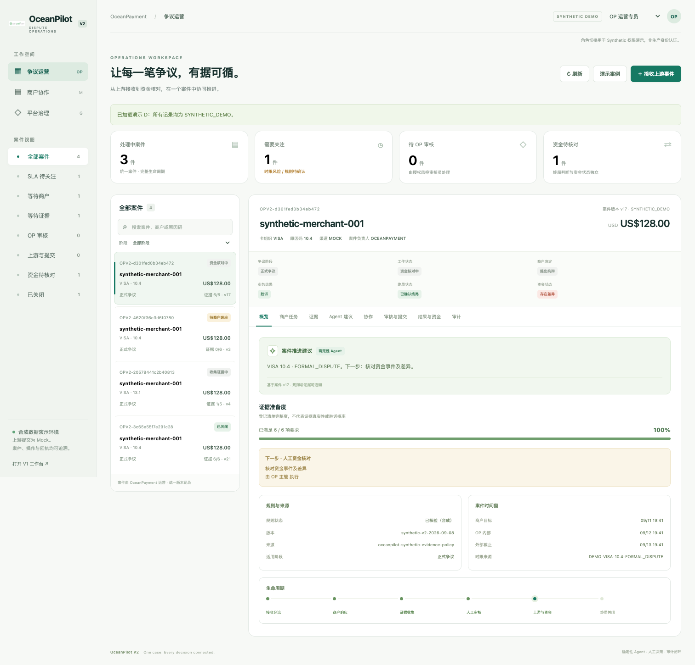
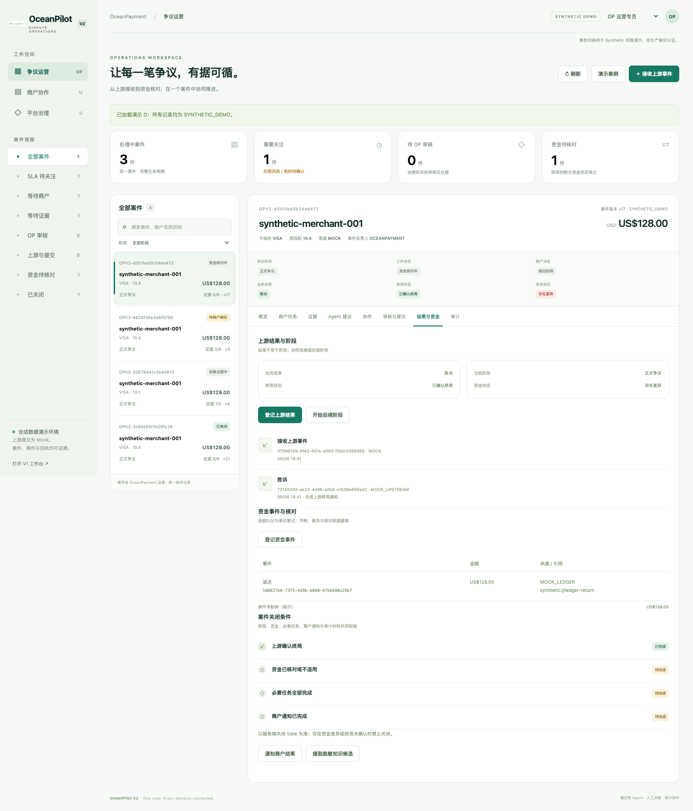

# OceanPilot V2 验收记录

日期：2026-09-08。分支：`oceanpilot-v2`。稳定基线：master `250e7d904fce451e6fe72b2192cba393b717c636`。版本：`2.0.0.dev0`。

按用户要求，V2 独立开发和验收，不创建 PR，不合并 master。该交付是合成比赛 Demo，生产数据、规则、身份系统与真实上游提交不在本次完成范围内。

## 本地验证

| 检查 | 结果 |
|---|---|
| 原版本回归基线 | 1471 passed，6 skipped |
| 最终完整 Python 测试 | **1640 passed，6 skipped** |
| Ruff lint | 通过 |
| Ruff format | 222 个 Python 源码/测试文件通过 |
| compileall | 通过 |
| wheel 构建 | `oceanpilot_evidenceos-2.0.0.dev0-py3-none-any.whl` 成功 |
| 从 wheel 读取三个 V2 页面 | OP / Merchant / Admin 资源完整，模板已替换 |
| 合成 benchmark | **47 / 47** 观察项通过，见 [机器可读结果](benchmark.json) |
| 浏览器 | A 完整闭环及知识批准、D 财务差异修复闭环；无 JavaScript 错误 |
| 响应式 | 320、390、600、780、1024、1512 像素均无横向溢出 |

6 项跳过：5 项需要实时 DeepSeek/Claude 密钥，1 项需要 PowerShell。没有为了使测试通过而调用真实模型或发送外部消息。测试框架有两项已知第三方弃用警告，不影响本次通过结果。

本机没有 Docker 命令；容器构建及容器内 V1/V2 页面 smoke 由已更新的 GitHub Actions workflow 执行。提交后的实际状态见 [oceanpilot-v2 分支 CI](https://github.com/jiang4wqy/oceanpilot-evidenceos/actions?query=branch%3Aoceanpilot-v2)。本表记录本机检查，不将未执行的本机 Docker 测试算为通过。

## 关键业务门槛

- OP 独占正式 intake，Merchant 仅本商户读写；商户、Agent 和 Admin 均不能代替授权 Risk / Supervisor 的业务审批。
- 未确认/冲突规则不猜时限，显式人工确认可用权利；限制为 ACCEPT 的规则拒绝 CONTEST。
- 缺证不能送审/通过；证据变化使旧审核和包失效，旧 revision 拒绝；包内容冻结并记录 hash。
- 两次人审独立；Mock 技术回执、业务接收和最终业务结果独立保存。
- 事件重复不重复产生影响；同一来源事件不能跨案重新绑定；不同通知通过 upstream case ID 关联同案。
- UNKNOWN 非终局结果持久化但不可关闭；下一阶段保留旧规则、期限、证据、审核、包和提交快照。
- 商户 Accept 不创建额外退款；NO_RESPONSE 不代表接受。商户净影响中退款、借记和费用为负；混币种拒绝。
- 终局后仍须资金核对、任务完成、通知和审计齐全才能关闭；新增资金记录会使旧核对与通知失效。
- 知识只在结案后脱敏生成候选，独立 Admin 人审批准才能检索复用。

独立审查发现并修复了跨案资金事件重用、allowed_actions 绕过、极端时区日期造成 500 的问题，并保留独立回归用例。

## 飞书与 Agent 的完成边界

飞书提供 43 项测试覆盖的签名 callback、可信 tenant/sender/chat 绑定、卡片、角色与 revision 校验、同案协作和崩溃重试。外发保持 Disabled，真实 tenant smoke 未完成。渲染卡片或 callback 返回成功不能作为真实消息已投递的证据。

V2 Agent 是可离线运行的确定性工作流规划器，提供上下文、规则解释、清单、缺证、下一步、总结和升级建议，提案绑定当前版本。没有把该结果描述成实时大模型回答，没有胜诉概率预测。证据为合成元数据登记，不进行真实正文/OCR/真实性验证。

## 演示与截图

[逐步 Runbook](demo.md) · [浏览器验收细节](UI_VALIDATION.md) · [迁移与架构](architecture-and-migration.md) · [飞书配置](feishu.md)





## 复现

```bash
PYTHONPATH=src .venv/bin/python -m pytest -p no:cacheprovider -q
.venv/bin/ruff check src tests
.venv/bin/ruff format --check src tests
PYTHONPATH=src .venv/bin/python -m compileall -q src tests
PYTHONPATH=src .venv/bin/python scripts/eval_dispute_v2.py
```

benchmark 只是六条合成规则和指定状态场景的确定性检查。它不衡量生产规则准确率、真实胜诉率、资金收益或真实运营效率。
