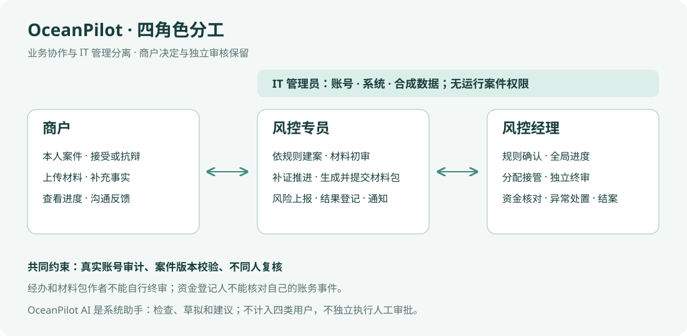

# 四角色改造验收（2026-09-14）

当前正式账号只有商户 MERCHANT、风控专员 OPERATOR、风控经理 SUPERVISOR、IT 管理员 ADMIN。原运营与风控初审合并；经理拥有专员权限并管理全局案件；IT 管理员拥有全部后台功能。AGENT 是不可登录的系统身份。

## 自动化验收

在项目 Python 3.12 环境执行 `PYTHONPATH=src:. .venv/bin/python -m pytest -q --tb=short`：**2280 passed，6 skipped**。跳过项为缺少 DeepSeek/Anthropic 凭据的实时模型测试和缺少 PowerShell 的脚本测试。`ruff check src tests` 与 `git diff --check` 通过。

新增 `tests/api/test_four_roles.py` 验证：

- 四角色权限、管理员后台页面与账号创建/停用审计；旧管理 URL 跳转与旧 API 的 410 响应。
- RISK_OFFICER/DIRECTOR 账号幂等迁移、密码哈希与商户范围保留、仅迁移账号旧会话撤销。
- 活跃任务与参与者迁移，历史审核、完成任务、审计及命令回执不重写，案件 revision 增长。
- 经理和 IT 管理员跨案件读取；晚创建的经理仍可读取已有案件；普通专员和商户保留对象隔离。
- 管理者的全量团队统计不受分页及负责人筛选影响，经理可把案件分配给新加入的获授权专员。
- 管理员可以处理业务，但材料包作者不得通过 APPROVE_PACKAGE 或 FINAL_REVIEW 批准自己的工作；账务登记人与资金核对人分离。
- 管理员的案件详情、协作消息和自动更新入口使用一致的访问权限。

更新既有权限、业务链、HTTP、飞书历史适配器和前端测试。前端增加经理进度统计、姓名转义、负责人筛选和普通专员隐藏团队视图的运行测试。

## 浏览器验收

在独立临时 SQLite、127.0.0.1:8028 测试实例中使用合成账号和两笔案件，已实际操作并观察：

- 风控经理登录后看见两名专员、两笔案件及团队进度。
- 选择一名专员后，案件列表收敛为一笔，团队进度仍保留两人的全量统计。
- IT 管理员登录并进入风控工作台、账号与演示数据页面；四角色下拉框、账号范围和管理入口正确显示。
- 桌面页面截图检查：团队表格和管理员表单无明显遮挡或截断。

浏览器验收没有修改既有业务数据库，也没有发布远端服务。升级运行实例时按 [迁移说明](architecture-and-migration.md) 备份并重启；旧角色账号需要重新登录。当前飞书生产入口继续使用全群知识助手。
