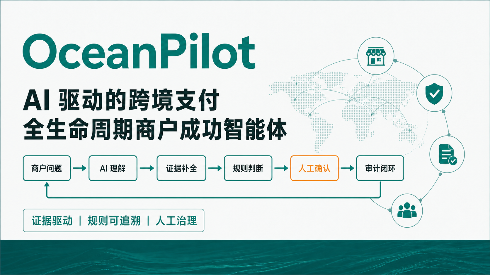
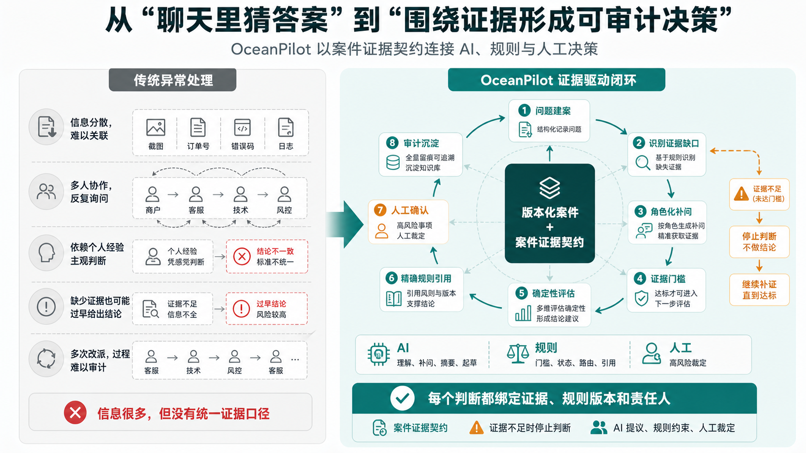
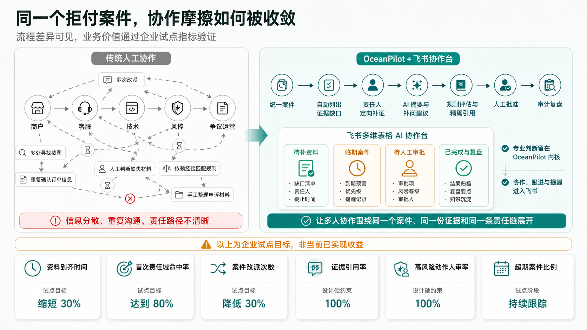

> V1 历史快照：以下口径对应 V2 开发前的稳定版本，不代表 V2 当前能力。

# OceanPilot — 跨境商户成功 AI 运营中枢



**面向跨境商户成功与支付运营建立统一 AI 工作入口，并用“支付异常 → 争议协作”证明一条可运行的深度主线。** OceanPilot 用一个版本化案件串联拒付理由、证据缺口、材料就绪评估、规则校验与打包、人工审批和案件处理审计；AI 负责理解、补问和起草，确定性规则约束流程，人工复核当前登记范围。

> **当前边界：** 全部案例为合成数据，假定已进入正式争议流程。主演示使用 `/demo` 用户端与 `/business` 业务端处理同一个版本化案件，结束在“人工登记复核＋案件复核摘要（合成示例）”。只登记合成材料元数据，未读取真实文件正文；材料就绪度不代表胜诉率、交易真实性或正文一致性。最终模拟发送由后端默认关闭。普通支付失败、3DS 挑战失败或回调异常仍属于 Foundation `PAYMENT_INCIDENT`，不能直接讲成拒付。真实飞书 tenant、Oceanpayment 数据、经生产核验的卡组织规则与上游申诉均未接入。

### 三个核心设计

- **拒付案件作为单一协作对象：** 用版本化案件聚合拒付理由、证据状态、评估、审批和审计，减少截图与聊天记录反复转发。
- **证据门槛先于申诉判断：** 按 reason-code 逐项定位缺口，关键证据不足时不生成乐观结论，转入补证或人工复核。
- **AI 提议、规则约束、人类裁定：** AI 理解模糊表达并起草材料；确定性规则计算材料就绪度和缺口；人工批准高风险步骤。

## What OceanPilot Is

OceanPilot 是一个面向跨境 PSP 与商户运营的独立参赛原型。当前工作台围绕正式争议的材料登记、缺口解释、规则引用、人工复核及摘要交接展开。用户端提供材料，业务端复核同案同版，未实现能力明确标注为规划中。

这个版本适合用于代码审查、架构讨论和比赛演示。所有商户、交易、银行规则和证据内容均为合成示例；仓库不包含真实商户数据或外部系统凭据，离线评测结果也只说明 synthetic fixture 上的可重复行为。

## Current Runtime Scope

| Capability | Status | Current behavior |
|---|---|---|
| Chargeback mainline | Available (synthetic) | 合成正式争议受理、材料分层闸门、精确规则引用、当前版本人工登记复核、HTML/JSON 摘要及持久化操作回执 |
| Web console and demos | Available (synthetic) | `/demo` 用户端、`/business` 业务端、A/B/C 后端样例副本、离线 Python HTTP transcript；`/admin` 仍是运行维护端 |
| EvidenceOS Foundation | Supporting slice | `PAYMENT_INCIDENT` 建案/补证、确定性诊断持久化与 identity replay，用于验证底层证据与审计能力 |
| Foundation Feishu callbacks | Supporting slice | 经签名校验的建案、补问、诊断卡和人工确认审计；与拒付主线共享签名与回执基础设施 |
| Basic observability | Available (synthetic) | PII-free request/trace 日志与进程内决策指标；不是生产日志平台或持久化 metrics backend |
| Chargeback Feishu callbacks | Available (synthetic) | `/chargeback` 显式建案、理由/补证卡片、签名与 replay 防护、哈希 chat↔case 绑定；未做真实 tenant smoke |
| Rules knowledge prototype | Available (unverified summaries) | 独立 SQLite 规则库原型提供 10 条可浏览摘要，其中 3 条可参与 Demo 打包；通用补证仍由领域策略驱动，真实规则、脱敏案例与 RAG 尚未接入 |
| Real integrations | Planned | 真实 Oceanpayment、外部 A2A/MCP/工单、上游申诉与公网 Feishu tenant smoke |
| Production readiness | Not claimed | 尚未完成鉴权、限流、生产可观测性后端、云数据库、备份、部署和运行保障 |

## 产品主线：同案协作与复核交接

主讲完整演示 A（Visa 10.4 内部清单 5/6），补齐一个实际关键缺口后交给业务端复核并导出摘要；再展示 B（历史批准后撤回关键材料）的阻断。C（Visa 13.1）用于自测与追问。每次排练新建样例副本，不清空数据库。

```text
合成案件：假定已进入正式争议流程
  → 确认理由与卡组织      保留案件编号、版本和明确前提
  → 登记材料与解释缺口    关键缺失阻断正式评估；普通缺失只允许有限分析
  → 查看实际规则引用      无精确映射则说明限制，不套用默认正式依据
  → 业务端人工登记复核    只复核当前版本的登记清单与内部处理门槛
  → 导出复核摘要          同版快照生成 HTML / JSON，不重新调用模型
  → 同事继续复核          明确列出正文、真实性、内容一致性与规则适用性未核验
```

确定性内核负责材料就绪度与门槛；模型只解释和提议，业务写入需要明确人工确认。离线为默认恢复方式；实时演示固定使用已验证的 DeepSeek，回答分别标识实时、确定性或异常降级来源。最终发送开关 `OCEANPILOT_MOCK_SEND_ENABLED` 默认关闭；冻结版本批准、持久化幂等与回执恢复未完成联合验收前，即使开启也拒绝发送。

- 设计文档：[docs/design/2026-08-06-chargeback-agent-cluster-design.md](../../docs/design/2026-08-06-chargeback-agent-cluster-design.md)
- 安全与部署分级：[docs/security/deployment-tiers.md](../../docs/security/deployment-tiers.md)
- 给公司的数据需求：[docs/data/2026-08-07-chargeback-data-request.md](../../docs/data/2026-08-07-chargeback-data-request.md)
- 离线可跑的演示：`examples/chargeback_demo.py`（内核补问，无持久化）、`examples/chargeback_transcript.py`（双端 API、人工审核与摘要 transcript）
- 一键起服务：`docker build -t oceanpilot-evidenceos . && docker run --rm -p 127.0.0.1:8000:8000 oceanpilot-evidenceos`
- 双端工作台：`http://127.0.0.1:8002/demo` 与 `http://127.0.0.1:8002/business`
- 离线评测报告（分类准确率 + synthetic 规则分离度）：`python scripts/eval_chargeback.py`

## Web 双端工作台 / Console

用户端负责案件信息、材料登记和缺口处理；业务端负责同案当前版本的复核、疑点处理、历史与导出。案件列表、规则页和 AI 操作区保持同一案件上下文；回执关联案件与版本，失败可重试，重复请求复用命令编号。

- `/` 跳转 `/demo`；同一进程的 `/business` 是业务复核端。
- Docker 使用映射端口 8000；本地示例使用 8002。
- `/admin` 是独立运行维护页面，仍可在 8003 启动 `oceanpilot.admin:create_admin_app`。
- `X-Demo-Role` 是演示角色分工，不是生产认证。操作与字段见 [工作台 API 合同](../../docs/implementation/2026-09-06-workspace-contract.md)。
- 双端步骤、A/B/C、离线恢复及重试见 [演示 Runbook](../../docs/demo.md)。历史截图与 AI 总窗口设计文档只记录当时版本，不能代替本次验收。

## 技术原则：证据先行闭环



OceanPilot 的核心不是增加一个信息入口，而是让 AI、确定性规则与人工共同遵守同一套案件证据口径：资料不足先定位缺口，达到门槛后才输出评估，高风险步骤始终由人工确认。

> **插图 1｜AI 应用创新性对比：** 从“聊天里猜答案”到“围绕证据形成可审计决策”。当前实际运行边界以本文状态表与 `docs/architecture.md` 为准。

## Architecture

当前运行时包含一条拒付产品主线和一条 Foundation 能力验证切片，两者都保持单向依赖：

```text
Merchant / Business Web -> Workspace HTTP
    -> WorkspaceService -> versioned commands / review / summary snapshot
    -> Supervisor / deterministic material gates
Legacy Chargeback HTTP / signed channel
    -> ChargebackChannelService -> Supervisor / deterministic kernel
    -> ChargebackCaseStore -> chargeback SQLite
    -> internal evidence policy -> readiness / missing evidence
    -> Packager -> independent rules SQLite -> in-memory fallback
    -> Appeal HTTP disabled (503; enabling alone still returns 501)

Foundation HTTP / signed Feishu callbacks
    -> CaseService -> domain evidence policies / DiagnosisEngine
    -> CaseStore port -> foundation SQLite
```

API 负责严格输入、状态码和错误；应用/领域层负责内部门槛、规则引用与编排。工作台命令把案件变更、版本、审计及幂等回执放在同一 Chargeback SQLite 事务中；审核和摘要持久化，材料变化使旧审核历史化。导出保存确定性快照，并检查生成期间的案件、审核及规则变更。传统只读 GET 不调用模型或写入审核状态。独立规则库是未核验摘要，通用补证仍由内部领域清单驱动。完整数据流见 [运行架构](../../docs/architecture.md)。

## Foundation：底层能力验证切片



> **插图 2｜业务价值直观对比：** 同一个拒付案件，协作摩擦如何被收敛。图中企业试点指标为试点目标，非当前已实现收益。

Foundation 以合成支付异常验证版本化证据、确定性诊断、审计和签名飞书回调，不是当前产品主线。其公开 HTTP 输入使用严格 UUIDv4 和 `synthetic=true`，调用方不能注入来源可信度、状态、revision 或路由结论。Foundation 诊断主链与飞书回调已实现为 synthetic demo；拒付主线也已接入同一签名事件/卡片入口，但尚未做真实 tenant smoke。真实 Oceanpayment 数据、外部 A2A/MCP/工单均未接入。

## 开发者指南 / Developer guide

**先读源码导航**：[`src/oceanpilot/README.md`](../../src/oceanpilot/README.md) 讲清六边形分层与唯一依赖规则,每层再各有一份 README：

| 层 | 文档 |
|---|---|
| 领域内核 | [`src/oceanpilot/domain/README.md`](../../src/oceanpilot/domain/README.md) |
| 应用/端口 | [`src/oceanpilot/application/README.md`](../../src/oceanpilot/application/README.md) |
| 适配器 | [`src/oceanpilot/adapters/README.md`](../../src/oceanpilot/adapters/README.md) |
| HTTP 接口 | [`src/oceanpilot/api/README.md`](../../src/oceanpilot/api/README.md) |
| 测试与门禁 | [`tests/README.md`](../../tests/README.md) |

**配置**：所有环境变量见根目录 [`.env.example`](../../.env.example)(存储路径、DeepSeek/Claude、本地模型、飞书凭据);凭据只经环境变量注入,绝不入库。运行/安装见下方 Quick Start。

**提交前门禁**(与 CI 一致)：

```bash
python -m pytest -p no:cacheprovider -q
ruff check src tests && ruff format --check src tests
python -m compileall -q src tests
```

## 提交材料索引

以下提交报告、插图与历史交付文档保留原日期口径；当前能力与验收应以本说明、Runbook 和对应 commit 的实际测试为准。

- [报名表 Part 1 / Part 2 可粘贴文本](../../docs/submission/registration-copy.md)
- [两页开题报告补充材料（PDF）](../../artifacts/OceanPilot-开题报告补充材料.pdf)
- [外部研究与事实边界](../../docs/submission/sources.md)
- [当前未完成能力与后续路线](../../docs/roadmap/incomplete-work.md)
- [飞书集成配置指南](../../docs/feishu-setup.md)
- [本地演示 runbook](../../docs/demo.md)

> 公共仓库仅供比赛评审；未授予复用许可。当前原型仅使用合成数据。Foundation 与拒付主线均已在签名 callback seam 跑通；真实 tenant smoke 和生产部署仍未完成。

## Quick Start

要求 Python 3.12。以下命令只在 `127.0.0.1` 启动本地服务。

Windows PowerShell：

```powershell
py -3.12 -m venv .venv
.\.venv\Scripts\python.exe -m pip install -e ".[dev]"
$env:OCEANPILOT_DB_PATH = "work/oceanpilot.db"
$env:OCEANPILOT_CHARGEBACK_LIVE_MODEL = "0"
$env:OCEANPILOT_MOCK_SEND_ENABLED = "0"
.\.venv\Scripts\python.exe -m uvicorn oceanpilot.main:create_app --factory --host 127.0.0.1 --port 8002
```

新终端启动运行维护端：

```powershell
$env:OCEANPILOT_CLIENT_BASE_URL = "http://127.0.0.1:8002"
.\.venv\Scripts\python.exe -m uvicorn oceanpilot.admin:create_admin_app --factory --host 127.0.0.1 --port 8003
```

需要启用 DeepSeek 时，将 `.env.example` 复制为不会被 Git 跟踪的 `.env`，填写
`DEEPSEEK_API_KEY`，并设置 `OCEANPILOT_MODEL_PROVIDER=deepseek`、
`OCEANPILOT_CHARGEBACK_LIVE_MODEL=1`。启动时显式加载该文件：

```powershell
.\.venv\Scripts\python.exe -m uvicorn oceanpilot.main:create_app --factory --env-file .env --host 127.0.0.1 --port 8002
```

密钥存放、轮换、live 测试和安全路由见 [DeepSeek 本地接入指南](../../docs/deepseek-setup.md)。

Linux / macOS：

```bash
python3.12 -m venv .venv
.venv/bin/python -m pip install -e ".[dev]"
export OCEANPILOT_DB_PATH=work/oceanpilot.db
export OCEANPILOT_CHARGEBACK_LIVE_MODEL=0
export OCEANPILOT_MOCK_SEND_ENABLED=0
.venv/bin/python -m uvicorn oceanpilot.main:create_app --factory --host 127.0.0.1 --port 8002
```

新终端启动运行维护端：

```bash
OCEANPILOT_CLIENT_BASE_URL=http://127.0.0.1:8002 .venv/bin/python -m uvicorn oceanpilot.admin:create_admin_app --factory --host 127.0.0.1 --port 8003
```

启动过程由 FastAPI lifespan 创建 SQLite schema 并执行一次 Store 健康检查。构造或导入应用本身不会打开数据库连接。飞书回调为可选：设置 `FEISHU_APP_ID/APP_SECRET/VERIFICATION_TOKEN/ENCRYPT_KEY` 后启用（凭据只走环境变量），配置步骤见 [docs/feishu-setup.md](../../docs/feishu-setup.md)，演示脚本见 [docs/demo.md](../../docs/demo.md)。未配置飞书时核心 API 与 `/health` 正常，飞书路由返回固定安全 `503`。

## API Walkthrough

服务运行后，在另一个 PowerShell 窗口执行：

```powershell
powershell.exe -NoProfile -ExecutionPolicy Bypass -File .\examples\demo.ps1 -BaseUrl http://127.0.0.1:8002
```

脚本按顺序验证：

1. `GET /health` 返回 `200`；
2. `POST /api/v1/cases` 创建一个 synthetic 支付异常案件并返回 `201`；
3. `POST /api/v1/cases/{case_id}/evidence` 追加 `context.environment=PROD` 并返回 `201`；
4. `GET /api/v1/cases/{case_id}` 读取持久化后的案件视图；
5. `POST /api/v1/cases/{case_id}/diagnose` 返回真实 `DiagnosisResponse`（首次 `201`，相同诊断身份 replay `200`）。

首次追加证据返回 `201`；同一 `evidence_id` 和规范化内容重放返回 `200`；同一 ID 携带不同内容返回安全 `409 EVIDENCE_CONFLICT`。演示脚本不启动或关闭服务器，也不访问外部服务。

## What Is Deliberately Deferred

已完成（截至当前主线）：Foundation 诊断快照 CAS 持久化、identity replay、stale 检查与原子审计；RFC 9457 Problem Details、request/trace 关联头与 OpenAPI 错误矩阵；经签名校验的 Foundation 飞书事件/卡片回调；synthetic 拒付 Supervisor、材料登记、分层评估、只读材料预览、时限计算、预防建议、审计/agent trace；案件诊断 Agent（确定性快照分析、执行轨迹与人工闸门）、证据原子撤回、卡组织持久化与审核审计恢复、只读规则引用（版本 ID 可追溯）；Web 控制台、Docker、跨平台 transcript、基础结构化日志/进程内指标和离线评测。

当前新增双端共享工作台、命令回执、A/B/C 副本与同版摘要导出。仍然延期：

- 冻结版本批准、持久化发送幂等与 Mock 回执恢复；本轮最终发送保持后端关闭；
- 真实 Oceanpayment 数据/API、真实银行规则、外部 A2A、MCP、工单、上游申诉、自动派单或任何资金动作；
- RAG/向量检索，以及 company-data 校准；
- 公网 HTTPS 部署与拒付真实 tenant smoke；
- 定时任务、出站 SLA 通知和超期后的生产工作流变更；
- 鉴权、限流、生产可观测性后端、云数据库、备份和发布运维。

逐项依赖、文件所有权与可执行验收命令见 [docs/roadmap/incomplete-work.md](../../docs/roadmap/incomplete-work.md)。延期能力不会用内存假结果或展示文案代替。

## Verification

本次分支的验收必须记录实际 commit 与实际结果，不沿用历史交付报告中的测试数量。离线全量测试、Ruff、compileall、OpenAPI 与 diff 检查完成后，再运行 A/B/C transcript 和双端页面演练；实时供应商 smoke 单独记录，缺少凭据不能算作通过。GitHub Actions（Python 3.12）由 [`.github/workflows/ci.yml`](.github/workflows/ci.yml) 定义。

可重复执行（Linux / macOS；Windows 用 `.\.venv\Scripts\python.exe`）：

```bash
.venv/bin/python --version
.venv/bin/python -m pytest -p no:cacheprovider -q
.venv/bin/ruff check src tests
.venv/bin/ruff format --check src tests
.venv/bin/python -m compileall -q src tests
.venv/bin/python -m pytest tests/api/test_lifespan_openapi.py -q
git diff --check
```

Foundation 遗留的 `ruff format` 格式漂移已在一个独立的机械提交中统一处理（不与功能/文档改动混合），`ruff format --check src tests` 现已通过。

## Competition Context

本项目用于 [2026 AI 先锋未来人才大赛](https://activity.feishu.cn/future-talent#challenge) 的 Oceanpayment 企业命题探索，关注跨境商户接入与上线后问题协作。当前实现覆盖 synthetic `PAYMENT_INCIDENT` Foundation 与 synthetic 拒付申诉集群，不代表 Oceanpayment 官方产品，也未获得其真实接口、流程、银行规则或生产数据验证。

领域证据契约、状态机、原子事务和规则表属于本参赛方案中的组合设计；其中使用的通用工程方法不被表述为团队独创算法。公开代码当前仅供比赛评审，未授予复用许可。
